% Principal Ideas
% J. Alex Stark
% 2003--2022


----------------------------------------

Heptodes documents and other content in `doc` directories are licensed under the
[Creative Commons Attribution 4.0 License] (CC BY 4.0 license).

Source code licensed and code samples are licensed under the [Apache
2.0 License].

The CC BY 4.0 license requires attribution.  When samples, examples, figures,
tables, or other excerpts, are used in a tutorial, or a subdivision thereof, it
is sufficient to provide the complete source and license information once.  This
must be close to the beginning, such as in an early acknowledgments slide.  If
this is done, only short notes are required to be placed with each usage, such
as in figure captions.

[Creative Commons Attribution 4.0 License]: https://creativecommons.org/licenses/by/4.0/legalcode
[Apache 2.0 License]: https://www.apache.org/licenses/LICENSE-2.0

----------------------------------------


# Principal ideas

## Introduction

We want to set out the main ideas that are being considered at this point. We
have looked deeply into some areas, and actually have to exercise restraint in
order to reduce the length and to avoid these dominating the discussion. We
wanted to provide a quick tour of the whole scope of the project.  By the end it
might have grown a bit long. We hope that you enjoy the ride.

### Nomenclature

Throughout this document we adopt some unusual terms for apparently familiar
categories. It might seem as though we are being deliberately different, but for
the most part we are trying to avoid existing associations with common terms.
Here are some examples.

*   *Commissioners* and *decomissioners* are used to mean subroutines similar to
    constructors and destructors. The sense of *commission* is richer than
    construct, and includes (a) progressive initialization and (b) commissioning
    into more than one fit state. Furthermore Patinon commissioners encompass
    what elsewhere might be called named constructors.
*   *Devoid* vs *fit* are the principal contrasting typestates of data.
*   *Untied* vs *tied* are the principal contrasting stypetates of references.
*   *Pliant* vs *fixed* are the principal mutability states of references.
*   *Simple* vs *compound* for data structure forms. Only the latter has member
    fields. This document will not deal much with object-orientation.
*   *Specifier* vs *annotation*. Both say something about items of code.
    Specifiers are in the code, annotations are in markdown.

Patinon will often choose words that are less commonly used. This is because
most of the more common ones are already taken.[^refstates]

[^refstates]: We considered *adrift* vs *yoked* for reference typestates: some
    of the nomenclature is not as radical as it might have been.

--------------------------------------------------------------------------------

## Capability typestate and typestate graphs {#typestate}

### Nomenclature

*   *Monotonic* and *monotonicity* are applied to the typestate of a compound.
    If a child is monotonic with respect to its parent, the allowable states for
    children must be non-decreasing. If we have a minimum typestate bound on the
    parent and increase that bound, related bounds on children must be
    non-decreasing. Reducing an upper bound must not result in an increase in
    the capabilities of a chlid.
*   *Tuple products* or, in specific cases *Tuple typestate products* or *Tuple
    enum(eration) products* are strong products (see
    [Strong products](https://en.wikipedia.org/wiki/Strong_product_of_graphs)
    and
    [Cartesian products](https://en.wikipedia.org/wiki/Cartesian_product_of_graphs))
    that are represented by their tuples. All valid sub-state transitions are
    allowed in the basic form of a tuple product, including simultaneous
    sub-state transitions.
*   A *restricted tuple product* is a tuple product wth specified restrictions
    on allowed transitions.
*   A *Cartesian tuple product* is a tuple product in which sub-states may
    change separately and not simultaneously.

### Basic and not-so-basic typestate forms

In Patinon a variable, when declared, is in the typestate *devoid*. Once fit for
use, it is in the *fit* typestate. This transformation is called
*commissioning*. Conversely, a fit variable is *decommissioned* into its devoid
state, which means it is ready for its memory to be freed.

> 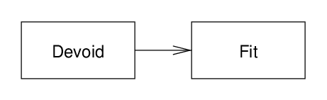{width=346}
> <br>
> Fig: Devoid-fit typestate.

Notice that typestate graphs (and permissions graphs, considered later) are
always directed. In the case of typestate the direction goes from less capable
to more capable, or from less defined to more completely defined. All Patinon
state graphs are DAGs. The directedness of edges in these graphs turns out to be
very helpful in simplifying specifications, and thus in simplyfying code
communication. It helps to keep Patinon lightweight.

*   Simple data will almost always have this two-state graph.
*   Elaborate compound data will have more states. These are the exception
    rather than the rule.
*   Most compound data will have a hierarchical typestate that Patinon will sort
    out for the programmer.

For a straightforward example of elaborate compound data suppose that we are
implementing the `wc` (word count) command-line utility, and that we want to
have one main structure that evolves as the processing progresses. This begins
in a devoid state. Then we process the command-line parameters, and then we
resolve the configuration. We might introduce a *configured* typestate for the
structure at this point. Then we open files, then we initialize counters. At
this point the structure is in its fit state and we process the data. When we
clean up and close the files we decommission to the *configured* state.

> 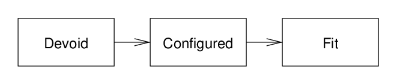{width=496}
> <br>
> Fig: Devoid-configured-fit typestate.

Patinon will devote substantial effort to the handling of states of hierarchies
of compound types. We call this *cascaded* typestate. We summarize it now and
will consider it again later on in more detail. Patinon will use field
specifiers and propagate typestate information. The central issue concerns
expectations at boundaries such as subroutine calls. For example, when we pass a
compound (or reference thereto) to a subroutine, this is specified in terms of
the typestate, constraints and permssions of the compound. The receiving
subroutine has assurances about the compound and needs to be able to turn that
into knowledge about descendant data when fields are accessed and methods are
called. On the other hand, when the caller commissions or modifies the compound
before making the subroutine call, Patinon has to work to clear rules as to how
knowledge about fields can be used to check assurances about owning compounds.
In unusual cases the relationship between the typestate of the compound and its
fields will have to be micromanaged. However, we expect these to be relatively
rare. In most cases all that will be required are a few field specifiers much
like `const` in many of today's type declarations.

Cascading of typestate is quintessential example, if a little extreme, of a
topic to be investigated by Patinon. Exploration of the topic unfolds in stages.

1.  Investigate in considerable depth.
2.  Project write-up for final design will be substantial.
3.  Design will require a small amount of learning and professionalism by
    programmers.
4.  Actual code will be quite straightforward.
5.  Success criterion is measurable simplicity.

The bottom line is that we will need to think extensively and deeply about many
issues, and that the results will boil down to a modest though significant
amount of material provided to programmers. The code that they write will not be
effectively more complicated than in current practice. This is much like the
*Rust* language.

### Error bifurcation

One common typestate pattern is bifurcating into an error state. For example, we
might request that a file be opened. The file handling object that is returned
would most frequently be in the *fit* state, ready to read (or write) data. If
the file cannot be opened, then the returned handler object will be in its error
state.

> 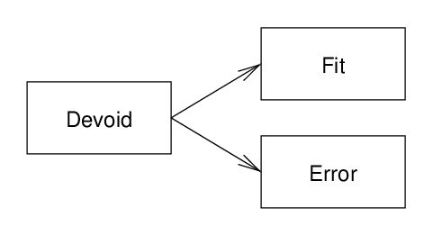{width=361}
> <br>
> Fig: Devoid-fit / error typestate.

The file handler is compound data. Member fields relating to errors are in a fit
state, and error methods are callable, if and only if the handler is in the
error typestate. Otherwise the member fields relating to errors are devoid and
it is illegal to call error methods. Patinon enforces this.

In the example of the `wc` command-line program we looked at above, errors could
be encountered when processing the configuration or when opening files. There
would therefore be two error states.

> 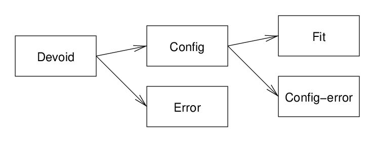{width=556}
> <br>
> Fig: Devoid-fit / error typestate.

### Deloop-loop

We mentioned above that typestate graphs are DAGs. In practice it would be very
rare for us to want to *specify* a graph with loops, and rather typestate will
generally form trees. Patinon will limit specified graphs to st-planar graphs,
since this will simplify checks and diagnostics.[^rarity] Once typestate is
expanded via graph products and cascading, loops are created, but in a way that
does not bother the programmer or complicate analysis.

[^rarity]: The rarity of loops might cause difficulty, in that it might be
    difficult to exercise Patinon's graph handling code sufficiently.

Consider a basic structure

```
   struct Coord {
      x :float32;
      y :float32;
   }
```

The `Coord` compound structure will have 2 states: devoid and fit. The graph
product of its fields is straightforward, with a loop.

> 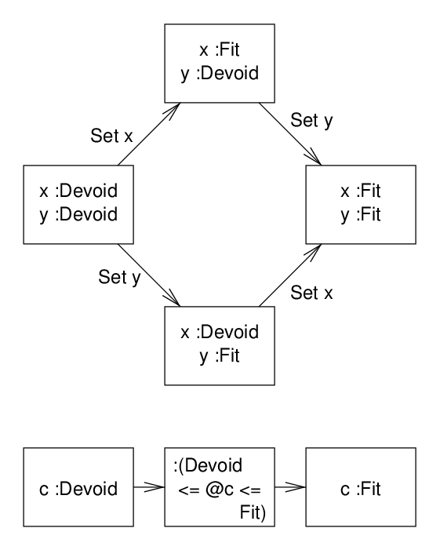{width=421}
> <br>
> Fig: Typestate of basic compound.

When commissioning a Coord, the branch that we takes depends on which order we
set (commission) x and y.

### References

How should Patinon represent references in typestate? One could treat a
reference to `Coord` as a modification of the typestate of `Coord`, replacing
the devoid state effectively with two states.

> 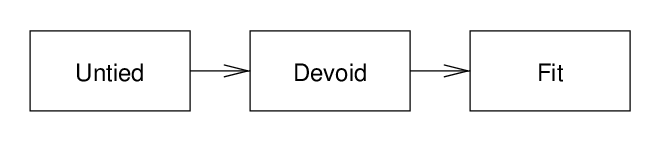{width=495}
> <br>
> Fig: Linear reference typestate.

There is some elegance to this. However, Patinon will (at least at first) take a
different approach, and instead think of references as containers.

Note that Patinon will probably also provide some form of embedding of types so
that accessing a `Coord` in a reference would be easy.

> 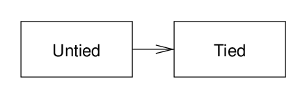{width=346}
> <br>
> Fig: Container reference typestate.

A wrapping (container-like) reference has two type states: untied, in which it
is not pointing to anything, and tied, in which it is tied to an allocated
object. In contrast with the Coord example the product linearizes because the
(untied, fit) combination is unreachable. Really this is a hierarchy.

> 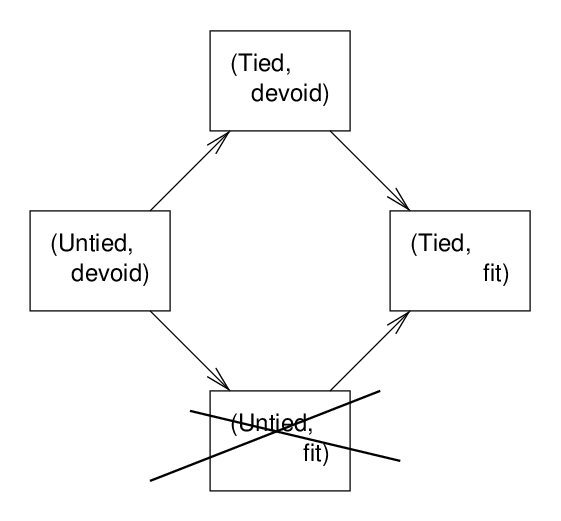{width=421}
> <br>
> Fig: Reference typestate product, with one invalid state.

### Posets and ranges

Since typestate graphs are DAGs, we can always find a non-strict partial order.
(See
[Partially ordered set](https://en.wikipedia.org/wiki/Partially_ordered_set).)
This means that we have a $$a \leq b$$ relation between any two states that is
true if and only if a is an ancestor of b. Note: we always avoid any use of
$$>$$ or $$\geq$$, and where appropriate use $$\nless$$ and $$\nleq$$. For
various reasons, which we will encounter from time to time, it is easiest to
deal with inequality constraints (closed interval). Even for single states it
can make sense to use intervals, that it $$a \leq s \leq a$$. The reason is that
single typestates of a compound can correspond to ranges of typestates of
children.

The main reason for building typestate on st-planar graphs is that it is quick
to test their partial order. Patinon does this using
[Topological sort](https://en.wikipedia.org/wiki/Topological_sorting) via
[Depth-first search](https://en.wikipedia.org/wiki/Depth-first_search). We
pre-calculate the left ($$l(s)$$) and right ($$r(s)$$) depth-first sorts. The
partial order $$a \leq s$$ is true if and only if both $$l(a) \leq l(s)$$ and
$$r(a) \leq r(s)$$. This is detailed later.

### Monotonicity and moving

Unless marked as having an exception, the typestate of members of compound data
must be *monotonic* with respect to the parent. This means that the allowable
states for children must be non-decreasing. Suppose that we have a minimum bound
on the typestate of the parent and find the corresponding permitted ranges of a
child's typestate. Suppose that we raise the minimum bound of the parent. The
minimum bound on the permitted child typestate must not decrease. (We may be
able to design Patinon's analysis to allow for multiple discontiguous ranges, in
which case the rule generalizes, applying separately to each descendant range.)

The converse must also be true: reducing an upper bound must not result in an
increase in the capabilities of a chlid.

This sounds complicated, but really it formalizes the concept of capability in
the directions of typestate graphs. Suppose that you select a typestate of the
parent. If you change you selection upwards the capabilities of the object
should not decrease, and that includes its children. If you change the selection
downwards the capabilities must not increase, at least as embodied in typestate.

This convention makes analysis *much* faster and simpler. To check compliance
with a typestate range restriction one only needs to consider the lower and
upper bound states. (This is discussed under cascading later.)

Exceptions are required. One example is moving an object such as a reference
from one place (reference container) to another among the descendants of a
compound structure. Patinon does this quite a lot in local data (explained
elsewhere). This violates monotonicity. Consider the typestate of the common
ancestor. Suppose that the move increases the capability of the ancestor,
perhaps if done as part of commissioning. The destination's reference goes from
untied to tied, which is monotonically increasing. But the source reference goes
from tied to untied, a loss of capability. Patinon will probably handle these
(a) in specification by marking the reverse transition, and (b) in analysis by
treating an exceptional member's typestate in piecewise fashion.

We will see later that monotonicity helps not only with analysis but also with
diagramming typestate for documentation and diagnostics.

--------------------------------------------------------------------------------

## Permissions and ownership, part 1

### Rusty foundation

Patinon will build on Rust's setup for ownership and borrowing, probably in a
very direct way, using a permissions control entity like its *lifetimes*. We use
the word permissions as a topic that encompasses permissions to reach,
permissions to read, and permissions to write. By *reach* we mean the process of
following a path of references from head data to descendant data. Permissions
deals with the process of reaching data, with times when the reach is revoked,
with the consequences when it is yielded temporarily or permanently, and with
questions of exclusivity.

That lays claim to a lot. Permissions is a very difficult area, and will require
in-depth thought early on, and will require working through code. If there is
any doubt about this, one only has to look at recent literature on the subject
to see how it is actively explored with markedly different approaches. Many have
been explored thoughtfully and extensively. This is perhaps the main reason we
think that Patinon is a timely project.

Fortunately, as with Rust's *borrow checker*, we can treat the typestate
features of Patinon somewhat separately, running permissions checks as a later
pass that is not necessary for code transformation. In fact, it may prove
possible to process code in 4 phases, with an optional 5th. (This is a bit
rough, and we will develop it a little later on.)

1.  Compile code in a fairly classic fashion. Resolution of procedures will be
    based on procedure names with basic knowledge of data types.
2.  Analyse capability typestate.
3.  Check contracts, with contract discovery.
4.  Analyse permissions typestate.
5.  (Optional) Process code annotations, with annotation discovery.

While this might not be the final arrangement, it is quite likely that the work
of permissions checking can be done separately after capability typestate has
been figured out.

Some features that we have already think are of value in Rust and other
permissions systems in the literature include the following.

*   An entity, variously called capability, permission, lifetime, and so on,
    that represents rights with scope and duration.
*   Rust's scoping by nesting. This will be a good starting point, even if we
    find later that Patinon can construct frames and perform recovery.
*   Invariants on permissions, and the approach to them and emphasis on them in
    some articles.
*   Isolation and immutability. These provide the ability to combine sole-owner
    mutability and shared immutability.

We can learn from the breadth and depth of explorations reported in the
literature. Patinon's guiding principles, as mostly embodied in success
criteria, will help us select a path using all this learning and experience.

### Permissions

In Patinon permissions are another kind of typestate, capabilities being the
other. They, too, are represented by DAGs. Permission typestates are combined in
tuples or hierarchies depending on the relationship. Containers have a tuple
relationship. For example, the reference to a `Coord` has mutability permissions
pliant and fixed, whereas a simple mutability graph for Coord would be
non-mutable vs mutable.

> 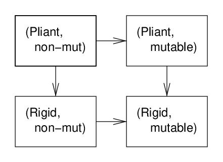{width=331}
> <br>
> Fig: Reference capability typestate.

The reference-Coord typestate tuple (rigidity, mutability) has 4 states, and all
the substate transitions are valid. In practice permission graphs are built up
from combinations of linear graphs, and hierarchical combinations will often
preserve that linearity. Patinon may restrict the base graphs to linear forms.
Many explorations of permission reported in articles restrict permissions to two
states.

### Local-scope struct

Each subroutine or main routine in Patinon has its own custom data structure
that **notionally** holds the in-scope data such as local variables. It is not a
real data structure, not least since some data in the stack frame and some will
be stored separately elsewhere. Nonetheless, local-scope structs are real types
and are useful for various purposes.

*   Representing capability typestate of data with the local scope. The local
    scope structure has its own custom typestate graph. As execution unfolds,
    the typestate of the routine traverses this graph.
*   Associating permissions typestate with data in the local scope.
*   Unifying the handling of the state of data, creating a single model. For
    example, moving a reference from one local variable to another is much like
    moving references between descendants of any other compound structure.

Within the local struct extra members are created to hold temporary data. For
example, if a reference to a compound local stack variable is passed as a
parameter to a function, that reference becomes a local variable with rather
limited lifetime. It is guaranteed that this variable is elided. Its presence in
the structure enables Patinon to track its ownership and permissions.

Here is a straightforward example.

```
proc AddOne(x: i32) -> r :i32 {
   r := x + 1
}
```

This does not need any module-scope or global variables, and so the local-scope
structure is:

```
struct AddOne_LocalScope {
   struct sig {
      x :i32
      r: i32
   }
}
```

Notice that for the present purpose we have defined a signature sub-structure
instead of an args structure, because it also includes the named return value.
The contract on `AddOne` can be expressed as typestates for the sig structure at
the procedure entry and exit.

### Nomenclature

This covers the next section as well, so is a bit long.

*   *Elision guarantee*. This is a guarantee that something like a temporary
    local variable that is created to track typestate will be elided in
    generated code. In diagnostics the fields are labelled as elided. In Patinon
    elision is not clever and is not used to circumvent design limitations.
    Rather it is used for entities that are created for analysis and
    diagnostics.
*   *Permissions* vs *capabilities*. In the literature *permission* refers to a
    conveyed right to access. The word *capability* is somewhat synonymous. We
    reserve capabilities for typestates that reflect the internal readiness of
    an object for use.
*   *Permissions guarantee* means a guarantee about others' access to data. For
    example, it might mean that no other users have mutation permission. Or it
    might guarantee that no users may make a copy of a reference.
*   *Warrant*. We use this as a verb in the sense of to authorize, as a noun in
    the sense of the authorization for an action, and notably as a noun for an
    *entity* that conveys authorization.
*   *Fractional permissions* refers, in Patinon, to having some permissions and
    not others. For example, it might be possible to insert into a map but not
    to delete existing entries.
*   *Head*. In the context of data reachability, ownership and permissions, a
    head is a reference from which other data is reached via descendant member
    references. It also can mean a (value) data structure, such as a local
    compound variable, with the same concept of reachable descendants.
    Equivalently, one could take a reference to the data structure and treat it
    as a reference head.
*   *Stash* and *unstash*. Stashing is making a head temporarily unreachable,
    that is unreachable until unstashed.
*   *Exclusive*. Referenced data is exclusive if all data reachable from the
    head can only be reached from the head. The exclusive referents of an object
    are those that are exclusive with respect to the head.
*   *Shared* is basically the opposite of exclusive. There *may* be references
    to a shared object other than via the head in question.
*   *Mutually exclusive*. (Sometimes called *separate*.) This is between a set
    of two or more objects (or references thereto) *and* with respect to an
    owning head or set of heads. Mutual exclusivity requires that all objects in
    the set are exclusive with respect to all the heads and each other. This
    sounds complicated but what it really means is this: the objects are not
    themselves exclusive unless and until the set of heads are rendered
    unreachable.
*   *Immutable*. A property of a reference or data. No mutation of it or its
    decendants is permitted. No mutation is permitted through any other head.
    This contrasts with *non-mutable*, which means that the object cannot be
    mutated through this head, but might be through others. The exception to all
    this is that immutable data can lead to mutexed mutable data. From the
    coder's perspective imuutability is often specified as a field qualifier.
*   *Landlord* and *tenant*. It is often useful to store a decendant reference
    in a local variable. This is considered a *tenant* reference whose warrant
    is derived from the warrant of the *landlord* head from which it was
    accessed. This is one means of making copies of references without
    destructive reads, and maintains the permissions association.
*   *Isolated*. An isolated reference or data has (can have) exclusive
    non-immutable parts and shared immutable parts. All paths to reach
    non-immutable descendants must go through the head. In Patinon this is
    extended to a set of heads such as when a local variable stores a tenant
    reference. True isolation is ensured by stashing. For example, if an
    isolated head is passed to a subroutine, Patinon can automatically stash all
    other heads in the set before the call and unstash afterwards.
*   *Framing* vs *nesting*. Frames are scopes that drop and add capabilities and
    permissions, which are then restored or revoked on departure. Nesting is
    standard code nesting, basically explicit frames. These are used in the Rust
    language to control lifetimes and warrants.
*   *Function* vs *procedure* vs *method*. In Patinon we only use *function* in
    the sense of *plain function*, an almost-pure function. For subroutines more
    generally we use *procedure*. Only occasionally are we concerned with class
    *methods*.
*   *Absorption*. This is when a secondary reference is deleted by *absorbing*
    it into another equal reference. The last absorption of a reference must be
    into the primary reference. At this point the object can be decommissioned
    and the primary reference deleted.

### Plain functions

Plain functions are those that the coder does not mind being called multiple
times or not at all. Plainness is one of the two properties (constancy, below,
being the other) that Pationon can use in constraints.

*   The general idea is that these are like pure functions, which do not allow
    side effects. In contrast, plain functions do allow side effects such as
    writing log messages.
*   It must not matter if a plain function call is elided completely, or called
    more than once.
*   There are some possible performance and capacity implications of a function
    being called multiple times. Patinon commits to not calling such functions
    much more than is clearly needed.
*   Plain functions can often be defined in a way that Patinon can understand,
    which include field access and integer arithmetic. This means, for example,
    that contracts can be discovered automatically.
*   If Patinon cannot understand the function, it can often understand its
    contextual behaviour via the contract. A straightforward example would be a
    function that finds a value in a way that Patinon can understand but that
    also writes a log message, which Patinon cannot.

### Repeatability of functions

A function is *repeatable* if it will return the same values each time that it
is called. A function method may be repeatable in some typestates even if the
object is mutated in between calls. This is used in containers. For example, the
content of a vector might be mutable when the structure is not. The `size()`
method is repeatable in that state.

*   Plain functions are often repeatable. Repeatable plain functions are common
    and very useful for defining constraints.

### Immutability and isolation

Patinon extends the idea of non-mutable and mutable data to the more general
write controls called *Immutbility* and *isolation*. Isolated objects are also
called *isolates*.

*   Immutable data is non-mutable. It can only reference immutable data.
    References can be shared. No (active) non-immutable references can exist
*   Isolates are self-contained in regards to data that they can mutate.
    Isolates can reach immutable data. Non-immutable objects in an isolate can
    only be reached through that isolate: they are exclusive to it.
*   If, within the non-mutable part of an isolate, a member reference has the
    `isolated` specifier, it has its own sub-isolation.
*   Local-scope data structures are isolated.
*   While isolated and immutable are typically field specifiers, which includes
    local variable declarations via local-scope data structures, it would make
    sense to declare a structure as isolated. This would be useful if the self
    parameter is isolated in all its methods.
*   We follow Rust at a foundational level. Either only one head copy of
    isolated or multiple copies of immutable.

Isolation can be violated temporarily. This is controlled by warrants and
recovered via stashing, which we will look at next.

--------------------------------------------------------------------------------

## Permissions and ownership, part 2

### Stashing

A variable can be *stashed* (alternatively *stashed away*). This means giving up
access to it temporarily. It will be unstashed later when it is used again or
deleted. Stashing is used to remove restrictions on data. For example, if there
are two references to an object and we stash one, the other might become an
exclusive reference. Patinon will check each unstashing to ensure that it does
not violate constraints. For example, if we required that the aforementioned
reference be exclusive, we could not unstash the other copy at that point in
program execution.

### Sacrilege: managed linked structures

Linked lists are a much-loved data structure, with good reason. Part of their
beauty is in the way that one only needs a reference to a single node to access
the remainder. Many tree and graph structures are similarly elegant. However, to
handle ownership and permissions Patinon does something that feels almost
sacrilege. When the coder wants strong permissions controls, Patinon uses actual
manager structures for these. So the nodes in a linked list are associated with
an owning `ListManager`. This structure has elision guarantees. It is in
optimized code a virtual structure.

Linked structure managers bring an important benefit. It is possible to use the
manager as the head for isolation of mutability. The critical aspect is that all
nodes accesses are considered dependent on the manager and at least notionally
accessed through it.

It is likely that unmanaged versions will be provided, or could be readily
created, should the management features not be required.

### Warrants

Patinon allows local copies of references reached from an isolate, but controls
these through *warrants*.

*   Each live isolate has its own warrant, which ties together descendants and
    ancestors and permissions assocated with them.
*   When accessing an isolated reference that it is a descendant of an isolate,
    a new *dependent warrant* is created. When created dependent warrants are
    quite restrictive.
*   In early versions of Patinon we will create *derived warrants* for
    non-isolated descendant access. We will see if this is useful and helpful.
*   Warrants are thus arranged in trees. (Maybe DAGs if Patinon finds it useful
    to enable accessors to declare multiple associations.)
*   An important aspect of warrant trees is in stashing. Consider dependent
    warrants. If the parent warrant's object is stashed, the dependency is
    temporarily broken.
*   Since local-scope data is in a compound structure the local scope begins
    with a warrant assocated with that.
*   Extra credit topic: dependant warrants might be issued as keyed-separate
    warrants for mutuablly isolated data, but only become properly isolated when
    warrants on which they depend are fully stashed.
*   Warrants are really a development of Rust's lifetimes. For instance,
    automatic assignment of warrants to procedure parameters and return values
    would follow Rust's rules.

### Managed unsafety

Languages such as Rust have safe and unsafe code. Naturally the hope is that
most code will be safe. The unsafe mode is used more in library code and in the
manipulation of data structures.

Patinon tries to reduce the need for outright unsafety through what we call
*managed unsafety*. The techniques for this are varied, and include the
following.

*   Providing a mechianism to declare constraints that are satisfied, but that
    Patinon cannot establish without at least a hint.
*   Allowing the use of potentially unsafe reference operations, but controlling
    them and enabling checks.

The overall strategy is to do as much as possible under safe conditions, without
burdening the programmer. If safety is not possible it is better managed than
handled in outright unsafe code.

### Kinds of references

Patinon allows copies of references in some cases. To handle this with as much
safety as possible and managed unsafety all the time, references are classified
as *primary*, *secondary* or *isolated*. Isolated references are not copied,
except for local-scope tenants.

The idea behind primary and secondary references is that every object has
exactly one primary reference and secondary copies can be made from this. The
design criterion is simple: objects are almost always decomissioned via their
primary references. This is what we mean by the true, or *primary* owner.
Sometimes objects have a tortuous commissioning process. The decommissioning is
typically simpler, and is initiated from one place.

Primary-secondary copied references are permitted within the non-immutable part
of an isolated object. (Copying immutable references is the more usual case.) An
example is a manage linked list. Backward links are secondary.

*   It might work to have isolated value members. If a reference were made and
    stored in local scope, it would have to be done under strict tenancy rules.
*   Immutability is a permissions typestate. Reference members can be annotated
    as immutable, in which case they are immutable when the parent is in fit
    state.
*   It might work to have immutable value members, but in that case one could
    not take a reference to the member unless one could know that the parent is
    also immutable. However, in that case you could do it anyway since you can
    take a reference to a descendant of an immutable.
*   Isolated references fields within immutable are permitted. They acquire the
    immutability from the parent.

Absorption. In a program, when a secondary reference is deleted the program
often has or can obtain the primary reference. Under managed unsafety secondary
references are absorbed back into primary references. Typically the check would
probably only be performed in debug or sanitizer configurations. The idea is
that, if all secondary references are absorbed correctly into matching primary
references, then primary references can be safely deleted. Actually, it would
work to absorb secondary references back into other live secondary references if
that were more convenient.

*   An absorption could be marked as required checked at runtime, upgrading it
    to safety. For the upgrade to safety to work, the primary reference would
    have to be nullable and not null, since this would ensure that primary
    references cannot absorb secondaries after they have been deleted.
*   Immutable secondary references can be absorbed into primary references. Once
    all secondary references have been absorbed, the immutability of the primary
    reference can be dropped. After that the data can be modified, and is quite
    often decommissioned.
*   This can be conceived as a managed-unsafety scheme for extending Rust's
    rule. Immutable references can have many copies. Mutable references can only
    safely have 1 copy, but Patinon relaxes the rule within isolates.

Perhaps Patinon can provide special support for invariance checking for the
primary-secondary references within an isolate.

### Fractional typestate

Fractional typestate is useful in Patinon for containers so that, for example
one can know that an owned reference will continue to exist when the container
itself is mutated. It can be useful to know that a hash map can have entries
inserted but not deleted. A possible general sequence for containers is.

*   *Pliable*. The container itself can be operated on freely.
*   Any insertions are allowed, but not deletions. Therefore existing objects
    continue to exist, but the keys to reach them might change. *This provision
    may be undesirable, because keying consistency is an important property.*
    This state would allow insertions into the middle of a vector or list.
*   *Persistent*. Insertions allowed, but only if they do not change what an
    existing key returns. This means appending to a list, or appending a
    reference element to a vector. Insertions into the beginning or middle of a
    vector are not allowed, because a vector's indices are its keys.
*   *Fixed*. No structure changes.

> 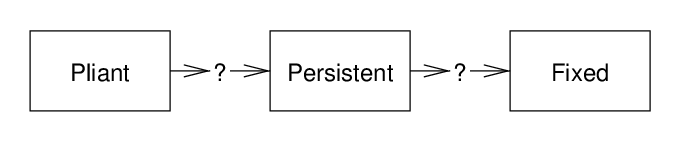{width=511}
> <br>
> Fig: Container typestate.

*   Mutability of content of a container is a separate typestate from the
    typestate of the container itself.
*   The scheme above still needs some work to distinguish between containers of
    references and values. For example, moving elements when a vector is resized
    has differing implications if the elements are stored values, whereas they
    might be more benign when elements are references.

### Building on Rust

The Rust language has a fairly straightforward system of ownership, borrowing
and lifetimes. For its design criteria it is robust and useful. There are some
limitations, and most notably it is necessary to place code in unsafe sections
more often than one would like. By building on Rust, Patinon seeks to extend it
in some aspects. Let us list some of them.

*   *Semi-safety*. While we want to extend the scope of what can be rigourously
    checked, Patinon will create a middle ground between this and unsafe code,
    *managed unsafety*. One way this will likely be done is by allowing
    partially-controlled copying of references (where one is not immutable).
*   *Field-level permissions specifiers*. These provide for field permissions
    limits, like `const` in current languages.
*   *Fractional permissions*. These are important to constraint checks.
*   *Isolation and immutability*. Employing the ideas of isolation and
    immutability should support more flexible control over mutability and shared
    immutability, and better thread-safety guarantees.
*   *Aliasing*. It may prove possible to bring safety to some aliasing within
    isolation, and managed safety for the remainder.
*   *Permissions dependence*. A richer (explicit) representation of derived and
    dependent permissions, along with stashing as a means of temporary breaking
    dependencies and endowing exclusivity, should enable isolation and mesh with
    typestate and constraint checks.
*   *Container disjointness* and *array disjointness* were not yet addressed,
    but these enhancements will bring some improvements to the handling of
    aliasing and thread-specific data. The extent of the improvements will be
    seen as the project unfolds.

--------------------------------------------------------------------------------

## Data and characterizations

### Enumerations

Enumerations are a proper data type in Patinon, and in fact even get special
treatment.

First, enumerations are not just a set of assigned numbers, but also have
associated short and, optionally, long descriptions. Whereas with C++ and
Doxygen this extra information is considered documentation, Patinon itself
handles these at its core. The reason is that enumerations are used for
typestate and other similar purposes. This will help greatly with diagnostics.
Specifically, getting the short description of an enumeration member is not
considered to be introspection, but rather inherent to code.

While here we address numberings of linear chains (`enum`s), much applies to
DAGs. One advantage of st-planar graphs is that we can obtain a couple of
well-defined numberings (lexigraphic orderings).

Second, Patinon knows about tuples of enums. It will provide packed and
mini-array representations of these. The project will assess which
representation is best used in the normal course of business.

Third, Patinon will support hierarchies of enumerations.

```
// Patinon will probably automatically generate straightforward names.
enum Citrus {
   orange,                               // Orange
   lemon,                                // Lemon
   lime,                                 // Lime
}

enum Fruit {
   apple,                                // Apple
   pineapple,                            // Pineapple
   citrus :Citrus,                       // Citrus varieties
   grape,                                // Table grape
}
```

Use of enumeration hierarchies would be straightforward. One could refer to
values as `apple` or `citrus.lemon`. One could also apply equality operators to
non-leaf values such as `f == citrus`.

Fourth, Patinon deals directly with closed enums, but can build one on top of
another using embedding. In the above example, if Citrus were embedded within
Fruit, then `lime` would be a valid enumeration of Fruit.

Fifth, in Patinon mutable enumerations are a special kind of boxing. The value
is paired with a base (offset). In the above example, automatic numbering would
assign 0, 1 and 2 to orange, lemon and lime. However, within the Fruit
enumeration, these would have the values 2, 3 and 4, since they follow after
apple and pineapple. So, when passing a mutable Fruit to a routine that expects
a mutable Citrus, this would be done with 2 as the base value. The routine adds
the base value before storing in the enumeration.

### Downgrading objects

#### Decommissioning of data

Patinon will not provide garbage collection. The vision is that a future
language would be much like Rust.

*   *Plain decommissioner*. This is a decommissioner that Patinon can choose
    when to run, because it does not have significant side effects. It has to
    have a more inline nature.

Patinon prefers to limit automatic decommissioning. For example, files must be
closed explicitly. This means that there are 3 levels of object decommissioning
instead of 2.

1.  Very basic objects such as `:int` integers are decommissioned quietly and
    automatically. It is a requirement that no actual work be required.
2.  Ordinary decommissioning. If the decommissioner is plain, then Patinon can
    choose if it would like to move the call to the decommissioner. (In reality,
    an inline decommissioner would probably be expanded and a code optimizer
    would reorder anyway.)
3.  Complex decommissioning. This is fairly unusual, but nevertheless a
    significant benefit provided by Patinon. Something like a web server would
    be decommissioned in careful explict stages.

Importantly, there is no background decommissioning that is triggered, say, by
automatic memory management.

#### Downgrading typestate

Full decommissioning notwithstanding, Patinon does allow for silent downgrading
of an object's typestate, provided that no work need be done. This can happen
within a straightforward code sequence, or when execution branches merge. It can
also be used in a nested scope, in which case the downgrade is temporary.

#### Decommissioning and unfolding

From the perspective of the local-scope structure, flexibility in the location
of automatic decommissioning is reflected in typestate range.

```
   x :int;                                           // @s <= devoid.

   x := 42;                                          // fit <= @s.

   a := 5 * x;                                       // Last use of x.
                                                     // devoid <= @s <= fit.
```

This helps to minimize chatter in the local-scope structure. Without it, there
would be a lot of extra typestates and diagnosing issues with unfolding
typestate in the local structure would be painful. The reason is that
decommissioning every ordinary local variable would introduce a new typestate.

#### Going out of scope

On the other hand, automatic downgrades can be undesirable.

```
   a :int;
   if (<some condition>) {
      a = 0;
   } else {
      < code that does not define a... >
   }

   < code in which variable a is used erroneously >
```

In this example, automatic coercion would lower `a` where the conditional's
branches merge, effectively cancelling out the assignment `a := 0`. Patinon will
allow automatic down coercion where a type permits that transition. However, we
need to be careful with communication. We do not want to inform the programmer
that `a` was used uninitialized. So we prefer to back-propagate the need for
initialized `a` and inform the programmer that the else branch failed to
commission the variable.

In early versions we probably will not coerce (much). Either a variable goes out
of scope in a branch (or not be used thereafter), or it must have the same state
on merge.

### Checking

#### Nomenclature

*   *Constraints* in Patinon are conditions codified in a way that can be
    readily understood by Patinon. These are often built up, being combined in
    straightforward Boolean logic.
*   *Requirements* are constraints required by the recipient of data such as a
    subroutine (callee).
*   *Assurances* are promises expressed as constraints. The provider of data to
    a subroutine (caller) promises to *ensure* that the assurances are met.
*   *Expectations* refers to both assurances and requirements combined.
*   *Execution paths* are the paths through which code might unfold, based on
    straightforward analysis of code. These include subroutine calls,
    conditionals, iterators, and situation branch and merge.
*   *Constraints analysis* is the process of tracking unfolding constraints
    through the execution paths of a program.
*   *Contracts* are a fusion of requirements at the entry of a subroutine and
    assurances at the exit. Importantly, these include sum-of-products fusions.
    For example, in a getter if the self parameter is mutable, a returned
    reference might be mutable, or they are both non-mutable.
*   *Internal consistency of contracts* is a correctness property of contracts.
    The exit assurances should not restrict the entry conditions further.
*   *Relevance reduction*. When a subroutine call is made there are typically
    more accumulated assurances than are related to the contract of the
    subroutine. Relevance reduction is the process of selecting the assurances
    that are relevant to fulfillment of that contract. Nonetheless, in
    diagnostics an assurance that is considered irrelevant might be so because
    of a mistake. Therefore they are still made available in diagnostic
    breakdown.
*   *Expectations checking* is slightly more general than contract checking.
    Within a scope (and not just at a call point) one can draw a boundary and
    describe the assurances that result from the code that precedes the boundary
    and the requirement of code that follows. Expectations checking is a
    slightly fuzzy concept. In principle Patinon should be able to check
    everything at every such point, in an advanced dataflow analysis.
*   *Explicit claims* are constraints explicitly stated in code. These
    supplement the constraints that Patinon is unable to gather from preceding
    code.
*   *Material implication and transgression*. Material implication is a Boolean
    (secondary) operator `A +-> B` interpreted as `!A + B`. If A is true then B
    must be true. Material transgression is written `A *-> B` and is logically
    the same as `!(A +-> B)`. Implications can be analysed directly in Boolean
    algebra, delaying the loss of semantic information relating to the terms.

#### Value constraints

While typestate provides the cornerstone for Patinon's expectations checks, we
also want to check integer constraints. (Aside: It may prove worthwhile to
handle ratio constraints as well. For example, one might want to divide an array
in half.)

The classic example of this is array bounds checking in straightforward cases.
Traditionally bounds checking was seen as having two approaches: bounds checked
at every access, such as Pascal and Python, and no bounds checking, such as C
and C++. Patinon takes a third way. Straightforward cases are checked. More
complex cases are handled with managed unsafety. The coder explicitly declares
the correctness, and the checks are typically enabled in debug and sanitizer
builds. Let us look at a straightforward example.

```
   // x is vector of integers.
   int s = 0;
   for (int i = 0; i < x.size(); ++i) {
      s += x[i]
   }
```

#### Expectations

The crux of this is being able to check the contract for accessing the vector,
basically `x.GetElement(i)`, written as `x[i]`. We want to be able to write the
contract for this method in something like the following fashion.

```
   GetElement(self, i :int) -> v :int {
   | :(mut <= @self +-> mut <= @v)
   | :(0 <= i < self.size())

      v := ...
   }
```

We have dropped in some syntax here which is not Patinon's, since that has not
been defined yet. It is just something to enable us to describe some ideas.

*   The `|` we will call a *continuation* mark. We are continuting the
    signature, and defining its constraints.
*   The `:` character introduces a specifier for the constraints. So `:int` is
    constraining the type to int.
*   The pattern `:( < ...expr... > )` specifies a constraint expression.
*   Separate specifier constraints are AND-ed together.
*   The `A +-> B` pattern is a convenience for material implication (`!A + B`).
    If A is true then B must be true. It also conveys the coder's intended
    meaning that one thing implies another.

The contract is used in two distinct ways. Suppose that we gather together all
the assurances that apply in the caller when it calls the method. This yields a
Boolean expression A that is a function of various items. Similarly let the
requirements of the contract of the method be R, and the promised assurances on
exit be P. We pass a variable from caller to callee that provides the index. The
type of this (induction variable `i` in the example iterating caller, and
parameter `i` in the method) needs to be checked. It is fairly clear to the
human. There is no type for the parameter outside of the allowed set that is
within the assured set.

*   Therefore we basically look for violations in the form of `A * !R`.
*   Feasible solutions to this (typestates, enumeration values and integer
    values) would represent conditions that the caller might establish on entry
    to the subroutine.
*   We can identify potentially irrelevant terms in A if there is no feasible
    region. Which terms can be dropped without causing a feasible solution to
    arise?
*   Internal consistency of contracts demands that there be no solution to `R *
    !P`. Well, maybe. This is a topic for deeper consideration.

### Object values

#### Integer constraints

Patinon knows that in the straightforward loop example that (a) the vector size
is unchanged, that is a fixed value in this context, and (b) that the induction
variable is in a half-open interval, namely `0 <= i < self.size()`. The
fixedness of `size()` is required by the standard loop iterator's range. The
size is greater than or equal to zero, which guarantees that the range be of the
standard kind, potentially empty.

From the checking point of view Patinon needs to deal with mixed linear
programming problems. Well, almost. Typically it only needs to check if there is
at least one feasible solution. Actual solution values might be usable in
diagnostics. As set out above solutions are violations of the requirements of a
subroutine that are within the assured constraints established by the caller.

#### Diagnostics

A general task for Patinon is to convey how constraints unfold with the
execution of code. This includes branching, merging and iteration. Patinon will
create output that can be used by a code explorer or diagnostic application to
display, for example, how the constraints on a data instance change.

Clarifying violations will be more specific. In this case the full range of
feasible solutions (to `!A * R`, equivalently `!(R -> A)`) might be relevant.
Constraints may often fan out, if expanded, to large sets of terms. Eliminating
those that are not violated will be important. In the project we will try to
maintain the semantic link between each term and its source constraint in order
to make diagnostic information meaningful. That is, Patinon should indicate
which constraint on which entity gave rise to the violated term in the mixed
programming problem. It would be desirable to avoid having to create a system
for merging common subexpressions, not so much for reasons of complexity or
achievability as for speed.

#### Expressions and characterizations

Suppose that we wanted to split an array `a` into two halves.

```
   s := a.Size()
   m := s/2                                          // Floored integer div.

   for i in [0 .. m] {
      ...                                            // Process 1st half.
   }
   for i in [m .. s] {
      ...                                            // Process 2nd half.
   }
```

Let us look at that integer division, and generalize it to `d := x / y`. The
integer division function's contract should tell us that

```
   d * y <= x < d * y + y
   x - y < d * y <= x
```

(In Patinon, commas group loosely, comparisons have greater precedence, and
arithmetic groups closely. Logic precedence matches arithmetic, so AND is at the
same level as multiply, for instance.)

This is just one minor example. The point about this is that Patinon will need
to interpret expressions and perform some kind of interval-like processing to
maintain inequalities in constraints. How far Patinon goes with this wil depend
on what turns out to be useful. We know that it will be necessary from time to
time to make explicit claims, and comprehension of rational expressions will
make it easier for coders to write these and Patinon to analyse them. One can
think of these kinds of expressions being like C++'s constexpr in that certain
expressions are understood by the code transformer. The difference here is that
some of the variables are not fixed, but instead variables that are free but
constrained.

--------------------------------------------------------------------------------

## Code structure

### Return values

Patinon uses named return values. Return values are named in the signature and
returned on exit. This is in contrast with what is at present the most common
pattern, that is stating the variables to be used for return values following
each `return` keyword.

Patinon separates allocation and commissioning. In most code the two are
co-located, but even then there is a slight distinction. The purpose of a
commissioner is to bring data into fit state. A consequence of this is that
so-called constructors, which return newly-commissioned data, are replaced by
commissioners, which modify data by making them fit for use.

*   Named return values sit better with typestate. Without a name, Patinon would
    have to use a name like *self* to track the typestate of return values.
*   By naming the return values in the signature, a small yet significant piece
    of documentation is incorporated into code. The virtue of this is seen in
    the care taken in naming input parameters.
*   Named return values in combination with situations (below) remove the need
    for the return keyword.
*   Return value names are used in the assurance clauses of subroutine
    contracts.
*   The idea of commissioning a named object brings clarity in regard to
    construction vs initialization. For example there is no such thing as a
    named constructor. There is no such thing as RVO (return value
    optimization).

### Nonmenclature

*   *Named return values* are the return values of a subroutine. So, instead of
    returning `(:int, :bool)` the signature of a subroutine states the names of
    return values as in `(total :int, monotonic :bool)`.
*   *Constness boundary*. A line that one can draw under the last mutation or
    commissioning of a variable in scope. After this it often has non-mutable
    usage.
*   *Define once*. A pattern in which a variable is declared as `const`.
    Commissioning may happen in conditional branching. Along each execution path
    the variable must be conditioned in one step, after which it becomes
    non-mutable.
*   *Relevance reduction* also includes identification of redundant and
    impossible terms.

### Basic dataflow analysis

Patinon can use its basic tools for capability and permissions typestate, along
with contracts, in order to figure out the pattern of commissioning and
decommissioning. In addition mutability restriction changes can be applied at
various points.

A pattern for a local variable might be as follows, in a trace through the code.
This pattern is a superset in the sense that many simpler patterns omit parts.

*   The object is declared, and for a local variable this implies allocation.
*   The object is commissioned. This often happens at declaration. Commissioning
    may proceed with further steps.
*   The data may be mutated, used, mutated.
*   Constness boundary. At some place in the routine there are no further
    mutations.
*   Non-mutable usage of the object.
*   Decommissioning of the object. Patinon allows this to happen in stages.

Variations:

*   In reality, the space on the stack may well not be used for anything else
    during the subroutine, effectively meaning that the
    allocation-to-deallocation lifetime spans the scope.
*   If decommissioning happens in stages, the mutability must be more clearly
    re-established.
*   In nested scope a variable may become non-mutable. In Rust this is handled
    by copying a reference to a non-mutable reference, which in Patinon is
    considered to be *stashing away*.

This is just fine. But it is better if the constness boundary is explicit, so
that Patinon can verify it. One possibility is that Patinon's auto-cleaner would
insert a permissions typestate transition if, say, there are more than a certain
number of statements between the last mutable use or commissioning and the last
non-mutable use.

### Define once

The following straightforward example fits into the preceding pattern, albeit
with a branching pattern to the commissioning.

```
   const int x;                    // Or declaration of more complex object.

   if (< some condition >) {
      x = 0;
   } else {
      x = 1;
   }

   < code in which object x is used >
```

This would not compile in C++, or most other current languages for that matter,
because RAII reigns as the supreme conceptual basis for data lifetimes. But the
code makes perfect sense from the point of view of dataflow analysis. If one
were to take the classical view of `const` this would make no sense in Patinon
either, but for a different reason. That is, there is no automatic
commissioning. The declaration line would be erroneous.

In Patinon the `const` keyword has a different meaning. Exactly one
commissioning statement is permitted along all conditional branches. The
variable is devoid before and must be fit at the merge. The permissions are
automatically reduced to non-mutable immediately after each commissioning.

### Empty feelings

It is likely that Patinon will make the typestate of an object quite like a
flexible and extensible dictionary of properties. One motivation for this is
that containers might have an auxiliary typestate that tracks their emptiness.

> 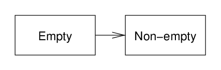{width=331}
> <br>
> Fig: Auxiliary emptiness typestate.

Much of the time a container would be passed around without this typestate
information. A container starts out empty. An `Insert()` method would set the
state to non-empty. A deletion method would make the state uncertain. The
standard `IsEmpty()` method would set it to the correct value. Actually this is
a neat example of how a constraint can mix typestate and values of data. In this
case the assurance constraint links the typestate with the Boolean return value.
Furthermore, the `Size()` method's return value range would depend on the
emptiness.

Incidentally, this shows the worth of relevance reduction. If the Size method is
called with uncertain emptiness, the output range is `(0 <= size) OR (1 <=
size)`. Patinon knows about parallel constraints (in the linear programming
sense) and can drop the redundant one. In fact, more generally, a redundant
constraint appears as rank deficiency in the weights matrix. Well, almost.
Rank-deficiency also occurs with upper and lower bounds that are parallel and
sometimes contradictory. And this is again useful, because contradictory
constraints provide a simple basis for relevance reduction and even
short-circuited checking for a feasible reason. It provides the advantage that
Patinon can tell the coder that a contract is valid because corresponding
constraints eliminate violation through contradiction.

There is an obvious reason for wanting to handle emptiness, namely that we do
not want to call IsEmpty when we know the result is true or false. This is not
just a matter of complexity but also of unnecessary checks and unreachable code.

The other key use for emptiness typestate is in container iteration. It is quite
possible that Patinon will have an `always` specifier for loops (or similar).
This is a communication between the coder and Patinon that the loop is always
executed. If a loop is executed at least once, then tighter constraints can be
established at the exit of the loop. In the future such information could be
used by the compiler. (Another benefit is to remove an unconditional branch in
machine code, which is not necessarily a big deal, but a slight reduction in
code size would be reaped in a lot of code.)

### Situations {#situations}

#### Nomenclature

*   *Condition*. After [[KnuthDE75](supporting.md#KnuthDE75)], a state of
    affairs involving program variables.
*   *Situation*. After [[KnuthDE75](supporting.md#KnuthDE75)], a condition
    occurring at a particular location in a program execution. Patinon develops
    a range of coding features around these.
*   *Event*. After [[KnuthDE75](supporting.md#KnuthDE75)], the occurrence of
    some action usually altering the state of program variables.

#### Definition and background

> **Situations** are labelled branch paths that only move outwards in scope and
> downwards in the written code. They are used when a particular state of
> affairs arises at a particular location in the execution of a program.
>
> Subroutines may return with situations. Execution proceeds to a handler
> provided in the caller code.
>
> In most uses, the state of affairs occurs infrequently. Exception: the
> frequency may be more even where the distance from branch point to handler is
> short.
>
> Situations are often associated with differences in typestate along the
> subsequent execution paths. When subroutines return situations, return value
> assurances are often dependent on those situations.

Situations, with minor variations, were proposed by quite a few writers in the
early 1970s. Among them is Knuth, who made various interesting suggestions in
his 1974 article on structured programming
[[KnuthDE74](supporting.md#KnuthDE74)].

Even more enlightening is the note [[KnuthDE75](supporting.md#KnuthDE75)] that
Knuth and Zahn wrote as a follow-up to clarify a point. (See
[this section](supporting.md#clarification) in supporting materials.) They
identified a sharp distinction between events and situations. We build on this,
and further make the distinction between the exceptional vs the normal
(unexceptional), and the frequent vs the infrequent. Thus a situation might be
both normal and infrequent.

In Patinon, situations replace `break`, `continue` and `return`. Separately from
situations, the decision to use named return values means that variable names
are not required at subroutine returns.

#### Style guides

Here we do not intend to argue the case for situations. Suffice it to say that
views that were expressed in the 1970s, such as dislike for invented Boolean
variables, continue to be relevant. Instead, let us focus on contemporary ways
in which situations have been advocated for some particular uses.

##### GStreamer example

A specific example is set out in full [here](supporting.md#GStreamer). GStreamer
code uses `goto` branches to simulate situations. The underlying motivation for
this is (one assumes) the fact that GStreamer plugin code has to make a lot of
checks. These checks need (a) to be handled cleanly, with clear situation
identification and handling, (b) to be labelled or to be distinguished in some
other way, and (c) be clearly separated from the main body of the plugin. Doing
this would be impossible without situations, or perhaps some other augmentation
of the language.

Note that usage of situations in Patinon may not be exactly like those in the
GStreamer examples.

##### Unwinding the Linux kernel style

The Linux kernel style guide outlines the use of `goto` statements to simulate
situations: see [this excerpt](supporting.md#Linux-kernel). One senses that this
guidance implies on the one hand permission to do this, while on the other the
recommendation to use them sparingly.

The example in the style guide illustrates what might call *unwinding*, that is
a generic pattern for setting up data structures in stages, but potentially
finding reasons to depart in between this stages. Consider this code pattern.

```c
subroutine ... {
   < Set up data structure A >
   if (< Problem with structure A >) {
      ==> DepartureScenario1
   }
   < Set up data structure B >
   if (< Problem detectable only after having B >) {
      ==> DepartureScenario2
   }
   < Set up data structure C >

   < Core code for routine... >
```

The problem is that we need to tear-down the data structures differently,
depending on the execution scenarios. In the Linux style example, structure A is
`foo`, whereas structure B is `foo->bar`. Situations provide a general and
controlled framework for the branches suggested in the Linux coding guide. The
subroutine concludes in the following fashion.

```c
< Tear down structure C >
   rollover                        // Rollover to first / next handler.

handle DepartureScenario2 {
   < Tear down structure B >
   rollover
} handle DepartureScenario1 {
   < Tear down structure A >
}
```

#### Some design considerations

In our examples of suggested uses of situations in *Patinon* we have largely
assumed a one-to-one correspondence of places in code where a situation is
raised and where it is handled. However, it is quite possible that *Patinon*
permit multiple lanuch points for one arrival point.

When situations were discussed forty years ago the formulations typically
required that all situations be declared in a list at the beginning of the block
structure, at the same level as the arrival points. We think it better that this
not be a requirement, since it would impede acceptance of situations. Brevity
tends to lead to clarity, and code exploration tools (and automatic
documentation tools) could annotate control structures with a list of their
situations.

The GStreamer example, while correct, shows how situation handling could be
unclear and how errors might creep in. Specifically:

*   Situation handlers themselves raise situations in order to organize common
    code. The handlers for `no_filename` and `open_failed` finish by passing
    raising `error_exit`. The handlers for `no_stat`, `was_directory`,
    `was_socket` and `lseek_wonky` pass on to `error_close`.
*   These initial handlers are separate from each other, whereas an unwinding
    pattern is used with the second handlers: `error_close` continues on to
    `error_exit`.

The *Patinon* project will consider the best enforcement of situation usage.
This probably means starting out with a conservative approach. That means that
if situation handlers pass control via other situations, the primary situations
should be more deeply nested than the secondary situations. This would avoid
confusion of one situation cascading into another further down the list of
handlers. Also, *Patinon* should initially require that all situations within a
block either fully complete or all continue (`rollover` above) to the next. That
is, separate handlers should not be mixed with unwinding handlers. Once we have
a range of experimental code examples, *Patinon* will consider if these
restrictions are helpful and warranted.

#### Alternatives

Situations are not a panacea. Alternative schemes would need to be considered in
the design of a production language, even if it draws heavily on Patinon.

*   One example is the *Go language* `defer` mechanism. There are some clear
    similarities with situations. However, we consider the differences
    important. Situations work well with typestate. A `defer` mechanism might
    nonetheless have its place. In this project, for the present, we focus on
    investigating situations.

#### Usage

The definition given above contained some indication of the intended usage of
situations. Here are some other ideas.

*   Situations should not be used lightly. They should simplify complex code and
    provide clarity. A clear benefit is needed for each use.
*   Situations deal with the normal but infrequent. Situations do not replace
    error mechanisms such as exceptions. They will probably replace some,
    perhaps many, *uses* of these mechanisms. This is because coders do not
    currently have a good mechanism for dealing with the normal.
*   Observation (based on simple searches, etc): The `break` and `continue`
    keywords are not used very often in production code. The `return` keyword
    occurs much more often. Situations will have many more uses than replacing
    these keywords. The relative frequency of return statements, and examination
    of these uses, suggests that in practice the main benefit of situations will
    be to leave a section of code at a mixture of nesting depths and gather the
    execution paths. One style guide (no longer available) recommended nesting
    functions in order to use this pattern.
*   In the manner of `break` and `continue` usage it is appropriate to use
    situations with short spans from departure to handler arrival points even
    when the situation is quite frequent. That is, short spans are an exception
    to the infrequency rule.
*   Situations across subroutine calls should be used sparingly. In Patinon we
    will obviously be exploring the design of some library functions. We will
    begin conservatively. For example, it might be seen as convenient to return
    a situation if a string match function fails to match. However, this may not
    be the best. The longer example below is fairly typical of a routine
    processing a stream of input, though perhaps having more than average
    departure points. We may find that what we need are clean ways of taking
    tuple return values and branching (or triggering situations) based on them.
*   Situations are not a means of optimization. In the long run (as opposed to
    simulating simulations in code transformed by Patinon) it may be that
    situations avoid performing a comparison in the subroutine and the called
    function. However, situations are not intended to be used in
    performance-critical code, at least to the extent that the extra conditional
    branch would be significant.

#### Longer example

The example that follows is from `fig2dev-3.2.6a/fig2dev/dev/readgif.c`. It was
selected because it happens to have `break`, `continue` and `return` statements
in a relatively short span. The code is slightly reformatted, and we focus on a
`for` loop and how it relates to its enclosing subroutine via the return paths.

```c
int read_gif(..) {
   ...
   for (;;) {
      if (!ReadOK(file, &c, 1)) {
         return 0;                 /* EOF / read error on image data */
      }
      if (c == ';') {              /* GIF terminator, finish up */
         break;                    /* all done */
      }
      if (c == '!') {              /* Extension */
         if (!ReadOK(file, &c, 1)) {
            fprintf(stderr, "GIF read error on extension function code\n");
         }
         (void) DoGIFextension(file, c);
         continue;
      }
      if (c != ',') {              /* Not a valid start character */
         continue;
      }
      if (!ReadOK(file, buf, 9)) {
         return 1;                 /* couldn't read left/top/width/height */
      }

      useGlobalColormap = !BitSet(buf[8], LOCALCOLORMAP);

      bitPixel = 1 << ((buf[8] & 0x07) + 1);

      if (!useGlobalColormap) {
         if (!ReadColorMap(file, bitPixel, pic->cmap)) {
            fprintf(stderr, "error reading local GIF colormap\n" );
            return 1;
         }
      }
      break;                       /* image starts here, header is done */
   }
   ...
}
```

Let us recode this, a little, using situations. We also convert the `break` to
until statements in a `do { ... } until ( cond ) { ... }` style loop.

This is an unusually complicated example, with three levels of departure /
merging. Also, the version that follows does more than the original in terms of
setting error information. Note that Patinon might propose a different syntax
for block interruptions such as mid-block else-if conditions and the like.
Having nothing between braces is not a big problem, but does not read perfectly
clearly.

```c
int read_gif(..) {
   ...
   ParsingError error_type;        /* error_type is in devoid typestate. */
   ...
   do {
      if (!ReadOK(file, &c, 1)) {
         error_type := ParsingError::kFileReadFailure;
         ==> PARSE_ERROR;          /* EOF / read error on image data */
      }

   } until (c == ';') {            /* GIF terminator, finish up */

      if (c == '!') {              /* Extension */
         if (!ReadOK(file, &c, 1)) {
            fprintf(stderr, "GIF read error on extension function code\n");
         }
         (void) DoGIFextension(file, c);
         ==> CONTINUE_GIF_EXTENSION;
      }
      if (c == ',') {              /* Not a valid start character */
         ==> CONTINUE_NOT_START_CHAR;
      }
      if (!ReadOK(file, buf, 9)) {
         error_type := ParsingError::kFormatFailure;
         ==> PARSE_ERROR;          /* couldn't read left/top/width/height */
      }

      useGlobalColormap = !BitSet(buf[8], LOCALCOLORMAP);

      bitPixel = 1 << ((buf[8] & 0x07) + 1);

      if (!useGlobalColormap) {
         if (!ReadColorMap(file, bitPixel, pic->cmap)) {
            fprintf(stderr, "error reading local GIF colormap\n" );
            error_type := ParsingError::kColormapFailure;
            ==> PARSE_ERROR;
         }
      }
   } until (false) {               /* image starts here, header is done */
   } handle (CONTINUE_GIF_EXTENSION, CONTINUE_NOT_START_CHAR) {}

   ...

   // Situation PARSE_ERROR not handled and instead passed to caller.
   // error_type remains devoid on frequent exit, whereas under all error
   // situations it has already transitioned to the fit typestate.
}
```

--------------------------------------------------------------------------------

## Unfolding typestate {#unfolding}

### Nomenclature

*   *Significance labelling* is annotating which assurances are required to
    fulfill a contract.
*   *Lame duck*. A variable is a lame duck after it has ceased to be used and
    when it has trivial decommissioning.
*   *Broadening* of constraints. This is taking a constraint and making it
    looser. The original constraint materially implies the new constraint.

### Phases and passes

Broadly speaking, Patinon will tackle its work in phases.

*   A: Initial code transformation. Basic parsing, conditional compilation, and
    handling of modules and dependencies, and so on.
*   B: Intermediate code transformation. Macro expansion. Type-dependent code
    (like templating).
*   C: Trace execution paths. Capability typestate, contract checking,
    permissions checking.
*   D: Generation of output code.

In this section we are mainly concerned with phase C. Some notes.

*   Quite a bit will actually be fudged by Patinon, and to a large extent we
    imagine what a real language would look like and fit Patinon in as best as
    possible. Aspects that will be fudged include module handling and proper
    transformation into intermediate representation (IR).
*   The general approach is to do as much as possible in each phase, and indeed
    in each pass within each phase.
*   Patinon would often end before the final code generation phase. This is
    because we want it to work usefully as an analyser and checker, and to
    perform these tasks quickly.
*   Most automatic discovery would (we think) happen along with analysis.
*   Patinon wants to be able to do as much as it in one file, and in one
    compilation unit.
*   Modules are normally in a DAG dependency, though some amount of mutual
    dependency would probably be required. We assume that very little
    auto-discovery would be performed on the "backward" dependencies.

The phase for tracing execution might proceed in 4 passes.

1.  Trace capability typestate.
2.  Check capability contracts.
3.  Trace permissions typestate.
4.  Check permissions contracts.

These might be coupled together, that is capabilities and permissions handled at
the same time. Also, the passes may happen in simultaneous "lines of enquiry",
each pursued as far as possible with each new input.

In the sections that follow we will address the task of tracing execution. Then
we will briefly revisit contract checking.

### Levels of refinement

Some of the passes are able to simplify assurances will more aggressive, and
more expensive analysis. For example, some are a little like common
subexpression elimination. We actually expect assurances to be fairly small with
readily separable components, with the result that even order-N-squared
elimination algorithms might be realistic. That said, it is very important that
compilation (code transformation) be fast. Whereas full documentation or
diagnostics can benefit from more thorough simplification.

Therefore Patinon may apply some of the analysis in two forms, the fast and the
clarifying. The difference should be in the coder-visible expression of
constraints and not in the strength of checking.

### Tracing execution

The basic task of tracing typestate through execution is to figure out what
assurances prevail at each point in the program. Patinon deals with 4 patterns.

1.  Sequential execution. The straightforward case is linear code, but there can
    be nested sections with branching.
2.  Conditional branches, and the re-merging of those branches.
3.  Iteration.
4.  Situations. Since these always move outwards and downwards, one can note all
    the departure points and corresponding assurances before the handler merge
    points are encountered.

#### Explicit claims

Bear in mind that while Patinon aims to deal with the majority of contract and
permissions checks automatically, it is sometimes necessary to be explicit.

*   Some explicit claims are added to code at the discretion of the coder,
    perhaps to simplify some logic. Most likely this will be to communicate a
    fact to a reader of the code. Patinon will then check these.
*   Some explicit claims are truths that Patinon is unable to confirm. The claim
    might be checked in a debug mode. Almost always a test should exercise the
    claim.
*   Claims should have a uniform clause structure, the same as other constraint
    specifiers.

### Sequential execution

Imagine that we are tracing a subroutine. (The main routine is like a subroutine
anyway.) Also imagine that it comprises only a sequence of simple statements,
and no iterators or such.

The requirement at the entry of the subroutine provide the initial seed for our
assurances. These are mainly going to be for typestate, but might restrict
integer values. Patinon then steps through each statement, which resolve to
nested subroutine calls or something similar with a contract, possibly built-in.
For now we are not checking the requirements, and simply combine the constraints
on entry with the callee's assurances to form the assurances that prevail after
the call.

Continue stepwise until end. Final assurances must be the same as or tighter
than the subroutine's exit assurances.

*   Define-once is applied. As soon as a define-once object reaches its fit
    state, it loses its mutability.
*   When combining assurances, this would be done with deduplication. A
    straightforward approach to this is to take separate terms from the new
    assurances (from the function call) and see if this is already materially
    implied by the prevailing assurances. Then vice versa: terms in the
    prevailing assurances can be dropped if materially implied by the remaining
    new assurances.

#### Mutations

We have not yet resolved exactly how we want to handle mutations in regards to
contracts. Assurances about mutated data are very different from those about
return values. Those about return values are simply combined with the preceding
assurances, in a cumulative fashion. When a subroutine mutates data, the
prevailing constraints on that data can be modified, including relaxation.

Patinon will begin with a fairly simple-minded approach to this. Subroutine
contracts supply clauses that provided assurances on return values. For
mutation, the contract specifies replacement rules. Clauses in the prevailing
contract need to be matched with those in the replacement rule.

The main difficulty here will be that Patinon will not always relax or otherwise
modify prevailing assurances in the way that a coder was expecting.

Another way of looking at mutation, and one that applies well to assurances, is
that one can imagine a new object being created. Suppose that we iterate $n$
times through a loop, mutating an existing object $x$ during each iteration. We
might say that we go through a sequence $x_k$ for $0 <= k <= n$. Before the loop
$x$ is $x_0$ and after the last iteration it is $x_n$. Now, if we make a
mutation in a single function call, its contract could pretend that $x_k$ and
$x_{k+1}$ are different variables. The entry requirements would be written in
terms of $x_k$, and then $x_{k+1}$ would be used in the return assurances. This
would be easy for Patinon to implement, since it is just a case of changing the
identification (name, perhaps) of the inbound instance. The biggest drawback
with this is that Patinon would drop all other assurances about $x_k$ and not
carry them forward. There would most likely need to be rules for carrying
forwards.

### Merging

Patinon does not try to be very clever about merging. That is to say, Patinon
expects merging execution paths to have assurances that are close to identical.
Separate paths can have variables that go out of scope, and their
decommissioning is discusssed below. After that very little reconciliation of
typestate would be done. Earlier work on typestate used *lowering* to reconcile
data that is in a higher state coming from one branch than when coming from
another.

It may be that Patinon can usefully reconcile by *broadening* the typestates to
match. This would involve taking two typestate ranges and creating a union. Put
simply, this involves creating the logical sum of the assurances coming from the
two branches. The main reason that Patinon needs to begin with a conservative
approach is that both lowering and broadening risk confusing diagnostic
messages. A trivial mistake such as not commissioning an integer along one
branch would be misinterpreted as an attempt to use a reconciled decommissioned
integer after the merge.

That said, some lowering should be performed on variables that are no longer
used. We will look at that below in an example for conditionals.

### Conditionals

Conditionals are straightforward, or at least as straighforward as the merging
process. All one needs to do is to trace the different paths and then merge them
at the end, including any empty alternatives. That said, the conditions can be
important in the branches and complicate the merge. Consider the following
example.

```c
{
   const s :int := size(x);        // Where x is array of f32.

   if (s >= 16) {
      ...                          // Branch A.
   } else {
      ...                          // Branch B.
   }                               // Merge point.

   ...                             // s potentially used.
  }
```

When tracing the execution through branch A, Patinon combines the condition
`s >= 16` with the prevailing assurances. It is quite likely that the assurances
are not modified differently in branch B, so the merge should be easy. However,
the conditions on `s` are still attached to the assurances. It might be that `s`
is not used in code after the merge. In that case it is a lame duck. It seems to
make sense to lower s and apply a pruning process to remove it from the
assurances in the branches. However, it might be used again. So a better
approach is to combine the assurances and apply broadening.

Patinon can combine assurances quickly and easily. It recognizes the common
terms when, say, OR-ing two constriant sets. With slightly more effort it knows
that `(s >= 16) OR (s < 16)` is always true.

Compatibility also is checked. In short, Patinon needs to be sure that it is OK
to relax the constraint term `s >= 16` to `true` (any value of s) at the end of
branch A, and at the end of branch B to relax `s < 16`.

Note that conditionals also include switch statements and sequential conditional
expressions.

### Challenges

This is the kind of place where the real trickiness in developing Patinon lies.
Large parts can be distilled into clean processes based on a relatively small
set of building blocks. A key difficulty is that Patinon needs to retain and
manipulate knowledge about individual constraint terms. The fundamental step in
the above merge is that, for instance,

$$
\DeclareMathOperator{\impl}{+\!{\rightarrow}}
 (s < 16) \quad\impl\quad (s < 32)
$$

(This is a variation on the preceding example that is meaningful in practice.)

So, in essence, a key challenge for the Patinon project is knowing how and when
to loosen constraints through broadening. Some broadening is fairly obvious,
like the range of s, others may be not.

### Loops

We might try to give Patinon a little flexibility over loop typestate. To do
this, non-nested loops will be scanned twice. In the first pass the loop entry
assurances are the starting point. Execution of the body of the loop is traced.
The final state is then used as the beginning state for a second pass.

It is required that the final assurances after the second pass must match the
assurances after the first, that is once variables such as the induction
variable go out of scope after trivial decommissioning.

If the loop may be executed zero times, then the exit assurances must match the
entry assurances. It is likely that Patinon will provide for *always* loops,
that is loops that are always executed completely at least once. Or perhaps
explicitly mark the *first exit* point.

### Nested Loops

Patinon would not be fast if all loops were scanned twice, because of nesting.
Two-passes could become 256 passes for 8-way nesting. Even worse, diagnostics
could be difficult.

Some alternatives:

*   An inner loop could be marked as not scanned multiple times.
*   Inner loops could be scanned in a normal fashion. An enclosing loop could be
    scanned twice, but on subsequent passes the assurances must match at the
    entry to each loop nested within.

In the second case, on the first scan of the outer loop the scan of the nested
loop creates a kind of contract for the inner scope. This would actually be
quite uniform, with conditionals doing the same.

### Situations

Handling situations requires Patinon to do one core merge: two branch points
from potentially different and potentially sibling nestings need to merge. Also,
in many cases a situation handler inherits (part of) the scope and assurances
from the branch.

Patinon is willing to insert shims, that is small sections of code that are
different for two situations coming into a handler. These would probably just be
trivial decommissioners, which actually do not generate code. However, this
might change in the future.

Apart from this reconciliation of incoming branches, Patinon will do no more. An
item of data such as an error code can be separately commissioned along the
merged situation branches, and quite likely not commissioned along others. But,
the error code variable must be declared in the scope that encloses the two
sections of code that raise the situation. Rule: handlers are processed as if in
the most deeply nested scope that is common to all departure points.

### Labelling

Contract checking might well perform significance labelling. When terms are only
significant to the contract of a decommissioner, that might be noted with
precise labelling.

### Back propagation and decommissioning

Assurances need to be adjusted at the end of scope to account for local data
that goes out of scope. There will be mismatches between (a) the assurances
built up as the preceding code unfolded and (b) the adjusted exit assurances.
One approach would be to detect violations and fix with decommissioners where
possible. Patinon would report unfixable violations in a neutral fashion, not
trying too hard to guess what the coder intended, but perhaps suggesting
explicit decommissioning.

At first Patinon will not apply much refinement to contracts. As a result,
assurances will build up, eventually containing junk. However, later we will
include passes that propagate simplifications backwards.

*   Trivial decommissioners, namely those that just drop a variable like a
    ordinary stack integer, can be moved earlier.
*   One refinement would be to check if an assurance term is needed for contract
    fulfillment. If significance labels were applied during contract checking,
    then one only has to look at the last point it was significant.
*   During we the project we will explore ideas to improve the information
    provided to coders. For example, we might want to identify *lame duck*
    objects, meaning objects that have explicit decommissioning without side
    effects. These become lame ducks after their last needed use until they are
    decommissioned. Patinon needs to deemphasize or hide the less relevant in
    order to present the relevant clearly.

--------------------------------------------------------------------------------

## Technical fun

### Ranges and inequalities

***This section is still under construction.***

Additional benefit of ranges: later insertion of typestate not as disruptive.

### st-planar graphs

***This section is still under construction.***

### Cascaded states and ranges

***This section is still under construction.***

Patinon will probably handle hierarchies of compound types via *cascaded*
typestate. This, an elaboration of the cascade of constness in standard
languages today, is discussed more fully later. Ordinary field specifiers will
enable Patinon to propagate typestate information, mostly upwards from member
fields to owners. Without any specifiers, and without thoughtfully choosing a
convention, Patinon would have to take the typestates of member fields and
create a graph product. This would result in complexity. Figuring out a good set
of specifiers and rules will be a key part of Patinon. We will define a standard
set of typestate graphs and standard means for straightforward extensions
thereof. For example, for most compound structures being in the *fit* state will
imply that all member fields are in the *fit* state. What does all this lead to?
In addition to making specification lightweight, the point is to support
contracts. As we will see later this means being able to ask questions such as:
*Is this compound structure in a suitable state to be passed as input data to
this subroutine?* This in turn means that we need to be able convert knowledge
about the state of member fields into summarized knowledge about the owning
structure.

### Material implication and transgression

***This section is still under construction.***

Here are some rules for manipulating material implications. Exactly how these
are applied might depend on what Patinon thinks should be left intact. For
example, some original negations might be treated as opaque terms, instead of
trying to combine them.

$$
\DeclareMathOperator{\impl}{+\!{\rightarrow}}
\DeclareMathOperator{\nonimpl}{{\times}\!{\rightarrow}}
 A \impl B     \quad=\quad  !A + B
 \\
 A \nonimpl B  \quad=\quad  A \times {!B}
$$

The following are manipulation rules. When applying these, Patinon knows when a
term is negated, and we prefix a term with a circle to mean *not-negated*.

$$
\DeclareMathOperator{\impl}{+\!{\rightarrow}}
\DeclareMathOperator{\nonimpl}{{\times}\!{\rightarrow}}
\newcommand{\yes}{{\circ}}
 !(A \nonimpl B)               \quad=\quad  A \impl B
 \\
 !(A \impl B)                  \quad=\quad  A \nonimpl B
 \\
 \yes C + (A \impl B)          \quad=\quad  A \impl {(B + C)}
 \\
 !C + (A \impl B)              \quad=\quad  {(A \times C)} \impl B
 \\
 \yes C \times (A \nonimpl B)  \quad=\quad  {(A \times C)} \nonimpl B
 \\
 !C \times (A \nonimpl B)      \quad=\quad  A \nonimpl {(B + C)}
 \\
 (A \nonimpl B) \times (C \nonimpl D)  \quad=\quad  {(A \times C)} \nonimpl {(B + D)}
 \\
 (A \impl B) + (C \impl D)             \quad=\quad  {(A \times C)} \impl {(B + D)}
$$

When checking for violations of a contract, this will be mostly in the form of
material trangression terms. The following two rules would be used in the actual
checking stage.

$$
\DeclareMathOperator{\impl}{+\!{\rightarrow}}
\DeclareMathOperator{\nonimpl}{{\times}\!{\rightarrow}}
\newcommand{\yes}{{\circ}}
 {(A + C)} \nonimpl B  \quad=\quad  A \nonimpl B + C \nonimpl B
 \\
 A \nonimpl {(B \times D)} \quad=\quad A \nonimpl B + A \nonimpl D
$$

### Availability

***This section is still under construction.***

In Patinon the typestate of objects should be known, and this is true as much
for references as anything else. However, there are occasions in which the
availability of an object is unknown. We will consider the case of references,
which will be needed especially when interfacing with foreign or legacy code. In
short, we traditionally mark the (lack of) availability of references by null
pointers.

> PICTURE: Devoid, unavail, unsure, avail.

When this, which is much like a container itself, is combined with a reference,
the devoid and unavail(able) states are like subdivisions of the reference's
untied state, the avail(able) state is tied to the reference's tied state, and
the unsure state implies `untied <= availability`.

> PICTURE: Product of availability and reference to which it refers, .

### Dotted lines

***This section is still under construction.***

Patinon's typestate graph definitions strangely do not care much as to which
transitions are valid. Transitions are a matter for contracts and the internal
transformations made by subroutines.

See [Transitive reduction](https://en.wikipedia.org/wiki/Transitive_reduction).

### Diagramming

***This section is still under construction.***

Want 2 forms. (a) represent cascade between ancestor and descendant, and (b)
want full layout between parent and all its children.

### ILP, MIP

***This section is still under construction.***

Really a question of feasible region.
