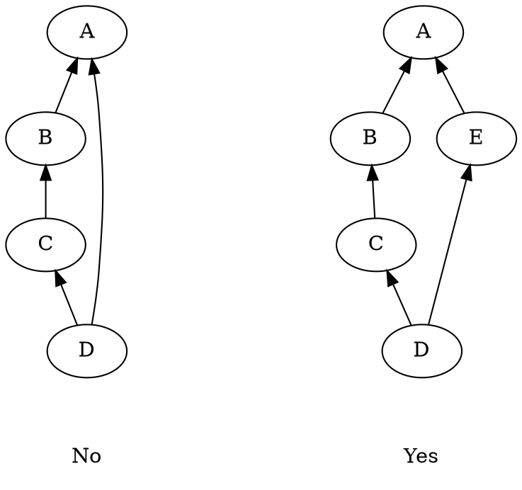

% Typestate
% J. Alex Stark
% 2003--2022


----------------------------------------

Heptodes documents and other content in `doc` directories are licensed under the
[Creative Commons Attribution 4.0 License] (CC BY 4.0 license).

Source code licensed and code samples are licensed under the [Apache
2.0 License].

The CC BY 4.0 license requires attribution.  When samples, examples, figures,
tables, or other excerpts, are used in a tutorial, or a subdivision thereof, it
is sufficient to provide the complete source and license information once.  This
must be close to the beginning, such as in an early acknowledgments slide.  If
this is done, only short notes are required to be placed with each usage, such
as in figure captions.

[Creative Commons Attribution 4.0 License]: https://creativecommons.org/licenses/by/4.0/legalcode
[Apache 2.0 License]: https://www.apache.org/licenses/LICENSE-2.0

----------------------------------------


# Typestate

## States in type or members

In Patinon enumerations and (node/edges) graphs have extensive support. They are
used for specifying typestate, and so have more than the usual importance. As a
project, we want to investigate possible best practices for typestate. It is not
clear if fine-grained state should be incorporated into typestate or an FSM data
field. The FSM approach can still employ static checking, because Patinon
includes value constraints in contracts.

Suppose that we are reading a header and do so in three calls, to be made in
sequence.

```
   part1 := msg.ReadHeader1( ... )
   part2 := msg.ReadHeader2( ... )
   part3 := msg.ReadHeader3( ... )
```

We could create an elaborate typestate for the class (of which msg is an
instance), essentially incorporating an FSM. From the current perspective (that
is, Patinon just starting), we envisage typestate to be best used for coarse
state management. The sequencing of reading parts of a header would be enforced
by entry and exit constraints on the value (that is, state in the member field)
of an internal FSM. Patinon enforces those constraints at compile time.

There are material differences between the approaches. Compile errors would
surface a bit differently. Typestate adds greater formality to the interface,
whereas an FSM can be updated more easily.

## Typestate

### Initialize once

*Patinon* applies initialize-once logic to "const" data. At the point of
variable declaration, which for values means their resource allocation, data is
not initialized.

*   All member fields must be assigned exactly once along each execution path.
*   Handling of iterators arise not at this point envisaged.
*   Conditional branches are handled, as are situations.
*   As soon as all members are assigned along an execution path, the variable
    becomes immutable.
*   When branches merge, the progress towards immutability must match.
*   Actual *initializers*, that is having an initializing contract, typically
    make the initialized object immutable on exit.
*   Const fields of all data, including mutable instances, are assign-once.
*   We may make it possible to hold them open as explicitly mutable until ready.
    This avoids the potential need to copy objects.

While this may seem a little restrictive, it is a whole lot better than C++,
which requires variables to be mutable when they do not need to be.

### Attributes as typestate

Example: After insertion, vector `v.size()` is guaranteed to return greater than
zero, not just greater than or equal.

This is like appending a non-empty false-true typestate as a state product.

Attributes can control the requirements and assurances of methods. For example,
attribute typestate for unique dekeying means that inserting into container must
guarantee disjointness, and then getter will guarantee the same.

### Typestate example

> ```
> struct Point ⌈
>    x :float32
>    y :float32
> ⌋
> ```

> ```
> proc ... ⎡
> ⎥ :( ... )
> ⎥ -> ret_val :int
>    let p :Point                           ; Default is "const", starts out mutable.
>    < Code not touching p...>
> ⎥ else ⎢
>                                           ; Latest allocation of p.
>    p.x := 1.0
>    p.y := 2.5
>                                           ; Automatic enforced immmutability of p.
>    < Code consuming immutable p...>
>                                           ; Earliest finalization of p.
>    < Code not touching p...>
>                                           ; Lifetime limit of scoped p.
> ⎦
> ```

*Patinon* will report the earliest point at which p is ready for finalization,
even though this would still be left until the end for a complex object.
Identifying the last use, and hence the end of life, of data is useful. Simpler
types, such as integers, are released immediately after their last use.

The programming concept of *Patinon* includes explicit downgrading of objects.
For example, files are not automatically closed. More elaborate structures
should always have done this, even though C++ promoted the universal
applicability of destructors.

### Some rules

Typestate graphs share characteristics of enumerations. That is, the node-states
of a typestate graph can be interpreted as enumerations. However, the addition
of edges makes things more interesting.

The complete typestate for an object is often the combination of typestates. For
example, a completion typestate (finalized, allocated, initialized) may be used
together with mutability. When combined, the complete typestate is to a large
extent like the Cartesian product of separate typestates, with each one being
potentially changed independently. Unlike enumerations, in which combinations
are written in tuples, typestates are associated with a type one by one, rather
like independent traits.

Many of the separate underlying typestate graphs are linear and most are trees.
More generally, graphs are required (for the current design) to be planar
directed acyclic graphs (P-DAGs). These are DAGs that can be drawn on a plane
without crossings. In fact, they are specified in this fashion, with ordering of
child nodes. These orderings enable *Patinon* to deal very efficiently with
state inequalities,

Combinations of typestates cannot be written as planar graphs. That is to say
that the Cartesian product of planar graphs is not a planar graph. Conversely,
if a non-planar graph really is needed, it could be separated into a
multi-component typestate graphs. However, even planar graphs are somewhat rare.
Most objects only use trees or linear graphs.

On the other hand, hierarchical typestates, where planar substates expand the
leaves of a planar parent typestate, are themselves planar.

Every branch in a loop must have at least one node (state) on it. If necessary,
an artificial typestate can be added. This means that *Patinon* does not need to
label edges, and can identify all branches via nodes. Only one subsetting branch
should be silently promoting. Multiple branches can demote into one destination
state.



In the left graph above One of the paths in the loop is missing a state. This is
corrected in the right graph. If we specified the state condition `D <= state <=
A` this would be true for any state in the loop. If however, we specified `(D <=
state <= E) OR (E <= state <= A)`, only one branch would yield true. Note that
the second condition must therefore not simplify to the first. This is the most
important reason for this rule: we want always to be able to specify branches.

Sets of typestates are partially ordered sets, or *posets*
([Wikipedia article](supporting.md#PosetWiki)). The ordering of Cartesian
products of states uses the product order.

## From principal

### Lightweight contracts and typestate

#### In the absence of contracts

One sees real code in the manner of the following.

```
function(*inputStructure input_data) {
   if (input_data == null) {
      <Handle null-input situation...>     // This should never happen.
   }
   <Code that is always executed...>
}
```

The function is always called with a valid input pointer, but it cannot assume
that to be the case. So the null-pointer case must be handled. The comment "This
should never happen" appears in real code. There are serious problems with this.
Do we aim for our tests to have complete coverage? If the checks are made deeper
into the function, we often cannot create data that executes that path. One
could elaborate further, but the general picture is that, without even simple
contracts, code is more complex and less well checked, and unnecessary tests are
required creating a burden and distracting from the important.

We should not pretend that any "safe" language is fundamentally that much
better. Invalid data triggers catastrophic failures. How these are caught and
how they surface to the user will vary, but the avoidable underlying problem is
in many ways the same.

#### Limited lightweight contracts

*Patinon* employs function contracts, with the intent that they primarily track
typestate. So the contracts for most functions only note what data is
initialized, what is immutable, and what may be accessed. In some cases integer
ranges are restricted. For example, for `x[i]`, the caller must ensure that the
index is in the valid range.

Contracts are also lightweight. With *Patinon*, all such measures refer to the
overall life of the code. So, we want specifying contracts to be simple. We want
automatic discovery, so that in many cases contracts need not be specified. We
want *Patinon* to generate clear contract documentation in order that
contributors to a codebase receive accurate and targeted assistance. When there
is a problem, the programmer should be given clear explorable debug information.
