--------------------------------------------------------------------------------

Heptodes documents and other content in `doc` directories are licensed under the
[Creative Commons Attribution 4.0 License](CC BY 4.0 license).

Source code licensed and code samples are licensed under the
[Apache 2.0 License].

The CC BY 4.0 license requires attribution. When samples, examples, figures,
tables, or other excerpts, are used in a tutorial, or a subdivision thereof, it
is sufficient to provide the complete source and license information once. This
must be close to the beginning, such as in an early acknowledgments slide. If
this is done, only short notes are required to be placed with each usage, such
as in figure captions.

[Creative Commons Attribution 4.0 License]: https://creativecommons.org/licenses/by/4.0/legalcode
[Apache 2.0 License]: https://www.apache.org/licenses/LICENSE-2.0

--------------------------------------------------------------------------------

<!-- md-formatter off (Document metadata) -->

---
title: Building Jaywalks
author:
- J. Alex Stark
date: 2003--2022
...

<!-- md-formatter on -->

# Section

## Subsection

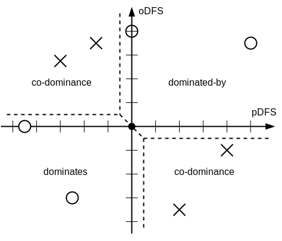

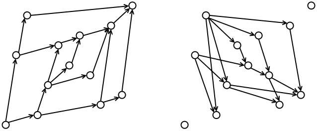

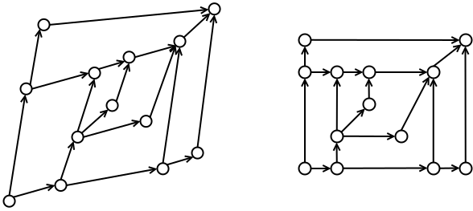

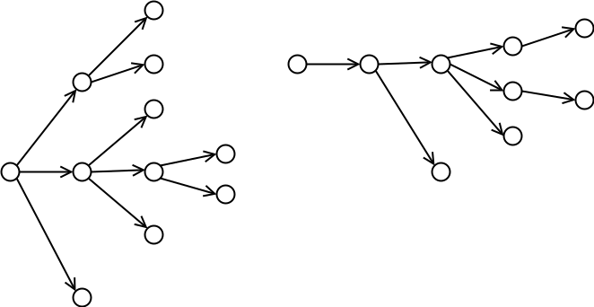

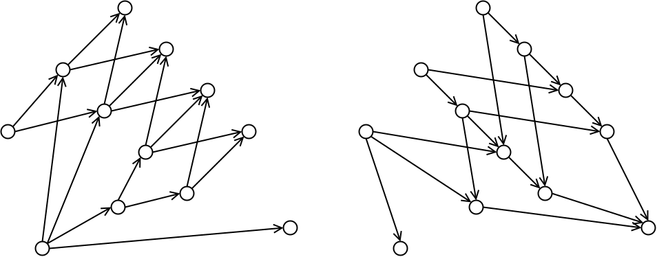

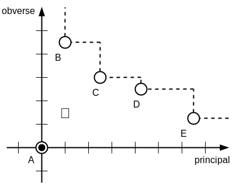

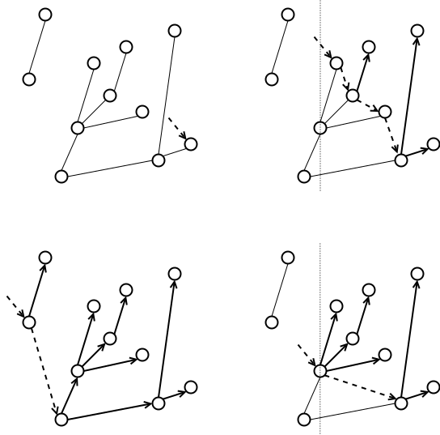

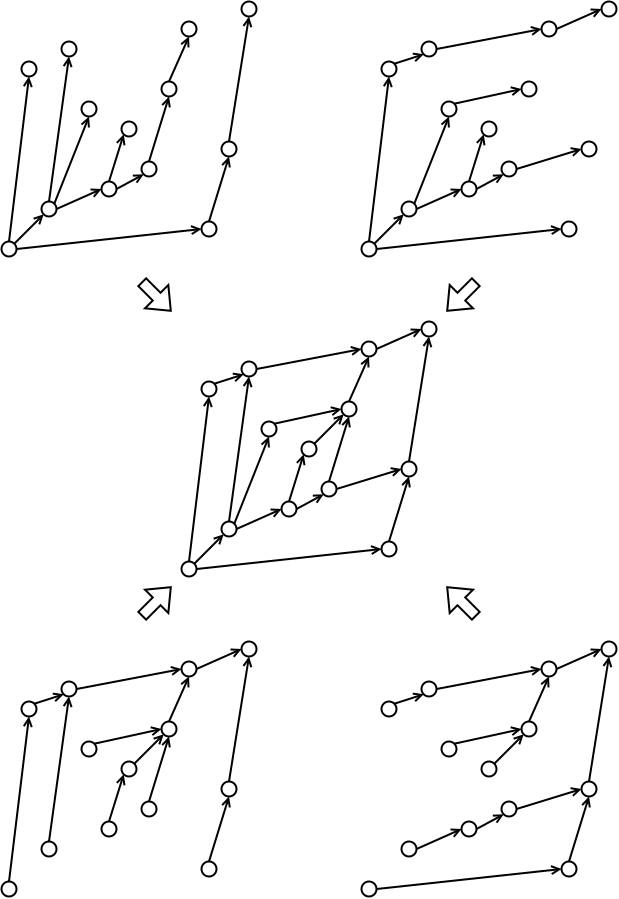

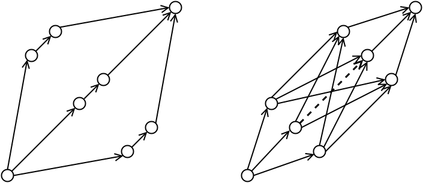

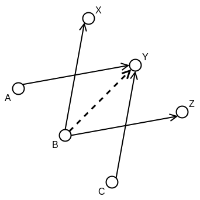

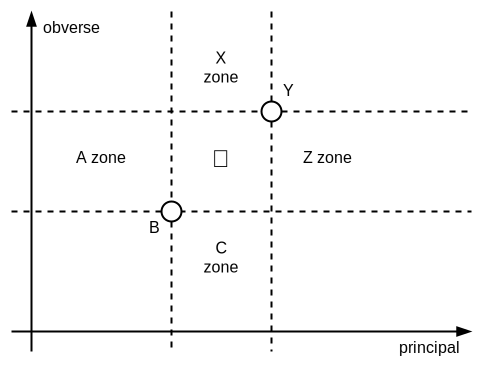

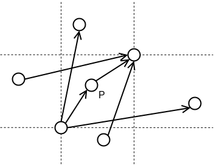

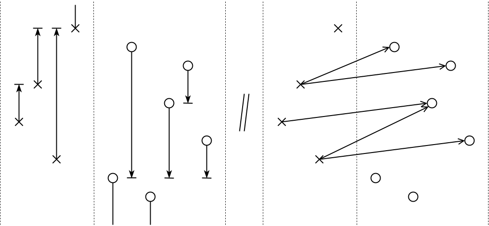

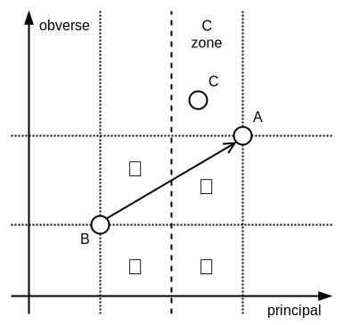

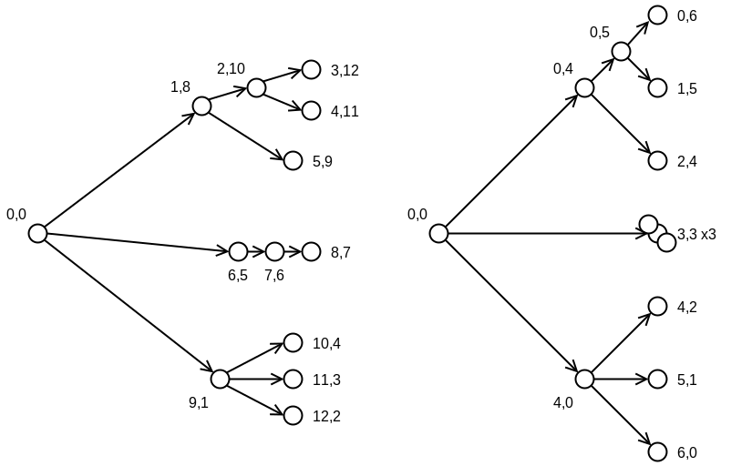

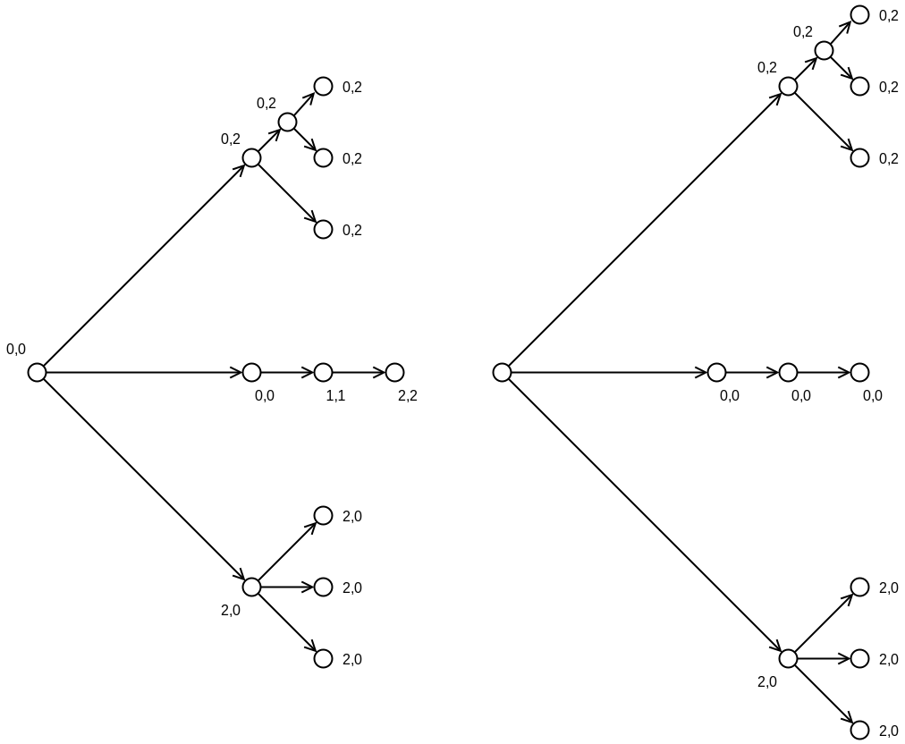

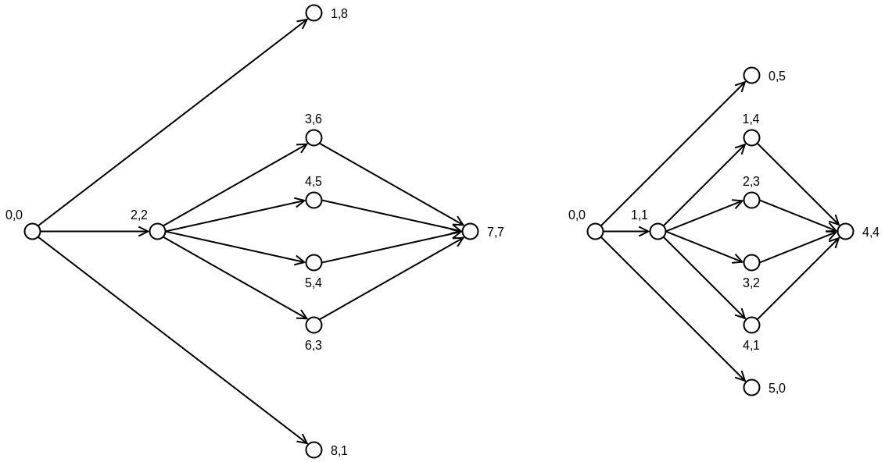

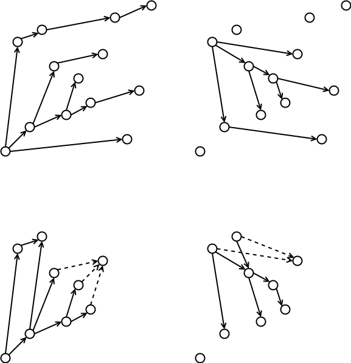
