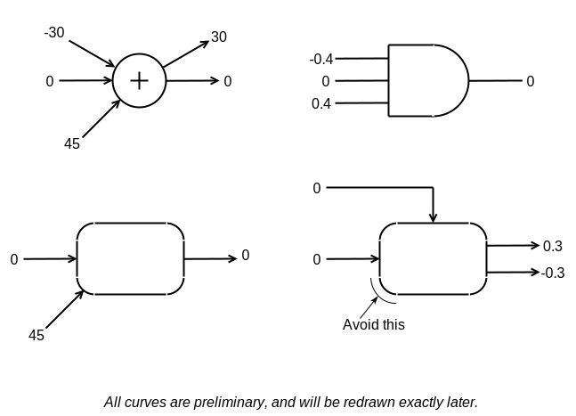

--------------------------------------------------------------------------------

Heptodes documents and other content in `doc` directories are licensed under the
[Creative Commons Attribution 4.0 License](CC BY 4.0 license).

Source code licensed and code samples are licensed under the
[Apache 2.0 License].

The CC BY 4.0 license requires attribution. When samples, examples, figures,
tables, or other excerpts, are used in a tutorial, or a subdivision thereof, it
is sufficient to provide the complete source and license information once. This
must be close to the beginning, such as in an early acknowledgments slide. If
this is done, only short notes are required to be placed with each usage, such
as in figure captions.

[Creative Commons Attribution 4.0 License]: https://creativecommons.org/licenses/by/4.0/legalcode
[Apache 2.0 License]: https://www.apache.org/licenses/LICENSE-2.0

--------------------------------------------------------------------------------

<!-- md-formatter off (Document metadata) -->

---
title: Rational Quadratic Splines and Bézier Splines
author:
- J. Alex Stark
date: 2003--2022
...

<!-- md-formatter on -->

# Task

## General purpose

Zebraix is intended to be a focused utility. In its unextended version it is
restricted to the specifics needed for a limited purpose. Nonetheless, we do not
want it to be unnecessarily narrow. For example, we would like to be able to
draw vertex shapes other than circles. The goal of this document is to explore
design possibilities that meet some fairly basic desires, and to do so in a way
that is flexible. Or put another way, can we leverage the capabilities of
libraries that we are using anyway, without adding a lot of complexity to
Zebraix, and gain useful features?

We can describe two motivating desires, in somewhat technical fashion, as
follows.

a. We would like to be able to construct shapes from the affines transformation
of circle arcs.

b. We need to be able to extract points along curve paths, specifying via a
parameter, such that the locations are evenly distributed.

Why these technical needs? They both have a mix of functional benefits. Consider
the second one. Even if we restricted Zebraix to one or a few arrow types and to
circles with external labels, we would still need to attach the edges to the
circles. We would benefit from being able to lay out edge attachment points
automatically. This benefit would grow quickly with an only modest expansion of
vertex shapes to rectangles, to rounded rectangles parallelograms, and so on.
Cubic splines provide an underlying mechanism for this, but circles and more
general arcs are challenging. Zebraix could take a hard-coded approach to
circles and rectangles. Here we explore what it would take to be more flexible.

For the foreseeable future Zebraix's rendering will be primarily to SVG. Since
any SVG renderer, like Cairo, has to handle text, we assume that it will handle
cubic splines and elliptical arcs. We want to avoid adding a lot of complexity
to Zebraix. We might characterize our present discussion asking what it would
take to "teach Zebraix" about affine transformations and circular arcs, and
hence also affine transformations of circular arcs. This assume that Zebraix
already "knows" about cubic splines.

This document is not short. Nonetheless, the solutions that we propose are not
especially complex or extensive to code, and they are approachable and practical
for the user.

## Specific aims

Cubic splines can, as mentioned, above, be readily split parametrically into
pieces and otherwise be joined, transformed, and specified quite elegantly. On
the other hand, elliptical arcs, and indeed segments of conic sections more
generally, are a bit more tricky, even when expressed as rational polynomials.
Consequently this document is really about rational quadratic splines and how
they might be used in the context of Zebraix. We explore the topics that follow
below. These correspond approximately to sections. From henceforth we will often
abbreviate *rational quadratic spline* to *RQS*.

*   Matching RQSs to cubic splines. Particular attention paid to parabolas, we
    are common to both, and to matching velocities.

*   Path redundancy in RQSs, and bilinear transformation.

*   Conversion of RQSs to elliptical arcs, when appropriate for rendering
    engines.

*   Schemes for distributing points along RQSs.

*   Specification of RQSs in ways that are invariant under affine
    transformation.

*   Conversion of RQSs to approximating cubic splines when the equivalent
    elliptical arc has a very large axis.

# Topic: Matching splines

Familiarity with the content of this section iss assumed in subsequent sections.
We assume familiarity with the basics of cubic Bézier splines, but will try to
give a more standalone discussion of rational quadratic splines. Understanding
of conic sections is assumed.

# Splines foundation

We will base all our discussion on two defining equations: one for cubic
splines, and one for RQSs. The cubic spline is defined with respect to $t$,
which has the range $[0, 1]$ over the path. The path and its derivative are

$$
g(t) = (1-t)^3p_0 + 3t(1-t)^2p_1 + 3t^2(1-t)p_2 + t^3p_3 \text{.} \label{Eq01}
$$

$$
g'(t) = 3(1-t)^2(p_1-p_0) + 6t(1-t)(p_2-p_1) + 3t^2(p_3-p_2) \label{Eq02}
$$

For RQSs, we use a three-point expression along with three weights ($w_A$,
$w_B$, $w_C$). The path and its derivative are

<!-- md-formatter off (Document metadata) -->

$$
f(t) = \frac{%
w_A(1-t)^2p_0 + 2w_Bt(1-t)p_m + w_Ct^2p_3
}{%
w_A(1-t)^2 + 2w_Bt(1-t) + w_Ct^2
} \label{Eq03}
$$

$$
f'(t) = \frac{%
2w_Aw_B(1-t)^2(p_m-p_0) + 2w_Aw_Ct(1-t)(p_3-p_0) + 2w_Bw_Ct^2(p_3-p_m)
}{%
(w_A(1-t)^2 + 2w_Bt(1-t) + w_Ct^2)^2
}\label{Eq04}
$$

<!-- md-formatter on -->

There is redundancy in the weights: they can be multiplied by an arbitrary
scaling factor.

![Examples of cubic splines and rational quadratic splines (RQSs) that fit into
the same parallelogram. The top-left curve is cubic with control points evenly
spaced with respect to the end points. In the next the control points are
unevenly spaced. The top-right curve illustrates the ability of cubic cplines to
take an S shape. (Pandoc has no paragraph break in captions.) The bottom-left
curve is a parabole, and thus is both a cubic spline and a RQS. The next is an
elliptical RQS, and one that is like a quadrant in that it is the affine
transformation of a circle quadrant. Finally, in the bottom-right the curve is
also an elliptical arc, this one with a flatter
shape\label{figA}.](figs/RatQuad-A.svg)

The gradients at the end points are useful for interpreting the specifications.

$$
g'(0) = 3(p_1-p_0) \label{Eq05}
$$

$$
g'(1) = 3(p_3-p_2) \label{Eq06}
$$

$$
f'(0) = \frac{2w_B}{w_A}(p_m-p_0) \label{Eq07}
$$

$$
f'(1) = \frac{2w_B}{w_C}(p_3-p_m) \label{Eq08}
$$

So both forms of spline have readily explicable path directions at the end
points. Cubic splines have a velocity interpretation that is somewhat
understandable, but the three weights in the RQS expression are not very
helpful.

## Matching spline specification

We now proceed to formulate a RQS specification that matches that of cubic
splines. We recommend this for consideration as one method for a real software
package.

Our general approach is to narrow cubic splines to those for which $p_m$ exists.
This is the intersection of the lines from $p_0$ to $p_1$ and $p_3$ to $p_2$. We
then formulate a four-point specification for RQSs that match the cubic
velocities at either end, and that can be identical for parabolas. In a sense
$p_1$ and $p_2$ subdivide the lines to $p_m$. Let us, with this in mind, define
proportions $\lambda$ and $\mu$ according to the following.

$$
p_1-p_0 = \lambda(p_m-p_0) \label{Eq09}
$$

$$
p_2-p_3 = \mu(p_m-p_3) \label{Eq10}
$$

We can match gradients, that is

$$
g'(0) = f'(0) \label{Eq11}
$$

$$
g'(1) = f'(1) \label{Eq12}
$$

if

$$
\lambda = \frac{2w_B}{3w_A} \label{Eq13}
$$

$$
\mu = \frac{2w_B}{3w_C} \label{Eq14}
$$

Aside: we can the rewrite the cubic spline gradients as

$$
g'(t) = 3\lambda(1-t)^2(p_m-p_0) + 6t(1-t)((1-\mu)p_3-(1-\lambda)p_0+(\mu-\lambda)p_m) - 3\mu t^2(p_m-p_3) \label{Eq15}
$$

There should be an exact match for parabolas, since these can be expressed as
cubic splines and RQSs. The following hold for parabolas, simplifying both
$f(t)$ and $g(t)$, and tying in with our subdivision proportions $\lambda$ and
$\mu$.

$$
\lambda = \mu = \frac23 \label{Eq16}
$$

$$
w_A = w_B = w_C \label{Eq17}
$$

$$
f(t) = g(t) = (1-t)^2p_0 + 2t(1-t)p_m + t^2p_3 \label{Eq18}
$$

This general approach works well when it works. It works at infinity. It does
not work will for near-parallel lines. Put more concretely, it works when the
lines from the end points to $p_m$ are parallel and perpendicular to the line
from $p_0$ to $p_3$. Then $p_m$ is at infinity. But the beauty of this approach
is that that is OK. We can specify a semicircle (or half-ellipse) very
conveniently in this way. On the other hand, when $p_0$, $p_3$ and $p_m$ are
colinear, or nearly so, then the ambiguity in specifying $p_m$ via $p_1$ and
$p_2$ is a problem.

# Topic: Path-invariant bilinear transformation

The RQS representation incorporates redundancy. The formula in terms of three
weights is specified by 3 points and 3 weights. We can remove 1 weight as a
degree of freedom, since scaling the numerator and denominator by the same value
leaves $f(t)$ unchanged. Suppose that $f(t)$ produces and elliptical arc. We can
specify an ellipse by its centre, its 2 axis lengths, and a rotation. These
degrees of freedom are equivalent to 2 and half points. We are left with 3
degrees. The beginning and ending angles of the arc account for 2 of these. But
one degree of freedom is left over. What does this control?

The answer is in a bilinear transformation of $t$ that leaves the path unchanged
but changes the speed pattern with which we traverse it. Let

Equation \ref{Eq36}:Eq36.

$$
v(t) = \frac{\sigma t}{1+(\sigma -1)t} \label{Eq36}
$$

For a control parameter $\sigma$. This is basically the general form of a
bilinear transformation for which $v(0)=0$ and $v(1)=1$. The path formula is
modified as follows.

$$
f_\sigma(t) = f(v(t)) =\frac{%
w_A(1-t)^2p_0 + 2\sigma w_Bt(1-t)p_M + \sigma^2 w_Ct^2p_3
}{%
w_A(1-t)^2 + 2\sigma w_Bt(1-t) + \sigma^2 w_Ct^2
} \label{Eq37}
$$

Consider the velocity of the modified path at either end.

$$
f'_\sigma(0) = \left(\frac{2\sigma w_B}{w_A}\right)(p_m-p_0) \label{Eq38}
$$

$$
f'_\sigma(1) = \left(\frac{2w_B}{\sigma w_C}\right)(p_3-p_m) \label{Eq39}
$$

$$
f'_\sigma(0)f'_\sigma(1) = f'(0)f'(1) \label{Eq40}
$$

We can make various observations. First, we can use $\sigma{}^{-1}$ in place of
$\sigma$ to create an inverse modification. More generally, if we transform by
$\sigma_1$ and then by $\sigma_2$, the overall transformation is the same as for
$\sigma=\sigma_1\sigma_2$. Second, for $\sigma>1$, the transformation speeds the
path traversal wrt $t$ at the beginning and slows it at the end. The product of
the two end velocities remains unchanged. This is useful to Zebraix, because it
provides a means for redistributing anchor points along a curve.

Changing the path in this way involves merely moving $p_1$ and $p_2$ such that
the lengths of $p_0$ to $p_1$ , and of $p_3$ to $p_2$, are multiplied by
reciprocal amounts. In other words, we scale $\lambda$ and $\mu$ in opposite
ways. In some cases, especially when manipulating RQSs, it is useful to have
$w_A=w_C$, and equivalently $\lambda=\mu$. This simplifies the denominator of
the RQS and creates a canonical form for a path. We call this *rebalancing*.

![Example elliptical arcs and the distribution of points, shown with $t$ evenly
spread, along the paths. The top-left is a semicircle and the vertical locations
of points are the sines of points evenly distributed by tangent. The middle-top
picture is of half and ellipse, and really only the positions of $p_1$ and $p_2$
are changed. We can further change them (top-right) such that the shape is
unchanged but the points are distributed asymmetrically wrt $t$. (Pandoc has no
paragraph break in captions.) The two lower curves are quarter-ellipses. The
left can be considered a stretched square, with the control points stretched in
like manner. The right has equal path velocities at either end, as might be
chosen if a fairly even spacing of points were
desired\label{figB}.](figs/RatQuad-B.svg)

Some bilinear transformations are illustrated\text{ (see figure \ref{figB}).} In
each case points along the paths are shown, for even distribution of $t$. If we
simply scale the figure, we can change a circle into an ellipse, leaving the
pattern of points essentially unchanged. We can also modify the relative
distances of the control points from the end points. The illustrated
quarter-ellipse curves show how the bilinear transformation provides a means for
spreading the anchor points according to need. For example, one might want a
distribution that is even in one axis. Alternatively, as shown, one might prefer
a distribution that is even along the path direction.

Linear RQSs are basically squashed elliptical arcs, with parabolas as an extreme
case. By *squashed* we mean that the points on the curve are transformed such
that they lie on the line between $p_0$ and $p_3$. Put another way, it is like
decomposing locations into components parallel and perpendicular to that line,
and zeroing the perpendicular component. The drawings along the top of the
figure illustrate this, with the distribution of vertical locations shown. We
can choose a distribution of points that is symmetric or with a chosen degree of
asymmetry. We can also choose the central spread.

A key feature of this four-point specification of RQSs is that it is consistent
under affine transformation. While an affine transformation may result in
unequal changes to the distances to control points, the RQS is consistently
transformed.

# Topic: Arc angles

## Quarter circles and semicircles

![Quarter-circle and semicircle surves. The left curve shows the control points
for a quarter circle, for which the RQS formula combines the tan-half-angle
formulae for sine and cosine. If we extend the range of tan half angles to
$[-1,1]$, we get a semicircle. RQS paths require a parameter in the range
$[0,1]$, but we can obtain the wider range by simple scale and offset. The
corresponding control points are shown for the right
curve\label{figD}.](figs/RatQuad-D.svg)

A RQS can be used to generate a quarter circle if it is formulated in terms of
tan half angles. That is, we can write

$$
f_Q(t) = \begin{bmatrix}
\frac{1-t^2}{1+t^2} \\
\frac{2t}{1+t^2}
\end{bmatrix} \label{Eq34}
$$

since $t$ is in the range $[0,1]$. This is illustrated\text{ (see figure
\ref{figD}). We can write this in termsof $p_m$ and so on, and we can
characterize in terms of control points.

$$
f_Q(t) = \frac{%
(1-t)^2\begin{bmatrix}1\\0\end{bmatrix} + 2t(1-t)\begin{bmatrix}1\\1\end{bmatrix} + 2t^2\begin{bmatrix}0\\1\end{bmatrix}
}{%
(1-t)^2 + 2t(1-t) + 2t^2
} \label{Eq41}
$$

We can also extend the curve to a semicircle. If we do this by extending the
tan-half-angle range to $[-1,1]$, we can keep $t$ to its RQS range by using
$2t-1$.

<!-- md-formatter off (Document metadata) -->

$$
f_S(t) = \begin{bmatrix}
\frac{1-(2t-1)^2}{1+(2t-1)^2} \\
\frac{2(2t-1)}{1+(2t-1)^2}
\end{bmatrix}  \label{Eq42}
$$

$$
f_S(t) = \begin{bmatrix}
\frac{2t(1-t)}{t^2+(1-t)^2} \\
\frac{t^2-(1-t)^2}{t^2+(1-t)^2}
\end{bmatrix} \label{Eq35}
$$

<!-- md-formatter on -->

While we can write a quarter-circle RQS in terms of $p_m$, this is not possible
for a semiscircle RQS, since there is no intersection. Nonetheless, we can get
close.

$$
f_S(t) = \frac{%
(1-t)^2\begin{bmatrix}0\\-1\end{bmatrix} + 2t(1-t)\begin{bmatrix}1\\0\end{bmatrix} + t^2\begin{bmatrix}0\\1\end{bmatrix}
}{%
(1-t)^2 + (0)2t(1-t) + t^2
}  \label{Eq43}
$$

## General circular arc

In like manner to the semicircle we can create a symmetric circular arc RQS as
illustrated\text{ (see figure \ref{figE}). Let$\delta$ be the tangent of half
the arc angle. If we take the quarter circle RQS and replace $t$ with $\delta
t$.

$$
f_\delta(t) = \frac{%
(1-t)^2\begin{bmatrix}r\\0\end{bmatrix} + 2t(1-t)\begin{bmatrix}r\\r\delta\end{bmatrix} + (1+\delta^2)t^2\left(\frac{1}{1+\delta^2}\right)\begin{bmatrix}r(1-\delta^2)\\2r\delta\end{bmatrix}
}{%
(1-t)^2 + 2t(1-t) + (1+\delta^2)t^2
} \label{Eq44}
$$

While XXXXXXXXXXXX

Equation \ref{Eq45}:Eq45.

$$
f'_\delta(t) = r\delta f'_Q(\delta t)\label{Eq45}
$$

Equation \ref{Eq46}:Eq46.

$$
f'_Q(t) = 2\begin{bmatrix}
\frac{-2t}{(1+t^2)^2} \\
\frac{1-t^2}{(1+t^2)^2}
\end{bmatrix} \label{Eq46}
$$

Equation \ref{Eq47}:Eq47.

$$
f'_\delta(0) = 2r\delta\begin{bmatrix}
0\\1
\end{bmatrix} \label{Eq47}
$$

Equation \ref{Eq48}:Eq48.

$$
f'_\delta(1) = \left(\frac{2r\delta}{1+\delta^2}\right)%
\begin{bmatrix}
\frac{-2\delta}{1+\delta^2} \\
\frac{1-\delta^2}{1+\delta^2}
\end{bmatrix} \label{Eq48}
$$

Equation \ref{Eq49}:Eq49.

$$
\left| f'_\delta(1) \right| = \frac{2r\delta}{1+\delta^2} \label{Eq49}
$$

Equation \ref{Eq50}:Eq50.

$$
3\lambda\left|p_m-p_0\right|\,3\mu\left|p_m-p_3\right| =
\left|f'_\delta(0)\right|\,\left|f'_\delta(1)\right| \label{Eq50}
$$

Equation \ref{Eq51}:Eq51.

$$
9\lambda\mu(r\delta)^2 = \frac{4(r\delta)^2}{1+\delta^2} \label{Eq51}
$$

Equation \ref{Eq52}:Eq52.

$$
\lambda\mu = \frac{4}{9(1+\delta^2)} \label{Eq52}
$$

Equation \ref{Eq53}:Eq53.

$$
\lambda\mu = \frac{2}{9}(1-\cos(\Omega)) \label{Eq53}
$$

Equation \ref{Eq54}:Eq54.

$$
\left|p_1-p_0\right| = \frac13(a+b-c) \label{Eq54}
$$

Equation \ref{Eq55}:Eq55.

$$
\left|p_2-p_3\right| = \frac13(a-b+c) \label{Eq55}
$$

Equation \ref{Eq56}:Eq56.

$$
9\left|p_1-p_0\right|\,\left|p_2-p_3\right| =
2bc-(b^2+c^2-a^2) \label{Eq56}
$$

Equation \ref{Eq57}:Eq57.

$$
9\left|p_1-p_0\right|\,\left|p_2-p_3\right| =
2bc(1-\cos(\Omega)) \label{Eq57}
$$

Equation \ref{Eq58}:Eq58.

$$
9\left|p_1-p_0\right|\,\left|p_2-p_3\right| =
2\lambda\mu bc \label{Eq58}
$$

# Figures and tables

<!-- md-formatter off (Document metadata) -->

--------------------------------------------------------------------------------
Arc type                           Angle range                         $\beta$       $\rho$         $\alpha$
---------------------------------  -------------                       -----------   -----------    -----------
Parabola                           $-\epsilon^\circ,\epsilon^\circ$    $0$           $1$            $1$

Arc less than semicircle                                               $(0,2)$       $(0,1)$        $(1/2,1)$

Semicircle                         $-90^\circ,90^\circ$                $2$           $0$            $1/2$

Arc greater than semicircle                                            $(2,\infty)$  $(-1,0)$       $(0,1/2)$

Full circle / indeterminate        $-180^\circ,180^\circ$              $\infty$      $-1$           $0$
--------------------------------------------------------------------------------

Table: CCCC brevity.\label{tabH}

<!-- md-formatter on -->

<!-- md-formatter off (Document metadata) -->

------------------------------------------------------------------------------------------------------
Vertegram face style             $\tau=$                                 $\tau=$
-------------------------------  ----------------------------            ----------------------------
Linear-tangent                   $u$                                     $\tan(\phi)$

Circular-tan-half                $\tan(\tfrac12\tan^{-1}(u))$            $\tan(\phi/2)$

Sin-tan-half                     $\tan(\tfrac12\sin^{-1}(u))$            $\tan(\tfrac12\sin^{-1}(u\tan(\phi)))$
------------------------------------------------------------------------------------------------------

Table: CCCC brevity.\label{tabL}

<!-- md-formatter on -->

# Equations

Equation \ref{Eq19}:Eq19.

$$
d = p_3-p_0 \label{Eq19}
$$

Equation \ref{Eq20}:Eq20.

$$
n\cdot d = 0 \label{Eq20}
$$

Equation \ref{Eq21}:Eq21.

$$
a = p_1-p_0 = \lambda(p_m-p_0) \label{Eq21}
$$

Equation \ref{Eq22}:Eq22.

$$
b = p_2-p_3 = \lambda(p_m-p_3) \label{Eq22}
$$

Equation \ref{Eq23}:Eq23.

$$
d = \frac{a}{\lambda} - \frac{b}{\mu} \label{Eq23}
$$

Equation \ref{Eq24}:Eq24.

$$
\frac{a\cdot n}{\lambda} - \frac{b\cdot n}{\mu} = 0 \label{Eq24}
$$

Equation \ref{Eq25}:Eq25.

$$
\frac{a\cdot d}{\lambda} - \frac{b\cdot d}{\mu} = \left| d\right|^2 \label{Eq25}
$$

Equation \ref{Eq26}:Eq26.

$$
\lambda = \frac{\gamma\left| d\right|^2}{b\cdot n} \label{Eq26}
$$

Equation \ref{Eq27}:Eq27.

$$
\lambda = \frac{\gamma\left| d\right|^2}{a\cdot n} \label{Eq27}
$$

Equation \ref{Eq28}:Eq28.

$$
\gamma = \frac{(a\cdot d)(b\cdot n)-(b\cdot d)(a\cdot n)}{\left| d\right|^4} \label{Eq28}
$$

Equation \ref{Eq29}:Eq29.

$$
w_A = \frac{3(b\cdot n)}{2\left| d\right|^2} \label{Eq29}
$$

Equation \ref{Eq30}:Eq30.

$$
w_B = \left(\frac{3}{2}\right)^2\gamma \label{Eq30}
$$

Equation \ref{Eq31}:Eq31.

$$
w_C = \frac{3(a\cdot n)}{2\left| d\right|^2} \label{Eq31}
$$

Equation \ref{Eq32}:Eq32.

$$
w_A \neq 0 \label{Eq32}
$$

Equation \ref{Eq33}:Eq33.

$$
w_C \neq 0 \label{Eq33}
$$

Equation \ref{Eq59}:Eq59.

$$
a\cdot n \neq 0 \label{Eq59}
$$

Equation \ref{Eq60}:Eq60.

$$
b\cdot n \neq 0 \label{Eq60}
$$

Equation \ref{Eq61}:Eq61.

$$
p_n = w_Bp_m =
\left(\frac32\right)^2\gamma\left(
p_0 + \left(\frac{b\cdot n}{\gamma \left| d\right|^2}\right)(p_1-p_0)
\right) \label{Eq61}
$$

Equation \ref{Eq62}:Eq62.

$$
p_n =
\left(\frac32\right)^2\left(
\gamma\, p_0 + \left(\frac{b\cdot n}{\left| d\right|^2}\right) a
\right) \label{Eq62}
$$

Equation \ref{Eq63}:Eq63.

$$
p_n =
\left(\frac32\right)^2\left(
\gamma\, p_3 + \left(\frac{a\cdot n}{\left| d\right|^2}\right) b
\right) \label{Eq63}
$$

Equation \ref{Eq64}:Eq64.

$$
a = \left|p_3-p_0\right| \label{Eq64}
$$

Equation \ref{Eq65}:Eq65.

$$
b = \left|p_m-p_0\right| \label{Eq65}
$$

Equation \ref{Eq66}:Eq66.

$$
c = \left|p_m-p_3\right| \label{Eq66}
$$

Equation \ref{Eq67}:Eq67.

$$
\sigma = \sqrt\frac{w_A}{w_C} \label{Eq67}
$$

Equation \ref{Eq68}:Eq68.

$$
\left|p_m-p_3\right| = \left|p_m-p_0\right| \label{Eq68}
$$

Equation \ref{Eq69}:Eq69.

$$
\rho = \frac{w_B}{\sqrt{w_Aw_C}} \label{Eq69}
$$

Equation \ref{Eq70}:Eq70.

$$
p_q = \rho p_m \label{Eq70}
$$

Equation \ref{Eq71}:Eq71.

$$
p_q = \left(\frac{1}{\sqrt{w_Aw_C}}\right) p_n \label{Eq71}
$$

Equation \ref{Eq72}:Eq72.

$$
p_q = \left(\frac23\right)\frac{\left|d\right|^2}{\sqrt{(a\cdot n)(b\cdot n)}} \label{Eq72}
$$

Equation \ref{Eq73}:Eq73.

$$
f_\rho(t) = \frac{%
\Bigl(\frac12-t\Bigr)^2p_0 + 2\Bigl(\frac12-t\Bigr)\Bigl(\frac12+t\Bigr)p_q + \Bigl(\frac12+t\Bigr)^2p_3
}{%
\Bigl(\frac12-t\Bigr)^2 + 2\rho\Bigl(\frac12-t\Bigr)\Bigl(\frac12+t\Bigr) + \Bigl(\frac12+t\Bigr)^2
} \label{Eq73}
$$

Equation \ref{Eq74}:Eq74.

$$
\alpha = \frac12(1+\rho) \label{Eq74}
$$

Equation \ref{Eq75}:Eq75.

$$
\alpha\beta^2 = \frac12(1-\rho) \label{Eq75}
$$

Equation \ref{Eq76}:Eq76.

$$
f_\rho(t) = \frac{%
\frac14\bigl(p_0+2p_q+p_3) + t\bigl(p_3-p_0\bigr) + t^2\bigl(p_o-2p_q+p_3\bigr)
}{%
\alpha(1+\beta^2t^2)
} \label{Eq76}
$$

Equation \ref{Eq77}:Eq77.

$$
p_a = \frac1{8\alpha}\Bigl(p_0+2p_q+p_3\Bigr) + \frac1{2\alpha\beta^2}\Bigl(p_0-2p_q+p_3\Bigr) \label{Eq77}
$$

Equation \ref{Eq78}:Eq78.

$$
p_c = \frac1{8\alpha}\Bigl(p_0+2p_q+p_3\Bigr) - \frac1{2\alpha\beta^2}\Bigl(p_0-2p_q+p_3\Bigr) \label{Eq78}
$$

Equation \ref{Eq79}:Eq79.

$$
p_s(t) = \frac1{2\alpha\beta}\Bigl(p_3-p_0\Bigr) \label{Eq79}
$$

Equation \ref{Eq80}:Eq80.

$$
f_\rho(t) = p_a + \left(\frac{2\beta t}{1+\beta^2 t^2}\right)p_s + \left(\frac{1-\beta^2 t^2}{1+\beta^2 t^2}\right)p_c \label{Eq80}
$$

Equation \ref{Eq81}:Eq81.

$$
\left[\, -2\tan^{-1}\left(\frac\beta2\right),\,\, 2\tan^{-1}\left(\frac\beta2\right)\, \right] \label{Eq81}
$$

Equation \ref{Eq82}:Eq82.

$$
(a\cdot n)(b\cdot n) > 0 \label{Eq82}
$$

Equation \ref{Eq83}:Eq83.

$$
\lambda\mu > 0 \label{Eq83}
$$

Equation \ref{Eq84}:Eq84.

$$
w_Aw_C > 0 \label{Eq84}
$$

Equation \ref{Eq85}:Eq85.

$$
\frac{(a\cdot n)(b\cdot n)}{\left|d\right|^2} \label{Eq85}
$$

Equation \ref{Eq86}:Eq86.

$$
-1 < \rho < 1 \label{Eq86}
$$

Equation \ref{Eq87}:Eq87.

$$
w_B = \sqrt{w_Aw_C} \label{Eq87}
$$

Equation \ref{Eq88}:Eq88.

$$
w_B = \left(\frac32\right) \frac{\sqrt{(a\cdot n)(b\cdot n)}}{\left|d\right|^2} \label{Eq88}
$$

Equation \ref{Eq89}:Eq89.

$$
f_\alpha(t) = (1-t)^3p_0 + 3t(1-t)^2\left(\frac23p_q + \frac13p_0\right) + 3t^2(1-t)\left(\frac23p_q + \frac13p_3\right) + t^3p_3 \label{Eq89}
$$

Equation \ref{Eq90}:Eq90.

$$
\lambda = \sigma\sqrt{\frac29\Bigl(1-\cos(\Omega)\Bigr)} = \frac{2w_B}{3w_A} \label{Eq90}
$$

Equation \ref{Eq91}:Eq91.

$$
\mu = \frac1\sigma\sqrt{\frac29\Bigl(1-\cos(\Omega)\Bigr)} = \frac{2w_B}{3w_C} \label{Eq91}
$$

Equation \ref{Eq92}:Eq92.

$$
w_A = \frac1\sigma \label{Eq92}
$$

Equation \ref{Eq93}:Eq93.

$$
w_B = \sqrt{\frac{1-\cos(\Omega)}{2}} = \rho \label{Eq93}
$$

Equation \ref{Eq94}:Eq94.

$$
w_C = \sigma \label{Eq94}
$$

Equation \ref{Eq95}:Eq95.

$$
XXX \label{Eq95}
$$

Equation \ref{Eq96}:Eq96.

$$
XXX \label{Eq96}
$$

Equation \ref{Eq97}:Eq97.

$$
XXX \label{Eq97}
$$

Equation \ref{Eq98}:Eq98.

$$
XXX \label{Eq98}
$$

Equation \ref{Eq99}:Eq99.

$$
XXX \label{Eq99}
$$

Equation \ref{Eq100}:Eq100.

$$
XXX \label{Eq100}
$$

Equation \ref{Eq101}:Eq101.

$$
XXX \label{Eq101}
$$

Equation \ref{Eq102}:Eq102.

$$
XXX \label{Eq102}
$$

Equation \ref{Eq103}:Eq103.

$$
XXX \label{Eq103}
$$

Equation \ref{Eq104}:Eq104.

$$
XXX \label{Eq104}
$$

Equation \ref{Eq105}:Eq105.

$$
XXX \label{Eq105}
$$

Equation \ref{Eq106}:Eq106.

$$
XXX \label{Eq106}
$$

Equation \ref{Eq107}:Eq107.

$$
XXX \label{Eq107}
$$

Equation \ref{Eq108}:Eq108.

$$
XXX \label{Eq108}
$$

Equation \ref{Eq109}:Eq109.

$$
XXX \label{Eq109}
$$
