---
author:
- J. Alex Stark
date: 2003–2023
title: Building Jaywalks
---

- [1 Task](#task)
  - [1.1 Relation to
    mergesort](#relation-to-mergesort)
  - [1.2 Jaywalks](#jaywalks)
  - [1.3 Inequality and
    co-dominance jaywalks](#inequality-and-co-dominance-jaywalks)
- [2 Scope and
  expectations](#scope-and-expectations)
- [3 Subtypes and
  complexity](#subtypes-and-complexity)
  - [3.1 Trees](#trees)
  - [3.2 Crossings](#crossings)
  - [3.3
    Complexity](#complexity)
- [4 Basic
  algorithms](#basic-algorithms)
  - [4.1 Brute
    force](#brute-force)
  - [4.2 DFS trees](#dfs-trees)
  - [4.3 DFS tree
    building](#dfs-tree-building)
  - [4.4 Tree-only
    building](#tree-only-building)
- [5 Imperfect, perfect,
  not](#imperfect-perfect-not)
  - [5.1 Four
    trees](#four-trees)
  - [5.2
    Incompleteness](#incompleteness)
- [6 Recursive
  merge](#recursive-merge)
  - [6.1 Dual graph
    builder](#dual-graph-builder)
  - [6.2 Joining
    subgraphs](#joining-subgraphs)
  - [6.3 Stack
    optimization](#stack-optimization)
  - [6.4 Unparented
    vertices](#unparented-vertices)
  - [6.5 Base
    algorithm](#base-algorithm)
- [7 Enhanced merge
  builder](#enhanced-merge-builder)
  - [7.1 Strategy for
    trees](#strategy-for-trees)
  - [7.2 Skipping](#skipping)
  - [7.3
    Crossings](#crossings-1)
- [8 Graph
  compaction](#graph-compaction)
  - [8.1 Basic
    compaction](#basic-compaction)
  - [8.2 Separating
    coincidences](#separating-coincidences)
  - [8.3 Aligned
    compaction](#aligned-compaction)
  - [8.4 Non-tree sole
    edges](#non-tree-sole-edges)
  - [8.5 Non-linear
    stretch](#non-linear-stretch)
  - [8.6 Variations and
    details](#variations-and-details)
- [9 Additional material:
  Dual-graph builder](#additional-material-dual-graph-builder)
- [10 Other ideas](#other-ideas)
  - [10.1 Relation to
    mergesort](#relation-to-mergesort-1)

------------------------------------------------------------------------

Heptodes documents and other content in `doc` directories are licensed
under the [Creative Commons Attribution 4.0
License](CC%20BY%204.0%20license).

Source code licensed and code samples are licensed under the [Apache 2.0
License](https://www.apache.org/licenses/LICENSE-2.0).

The CC BY 4.0 license requires attribution. When samples, examples,
figures, tables, or other excerpts, are used in a tutorial, or a
subdivision thereof, it is sufficient to provide the complete source and
license information once. This must be close to the beginning, such as
in an early acknowledgments slide. If this is done, only short notes are
required to be placed with each usage, such as in figure captions.

------------------------------------------------------------------------

<!-- mdformat off (Document metadata) -->
<!-- mdformat on -->

# Task

This document describes methods for building a jaywalk DAG data
structure from a representation in terms of pDFS and oDFS indices, or an
equivalent. The process of decompressing textual representation is
covered elsewhere.

## Relation to mergesort

See note at end.

## Jaywalks

A jaywalk has the following characteristics.

1.  The vertices form a poset of order-dimension 2. Specifically, we can
    check to see if one vertex is the descendant of another by comparing
    the principal and obverse orderings (indices).

2.  The graph is transitively irreducible. That is, only edges required
    for reachability are included.

3.  When comparing vertices we permit equal values in either the
    principal or obverse indices, but not both. That means that we can
    order vertices using lexicographic sorting. For instance, we obtain
    the principal ordering by comparing principal indices. Where two are
    equal, we compare obverse indices to disambiguate.

4.  There must only be external sources and sinks. That is, while it is
    not required to have a single external source and single external
    sink, it must always be possible to add them and connect them to the
    existing sources and sinks without introducing edge crossings.

<figure>

<figcaption aria-hidden="true">Lexicographic comparison of principal and
obverse indices. The diagram shows, with respect to the vertex in the
centre, the locations or combinations of indices that a vertex can have
to be in a dominant or co-dominant relationship. If a vertex has
strictly greater principal and obverse indices (upper-right quadrant) it
is reachable in the dominance drawing. Likewise, vertices in the
bottom-left quadrant can reach the vertex in question. In contrast,
vertices in the top-left and bottom-right quadrants have a reachability
relationship only in the co-dominance drawing. On the axes, we employ a
lexicographic comparison so here vertices are reachable only in the
dominance. Therefore dominance and co-dominance drawings are not quite
complementary in regard to handling comparisons for
reachability.</figcaption>
</figure>

In the figure we clarify the comparison of indices and how that tests
for reachability. Notice in particular that in a co-dominance drawing
both indices must be strictly greater than (or less than).

In some cases we will “receive” jaywalks in tidy and compact indexed
form. One input form is a vector of vertices sorted in pDFS order with
forward-backward links that chain the vertices in oDFS order. This is
also the standard internal form that we will assume as our starting
point for the builder algorithms. In other words, the main concern of
this document is how to take a jaywalk in this form and add
(parent-child) edges. An alternative standard form of input has oDFS
indices instead. Algorithms can choose either, and some will implicitly
create an oDFS sort.

## Inequality and co-dominance jaywalks

In order to be flexible, and to support compact renderings of jaywalks,
we use use inequalities when comparing the principal and obverse indices
of two vertices. This is illustrated in the preceding figure. One vertex
dominates another, that is can reach the other, if both prinicipal and
obverse coordinates are less than those of the other. For the dominance
drawings we also allow either principal or obverse index to be equal,
but not both. Another view on this is that we can find the pDFS order by
sorting by principal indices, and resolving ties lexicographically by
then applying a stable sort by obverse indices.

For practical convenience, when processing input provided in the form of
principal and obverse values (indices), we assume that those values are
integral. We do not assume that the values form a contiguous sequence.

<figure>
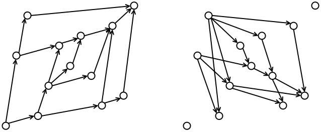
<figcaption aria-hidden="true">An example jaywalk and its corresponding
co-dominance drawing. This can be obtained by inverting the obverse
values, or equivalently by reversing the oDFS order.</figcaption>
</figure>

If we reverse the oDFS order, or alternatively negate the obverse
coordinates, we convert the dominance drawing of a jaywalk to its
co-dominance drawing. Note, one could flip the principal order, but we
chose as our convention to flip the obverse order. This is for the
practical reason that we store jaywalk vertices in a vector in pDFS
order.

Also observe that, if we use inequalities to resolve equal principal and
obverse coordinates, that we can no longer simply flip the obverse
coordinates. We now have to change the comparison. Only strictly
greater-than coordinates establish reachability in the co-dominance
drawing. This ensures the universal rule that, if we pick two vertices,
one will be reachable from the other in either the dominance drawing or
the co-dominance drawing, but not both.

# Scope and expectations

The present investigation is intentionally limited in scope. We aim to
find efficient and acceptable algorithms. We try to set out further
optimization ideas but do not explore these exhaustively. While we have
a fairly clear idea of the kinds of graphs that will be commonly
encountered, it is better to wait until we have a substantial corpus of
real examples before optimizing in fine detail. Our priorities are as
follows.

- The worst-case scenarios should be handled well. That is, for example,
  we want to avoid $O(N^2)$ algorithms.

- Graphs will often be small, so a simpler $O(N\log(N))$ algorithm may
  be preferrable to an elaborate $O(N)$ algorithm.

- General efficiency across a range of graph forms is important. Highly
  complex bookkeeping is to be avoided. Code should not be heavy on
  special casing.

- After initial sorting, at least with respect to pDFS order, it is
  desirable that shallow trees and trees of chained stages (deep trees)
  should be handled in $O(N)$, much like sorting algorithms that are
  efficient when receiving data that is close to sorted.

<figure>
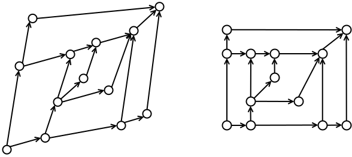
<figcaption aria-hidden="true">Illustration of a fully-constructed
jaywalk. In the left drawing the coordinates are strictly greater-than
and less-than. In the right drawing vertices share principal and obverse
coordinates. Lexicographic comparison can be used to test order and
reachability. The right drawing is substantially more compact, with a
6 × 5 grid instead of a 13 × 13 grid, but the result is not
necessarily more readable. Some edges have more prominence, and some
appear to have different meaning.</figcaption>
</figure>

While rendering is not part of the present discussion, we do consider
methods for compacting layouts. An example is illustrated. In
particular, it is desirable to render enumeration-like trees
(“treenums”) so that leaves line up. We include them because such layout
adjustments are algorithmic.

Finally, we want to be especially efficient when handling jaywalks that
embody code entities. These arrive with sorted vertices and contiguous
coordinates.

# Subtypes and complexity

## Trees

<figure>
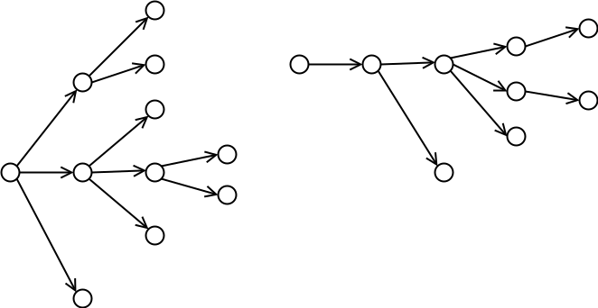
<figcaption aria-hidden="true">Examples of trees: A shallow tree has few
levels compared to the number of vertices (left), whereas a narrow and
deep tree is used more like a chain of states with short side off-shoots
(right).</figcaption>
</figure>

Many of the jaywalks we use in practice will be trees. We wish to handle
these well, especially those that are either shallow or deep.
Hierarchicial enumerations may often be shallow, and typestate graphs
will often be chain-like. Of the permissions and typestate graphs that
are not trees, many will be mostly tree-like, with few and simple
merges. See the illustration.

## Crossings

<figure>
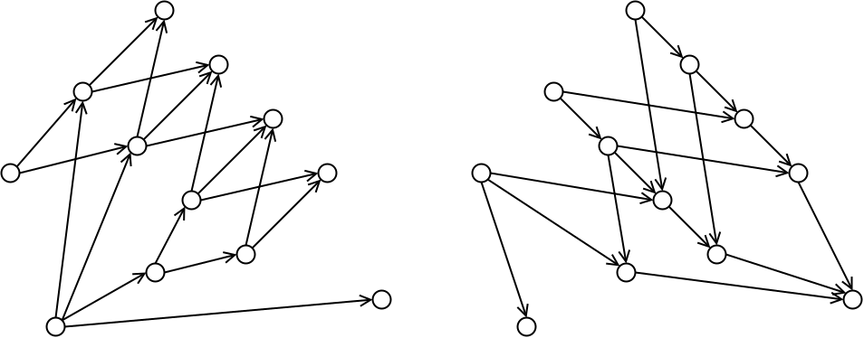
<figcaption aria-hidden="true">An example of a graph with crossings,
and, for reference, the co-dominance graph. This illustrates how a graph
with few edges can have a corresponding graph with many. If we stretch
the graph spacing in the direction bottom-left to top-right, the
co-dominance graph will become simpler and the dominance graph more
complex..</figcaption>
</figure>

While st-planar graphs, which have no crossings, are always
order-dimension 2, and so can be plotted in a dominance drawing without
crossings, the converse is not true. Moreover, it is important to note
that even a simple arrangement of vertices can have many crossings. In
fact, a simple co-dominance graph can have a complex dominance graph,
and vice versa. An example is shown, illustrating how, in the worst
case, a graph can have $N^2/4$ crossings.

## Complexity

The input we receive when building a jaywalk varies according to the use
case. (Recall that building is the task of adding edges to the vertex
data structures.) In the case of minimal input, which is basically
coordinates, the task is $O(N\log(N))$ since we have to sort principal
and obverse indices. Even if the sort is implicit, it is there in the
background. We know this because the sorted indices can be recovered in
$O(N)$ time from the fully built graph. That said, note the following.

- In many case an $O(N)$ sort may be achievable, because we can use an
  efficient heap sort if, say, the principal indices are in a
  near-contiguous ranges of integers. On the other hand the need, in
  many cases, to fall back on a lexicographic sort complicates matters.

  We have chosen to use mergesort for our initial sort, if not a
  built-in sort, since that fits the scope of this study.

- (Side note.) If the principal and obverse indices are contiguous
  integers in the range $[0,N)$, the lexicographic comparison can be
  based on obverse index + (principal index / $N$), or a similar
  expression, thus simplifying the sort. Or a sub-sort might be
  employed.

- Once ordered principal indices are found, the obverse sort may be
  integrated into the graph-building process. In the manner of mergesort
  optimization, it would be good if this could run at $O(N)$ for special
  cases. In the extreme case of a simple chain the obverse coordinates
  will be in order already. If the graph is a depth-1 tree, they will be
  pre-sorted in reverse order.

The complexity of builder algorithms are, fairly generally,

$$
a_0 + a_1N + a_2N\log(N) + a_3N^2 + a_Dm_D + a_CM_C
$$

where $N$ is the number of vertices, $m_D$ is the number of dominance
graph edges, and $M_C$ is the number of co-dominance graph edges. Since
for the most part we do not need the co-dominance graph, an ideal
general algorithm without presort of obverse coordinates has complexity

$$
a_0 + a_1N + a_2N\log(N) + a_Dm_D
$$

If the graph is a tree we hope to achieve close to

$$
a_0 + a_1N + a_Dm_D
$$

noting further that $m_D=N$ (strictly $N-1$) for a tree. Since we have
small graphs it is important that achieving this complexity does not
come at too great a cost. In other words, an algorithm with high $a_1$,
but zero $a_2$ is not really preferrable to one that is efficient with
non-zero $a_2$.

# Basic algorithms

## Brute force

<figure>

<figcaption aria-hidden="true">The vertex A has children B, C, D and E.
Vertices right and above are reachable from A, but any beyond the dashed
line are also reachable from B, C, D or E and so are not children of
A..</figcaption>
</figure>

The most basic algorithm is to go through each vertex and find its
children by scanning through all vertices with higher principal index.
The process is illustrated, showing the case of scanning children of A.
Suppose that we scan potential candidates in order of increasing
principal index. We then need to track the minimum obverse index of
children so far added, since the child with the lowest obverse
eliminates all higher vertices, since it can reach them.

## DFS trees

We have stated that DFS provide the indices that can serve as
coordinates. At this point we set out exactly what we mean by pDFS,
oDFS, and the trees associated with them. A pDFS tree is a tree composed
using edges from the DAG, but only those traversed during the principal
depth-first search. An example is shown.

<figure>
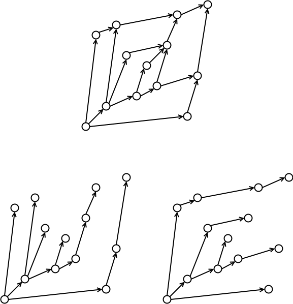
<figcaption aria-hidden="true">An order-dimension 2 graph (top), its
pDFS tree (left), and oDFS tree (right).</figcaption>
</figure>

It gets confusing to talk of left versus right when specifying the
search order, because this changes with the angle of view. Even
anti-clockwise vs clockwise does not work, because there is nothing to
say that the principal coordinate should be the x coordinate (nor any
rotation thereof). Our preference is instead to define the pDFS as a
last-last search or last-first-last. These are interpreted in terms of
the ordering of children, and by implication the actual stored data.
When we say “last-first-last” we mean that the last child is traversed
first and placed last in the ordering. We define the obverse DFS as
being first-last or first-first-last. This is interpreted as “first
child search first and placed last”.

Observe in the example illustrated that, apart from sources which by
definition are unparented, every vertex has one edge connecting it to a
single parent. Where there is a merge the pDFS tree edges link to the
parent vertex with the lowest pDFS index and highest oDFS index.

## DFS tree building

<figure>

<figcaption aria-hidden="true">Selected steps in the <em>O</em>(<em>N</em>) tree-building
algorithm, clockwise from top-left. The example is a modified version
(rotated 180 degrees) of an example that we use in this documents. The
top-left drawing shows the unparented stack (dashed line) containing
just the global sink. The top-right drawing shows an intermediate stage
just before we add the vertex on the dotted line. In the bottom-right
drawing we see this vertex is now at the top of the unparented stack.
Three vertices were popped from the stack and are children (in the pDFS
tree) of this vertex. Lastly, the bottom-left drawing shows the roots of
the final pDFS tree comprising the unparented stack.</figcaption>
</figure>

The above provides the basis for an algorithm for building trees from
principal and obverse coordinates. The process is illustrated.

- For convenience, add extra global source and sink vertices in the
  manner of an algorithmic sentinel.

- The core dieaq is to maintain a linked list of vertices that are, to
  this point, unparented. We can operate this list as a stack. At the
  beginning the stack is initialized containing just the global sink. At
  the end the list contains just the global source.

- We can stop the process one step before the end and then the stack
  contains the vertices that are unparented in the unaugmented DAG.

- The algorithm proceeds by visiting vertices in descending order of
  principal coordinate.

- When visiting a vertex, first traverse the unparented stack, popping
  vertices that are children of the curren (new) vertex. Stop when a
  vertex with lower obverse coordinate is encountered, or the stack is
  empty. Then push the new parent onto the unparented stack.

- Invariants: the unparented stack contains vertices, from the top, in
  monotonically increasing principal coordinate and monoto9nically
  decreasing principal index. This is maintained because we push new
  vertices to the top and all previously visited have higher principal
  cooredinates. Furthermore, we pop vertices fromt he top with higher
  obverse coordinate.

- This algorithm’s complexity is $O(N)$ since we add each vertex once
  (push) to the unparented stack and we conly scan each vertex once
  before popping it to parent it. The exception is that we leave one
  vertex on the stack for each added.

- We see that it is not really necessary to add the extra global source
  and sink. We can seed the unparented stack with the first vertex, and
  the non-empty stack at the end usefully contains the sources (tree
  roots) in order.

To obtain the oDFS tree, switch principal and obverse coordinates in the
above algorithm.

## Tree-only building

The pDFS and oDFS trees can be obtained in a different fashion. Each
tree has one parent. We can find the tree by deleting all but one edge
fro each vertex. For the pDFS tree we retain only the link from a vertex
from its last parent. For the oDFS tree we retain only links from a
vertex’s first parent.

This is not useful as a building algorithm, since it would require us to
build the full DAG first. Nonetheless it suggests a scheme for building
trees. This is because it shows that the pDFS and oDFS trees are
identical if the DAG is a tree. Zebraix needs to accept input that is
any order-dimension 2 DAG, and process it correctly, even if it believes
that the input is a tree.

This suggests an algorithm that might be used if we are confident that
the graph is a tree. First build the pDFS tree. Then run th oDFS
building process, and check for each vertex, when we add its parent,
that it matches the pDFS parent. If the parents to not match, abort the
second tree and fall back on a slower and more general method. If the
alternative method can make use of the oDFS tree, we would instead
continue that until completion. This is worth doing if we expect to
encounter trees very often, which we do, and if the more generall
fall-back algorithm is substantially slower on trees.

As an extra note, we observe that it would be possible to mark subtrees
as fully built if that were useful to the follow-on algorithm,

# Imperfect, perfect, not

<figure>
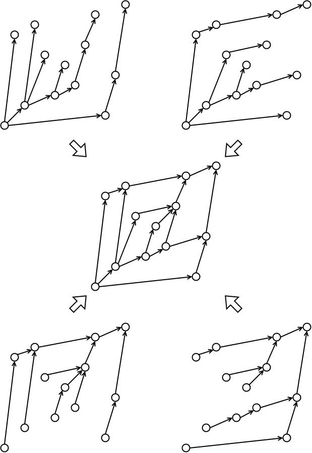
<figcaption aria-hidden="true">Four trees that can be constructed
efficiently and the DAG created by merging them. The four trees,
clockwise from top-left, are pDFS, oDFS, 180-oDFS, 180-pDFS. In this
case the central merged DAG is complete.</figcaption>
</figure>

## Four trees

In addition to the pDFS and oDFS trees, we can obtain two others very
easily. To build these we rotate the plane $180^\circ$, construct the
pDFS and oDFS trees, and rotate $180^\circ$ to restore the locations.
The result are two trees that are rooted at the global sink. The
$180$-pDFS tree, as we call it, contains edges connecting every vertex
to its first child. The $180$-oDFS tree connects vertices to their last
child. Four trees are illustrated.

If we merge these four trees we build a DAG, and in doing so have a
candidate jaywalk builder algorithm. A practical algorithm must address
three questions. First, when does the four-tree method “fail” in that
the resulting graph is incomplete? Second, how do we detect this? Third,
can we fill in the gaps with reasonable efficiency?

## Incompleteness

<figure>
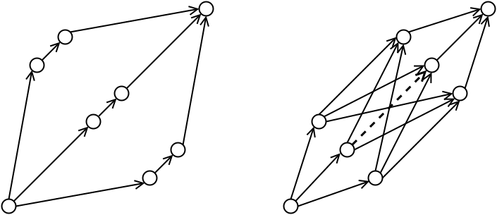
<figcaption aria-hidden="true">Two similar arrangements, one (left)
without crossings and the other (right) with crossings. Note in
particular that the dashed edge is missed by the four-tree algorithm
because it is not the first or last, parent or child, connection for any
vertex.</figcaption>
</figure>

Simply put, the four-tree algorithm will miss edges that are not the
first or last, nor the parent or child, of any vertex. These are the
edges that the trees find. In other words, an edge will be missed if and
only if both it both connects the parent to its middle child and
connects the child to its middle parent. This is illustrated. We refer
to these edges as *middle edges*.

<figure>
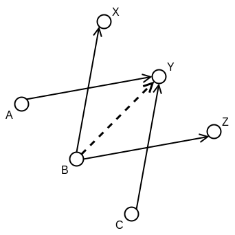
<figcaption aria-hidden="true">A portion of an incomplete graph. In the
built jaywalk there are edges from B to X and Z, and edges from A and C
to Y. In the text we show that if AY crosses BX, and BZ crosses CY,
there must be a middle edge from B to Y.</figcaption>
</figure>

<figure>
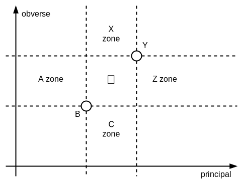
<figcaption aria-hidden="true">Limits on the relative locations of
vertices in the preceding figure. Because transitive reduction, A, C, X
and Z must be in the indicated zones relative to B and Y.</figcaption>
</figure>

- Lemma:

  If there is a middle edge, the edges either side must cross in an
  incomplete graph, provided that that graph contains at least the edges
  in the four trees.

- Proof:

  First, we state the lemma with specifics. This is more complex than
  the proof itself.

  If the incomplete graph contains the edges from the four trees, every
  vertext will have edges to its first and last children and to its
  first and last parent. This means that for any middle edge, the graph
  will have edges from its parent to later and earlier children, and to
  its child from later and earlier parents. The edges “either side” are
  the next of those in the incomplete graph in each case. This is
  illustrated where BY is the middle edge. In the incomplete graph X is
  the next child of B, and Z the previous child, relative to Y among
  four-tree edges. Likewise, A and C are the previous and next parents
  of Y.

  Second, observe as illustrated that the location of A is quite
  restricted by transitive reduction. If there is an edge from A to Y,
  then B cannot be reachable from A. If there is an edge from B to Y
  then A cannot be reachable from B. The locations of C, X and Z are
  similarly restricted.

  Third, any line from B to possible locations of X must cross a line
  from possible locations of A to Y. The same applies to BZ, which must
  cross CY.

<figure>
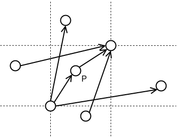
<figcaption aria-hidden="true">Example of part of a graph illustrating
how a search for middle edges would have to know how to skip
configurations where there is an intermediate vertex such as
P.</figcaption>
</figure>

This analysis shows that middle adges are closely tied to crossings. In
particular, if the merged four trees graph is planar, we know that it is
complete. Planarity testing is actually efficient (PQ methods and their
relatives). However, we do not know yet of an overall approach to
finding all edges in subgraphs like that shown in the figure, and hence
in graphs with middle edges more generally. Moreover, we do know of a
straightforward recursive graph builder algorithm, and we suspect that
the most fruitful approach would be to leverage tree-based information
to accelerate a recursive algorithm. Consequently, we do not have a good
answer to the third question.

# Recursive merge

## Dual graph builder

There is an algorithm that is perfect for constructing graphs but is
useless in our case. This algorithm constructs both the dominance and
co-dominance graphs simultaneously. It is quite straightforward and its
complexity is proportional to the complexity of the task, that is,

$$
a_0 + a_1N + a_Dm_D + a_CM_C .
$$

The problem is, as we saw earlier, that the co-dominance graph can have
complexity $O(N^2)$ for a simple dominance graph. This is because
$M_C\approx N^2/4$ in the worst case. Therefore constructing both graphs
is not in general efficient when one only needs one. The natural
question is whether we can take this method and elide construction of
the co-dominance graph and the associated underlying manipulations so
that the resulting algorithm is efficient for one graph. However, we
have not succeeded in doing this.

The algorithm is described in an appendix.

## Joining subgraphs

**TEXT MISSING FROM FIG N**

<figure>

<figcaption aria-hidden="true">Fusing two ranged subgraphs, shown
separated by a dashed line. The left subgraph has lower principal
coorindates. The ranges of principal coordinates int he left, right and
combined subgraphs are continuous. The joining process requires us to
add the edges from the complete graph that cross the dashed line between
vertices in these subgraphs. We define active ranges of obverse
coordinates for each side In the left subgraph a vertex is actives from
its obverse coordinate up to the obverse coordinate of its immediate
descendant within that subgraph. Likewise, in the right subgrah the
active range of a vertex extends from its obverse coordinate down to
that of its immediate ancestor. The purpose of these ranges is to check
which locations in the right subgraph a vertex can link, and likewise
those in the left that can link to a vertex in the right. Observe that B
is in the active range of A, but A is not within the active range of B.
This is because it is reachable via an intermediate vertex
..</figcaption>
</figure>

The basic idea behind this algorithm is to subdivide the graph by ranges
of principal coordinate. The key task is then to reverse this division,
that is to take two subgraphs and join them There are two invariants.

1.  Subgraphs contain all edges from the complete graph within that
    subgraph.
2.  Subgraphs contain all vertices from the complete graph within a
    continuous range of principal coordinates.

We may add other data invariants to aid the building process.

What we need to do in the join is to add all adges that connect a vertex
in the left subgraph to one in the right subgraph, crossing the join.
This is illustrated in the figure. The approach we take is to consider
feasible ranges of obverse coordinates. For a vertex in the left, we
find an “active” range, that is of locations in the right that would be
reached by this vertex and no other descendant on the left. This is one
condition. A vertex in the right can only be reached from one in the
left if no ancestor vertex in the left can be reached from it. (This is
mostly specific restatement of transitive irreducibility.)

We sweep the verrices from lowest obverse to highest, and the basic
process is as follows for the subgraphs.

*Left:* We add the vertex to the active set when we reach it. We remove
it when we reach, among children connected in the subgraph, that with
the lowest obverse, or equivalently the highest principal, coordinate.

*Right:* The reverse process to that of the left. When a vertex is
visited, it is removed from the active set and replaced with all
children for which the removed vertex is the parent with the highest
obverse and hence lowest principal coordinate. Another way of viewing
this is that a vertex is added at the last opportunity.

The process for managing the set of active vertices in the left subgraph
is a bit awkward because we have to tag the child vertex with all
relevant parents in order to remove them. Also, we have to apply the two
range conditions. Instead we can add new edges to children when visiting
a vertex in the left. The range on the left is from the current vertex’s
obverse coordinate to that of its child with the lowest obverse. We
traverse the set of active vertices in the right, joining to all those
less tham the upper obverse bound. None will have less than the lower
bound since those have been removed.

## Stack optimization

**EXTRA CROSS ON L SIDE OF FIG O? ALSO, ISN’T (6) A NO?**

<figure>

<figcaption aria-hidden="true">Patterns of overlaps of active ranges in
the left subgraph. Patterns for the right subgraph are rotated 180
degrees. This illustrates that nested overlaps are possible, but not
staggered overlaps. Further, the inner range is further away from the
other subgraph (the side of the dashed line in the preceding
figure).</figcaption>
</figure>

For the present prupose we are interested in the active set for the
right subgraph. It turns out, as illustrated(figure )}, that while
ranges of activity can overlap, those overlaps must be nested and not
staggered. Furthermore, inner ranges must have higher principal
coordinates. This means that when a range finishes, which happens when a
vertex is encountered in the upward sweep, it must have the highest
principal coordinate and lowest obverse coordinate.

- This means that we can operate the active set as a stack. We pop the
  highest principal, since that must be the one that we encounter, and
  push children starting with the lowest principal and highest obverse.
- This introduces a new invariant, that the active vertices in the right
  subgraph are in a sorted stack.
- The initial stack is the chain of unparented vertices.

## Unparented vertices

Maintaining an unparented chain in $O(N)$ complexity is straightforward,
with the additional invariant that we know the lowest obverse in a
subgraph. We record the chain in descending order of obverse and
necessarily ascending principal. At the beginning of a subgraph joining
process, first pop vertices from the unparented chain and push to the
active stack, reversing the order. Stop when coming to a bertex with
lower obverse than the lowest overall in the left graph. Do not pop
this. Instead append the remaining chain to the left graph’s unparented
chain. This is the chaoin for the joined graph.

## Base algorithm

Let us summarize the algorithm as described, in pieces. The following
are maintained as data structures for subgraphs.

- Vector of vertices, ordered by principal. Derived as a slice of main
  structure.
- Edges, which are complete set for subgraphs before joins, and for
  combined graphs once joins.
- Next and previous links, creating deque of vertices ordered by
  obverse. Overall algorithm effectively operates as a mergesort on
  this.
- Ends of obverse chain, also providing min and max obverse.
- Linked list (or deque) of unparented vertices, starting from highest
  obverse, which is lowest principal. List ordered.
- During join, stack of active vertices in left subgraph, descending
  obverse, ascending principal.
- At end of join, an ordered list of sinks. These are the unparented
  vertices.

The first step in the join is to create the combined unparented list and
at the same time seed the stack of active vertices. Then the algorithm
proceeds in the gereral fashion of a mergesort operating on the chaining
of vertices, sorted by obverse coordinate.

- Traverse the two chains sorted by obverse, in ascending order. It may
  work best to berge the right into the left, leaving the right empty at
  the end and the left as the combined graph.
- If the next vertex—the one with lowest obverse—is in the right graph,
  this must be the vertex at the top of the active stack. Pop this and
  traverse its children. Push those children for whom the popped vertex
  is the parent with highest obverse / lowest principal.
- If the next vertex is in the left graph, find the obverse coordinate
  of the last child, that is with highest obverse. Traverse active
  stack, adding vertices, in order, to children, after the last child
  stop when encountering potental child with obverse higher than limit.
  (This shold eventually become grandchild.)
- In either case add vertex to merged obverse chain.

This is a solid enough algorithm with complexity

$$
a_0 + a_1N + a_2N\log(N) + a_Dm_D
$$

# Enhanced merge builder

Mergesort algorithms may gave enhancements so that they execute in
$O(N)$ if the data is pre-sorted, or largely so. We woudl like to do
something similar. If the graph is a tree, since we have already sorted
by principal coordinate, the obverse coordinates will have blocks that
are sorted. The sort order varies depending on the general shape of the
tree.

## Strategy for trees

In short, we want to be able to build trees, or near-trees, in $O(N)$
work without too much degradation of the algorithm for the general case.
When we say a “near tree” that might be a true tree with the addition of
a global sink. Or there might be one internal merge vertex. So the
algorithm should not be very sensitive to the topology. Nonetheless, our
initial approach might be to consider how we might build a true tree by
recursively joining subgraphs, doing so with $O(N)$ complexity. This
amounts to creating a join method that has complexity in proportion to
the number of edges added. Consider some characteristics of trees.

- No edge crossings.
- Blocking of the drawing of the joined graphs, that is with clear empty
  spaces.
- Only unparented vertices in the right participate in joins. (Note that
  there is not a clear equivalent for the left subgraph.)

All these have the potential to be avenues for optimizing the builder.
However, the fact that unparented vertices in the right subgraph are thw
only ones that participate in edge addition is attractive in that it
matches our existing join algorithm. If we look at the algorithm, what
we would need is a way to figure out, when popping an unparented vertex
from the stack, that we can skip the intervening vertices and so do not
need to push anything onto the stack. More tricky is that we will need
to elide vertices in the left graph. We need to skip over most and only
process those that join to the right graph. It would be fine to peek at
vertices in the vicinity, provided that work is fairly constant per
added edge.

## Skipping

**Side margin note: pDFS obverse chain.**

If we push all acitvated child vertices onto the stack, for the right
subgraph, we will not avoid $O(N\log N)$ work. We need to skip whole
subtrees, and in the overall tree case, push nothing and instead just
pop unparented vertices in sequence. We can do this as follows. When we
pop an active right vertex from the stack, we can look at the next one.
It does not directly help us. However, the right vertices are chained.
So first peek at the active vertex on the top of the stack, then
backtrack down to the next lowest obverse in the right. If this obverse
is less than that of the next in line in the left subgraph, all vertices
in the right are unreachable from the left. We can splice the whole
subchain into the combined obverse chain. In the special case of a true
tree, this is the whole subtree of the previously unparented vertex that
we just popped.

Skipping vertices on the left is just as important, and is a mixture of
easier and slightly harder. Consider the case of a wide and shallow
tree. In this case for much of the subgraph joins the obverse
coordinates of left vertices will be greater than the highest on the
right. These are automatically skipped assuming that we stop the merge
and clean up once the stack of active right vertices is empty. This is
actually sufficient for $O(N)$ performance on true trees. There is a
means of optimizing by leaping over subchains. This is relevant if the
left subgraph itself contains a subgraph that merges in to one vertex.
In other words, this is when there is a number of ancestors to a common
descendant. Skipping for this case is not trivial, because it can be
defeated by small variations. The ideal scan of left vertices would be
in reverse obverse order, but we cannot in linear time achieve that,
since it implies a full sort of vertices by obverse coordinate.
Nonetheless, we propose a method that may prove beneficial in practice.

<figure>

<figcaption aria-hidden="true">Illustration that it is OK to skip
vertices in the left subgraph using the last parent of a vertex in the
right. Suppose that we are considering A and its last parent B. It is
not possible for C to have a parent with lower obverse coordinate than
B. Therefore B can be the last parent of C, and we can skip all vertices
with lower obverse when considering A and not as a consequence miss any
parents of C. In the diagram areas cannot have bertices since these
would either be parents in place of B, or be another parent of A after
B..</figcaption>
</figure>

The method for skipping left vertices may require more work than the
savings it brings. Basically, we construct a full pDFS tree in advance.
When we finish popping and pushing active right vertices we peek at its
last parent, which is its parent in the pDFS tree. If the obverse of
this is greater than the next vertex in the left, a subchain of vertices
can be skipped. Note that the last parent may not be in the left
aubgraph and instead further left, and it may have an even lower obverse
when there are crossings.

As a quick check, illustrated we show that skipping left vertices for
one right vertex will not results in missed edges later in the active
stack. There is an invariant. If we traverse the active stack, the
obverse coordinates of last parents will be monotonically non
decreasing.

## Crossings

It might be useful to detect crossings. There are $O(N)$ methods for
doing so, and even $O(N)$ algorithms for detecting planarity and
rearranging vertices to remove crossings in planar graphs. However, we
have not seriously explored checking for crossings during the building
process and leave that for future contributions.

We can check for crossings in a complete jaywalk as follows. Basically
we imagine removing one vertex at a time, in principal or obverse order.
Recall that these provide topological sorts, so we are sure to delete a
parent before all its descendants.

Seed a chain of sources with the unparented list. If not available, we
can go through vertices in principal order and add those with zero
parents. Maintain count of parents. When removing a vertex, decrement
parent count for all children. First and last children may have non-zero
parents, but removed one must be last and first respectively. Inner
children must have zero parents, otherwise there is a crossing. Add all
children that now have zero parents. Note if implementing: check case of
isolated DAGs.

# Graph compaction

We now consider how we might compact graphs, align leaves in a tree, and
non-linearly stretch graphs to balance internal proportions.

## Basic compaction

<figure>
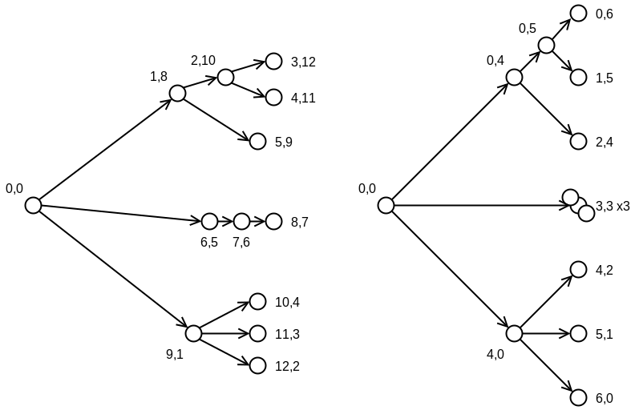
<figcaption aria-hidden="true">An example of a tree (left) and the
result of compacting by using cumulative counts of subsequent children.
This lines up the leaves in the tree, but the locations of single
children coincide. The counts used as coordinates are obtained by
traversing the vertices in pDFS and oDFS trees. The count for a vertex
is incremented if it is not the first child traversed. Equivalently,
this is if the vertex is not the child of the previous
vertex..</figcaption>
</figure>

In this and subsequent layout schemes we use an increment of 1 and hence
grid separation of 1 for the base layout component. Our basic compaction
is designed for trees. As shown in the drawings, the pDFS/oDFS
coordinates produce a tree layout that is somewhat uneven. The graph is
not laid out to align leaves, or according to depth, or according to
subtree vertex counts. We propose a base algorithm that ensures two
properties for a true tree. First, leaf nodes are aligned. Second the
distance of a parent from its leaves is proportional to their number
minus 1. The algorithm to do this is straightforward and efficient. We
create coordinates by traversing the vertices in pDFS order, then in
oDFS order. In each case we increment a cumulative counter. We could
recover the original DFS coordinates by incrementing unconditionally at
each vertex. We obtain a basic alignment if we do not increment for
vertices that are first children. We only increment for subsequent
children. This is equivalent to skipping the increment whenever the
previous vertex is the DFS parent of the current vertex.

The size of the drawing equals the number of DFS leaves. In the example
shown there are 7 leaves and the graph fits in a square box $(0,0)$ to
$(6,6)$. Observe that this is the DFS leaves, not the number of sinks in
the completed graph. In the algorithm we essentially count all the
edges, disregarding one edge for each internal DFS tree node. There are
$N-1$ edges, so the increments will equal the number of leaves minus 1.
Hence we increment 6 times for 7 nodes.

This scheme is not quite workable. If vertices have single children,
they are drawn on top of them. That is, they coincide.

## Separating coincidences

<figure>

<figcaption aria-hidden="true">Compacted tree with coincident vertices
separated out. The left drawing separates out the coincident vertices in
the preceding drawing by addition of the shown coordinate offsets. These
are obtained by incrementing counters while traversing the DFS trees.
The counter is incremented whenever we <em>descend</em> along a sole
edge. The right graph goes further, adding offsets to the left graph so
that tree leaves are aligned. The offsets are counters incremented
whenever we <em>ascend</em> a sole edge. In this case the incremented
counter is not written to the parent, because that vertex was previously
visited..</figcaption>
</figure>

There is a fairly natural way to eliminate coincidence of vertices, as
illustrated. We do this in the form of supplementatl cumulative
counters. This approach has the merit that it will not introduce any
more problems than it solves in terms of poset ordering. We proceed in
the same fashion as the counter of subsequent children, instead
incrementing the counter when we *descend* down an edge to a *sole*
child. The resulting counts are shown on the left, with the sole-child
counts applied as additive supplements, resulting in revised vertex
locations.

If we do not value alignment of leaves, this is a good candidate
compaction scheme.

## Aligned compaction

If we want the leaves aligned, we can achieve this by spacing out
further. This is illustrated in the right diagram (preceding figure. The
adjusted layout is drawn with the further adjustments. The rule for
these offsets is to increment the counter when *ascending* a sole edge.
The incremented counter is not seen in the parent, because we have
already processed that one. Rather, it is first seen in the next side
relative.

The two adjustments added together preserve the leaf alignment achieved
with the count of subsequent children. If we step through the leaves the
adjustments are $\dots(0,2), (0,2), (1,1), (2,0), (2,0),\dots$. In the
example two such adjustments are superimposed. If alignment is not
important we may prefer the compactness of the left graph. Our choice
has been to create a set of adjustments that are monotonically
increasing over the principal or obverse order, intending that the
locations will be found as a weighted sum of these adjustments with
positive weights. We prefer this over, say, subtracting adjustments or
equivalently having negative weights.

## Non-tree sole edges

<figure>

<figcaption aria-hidden="true">Increments for non-tree graphs. The two
preceding figures showed compacted layouts for trees. Here we show a
non-tree graph with a compacted layout, right, that uses only
coordinates from the cumulative-subsequent counter of the first figure.
The offsets for separating coincident vertices should be zero. This can
be achieved, as in the second pair of drawings, if we only increment
when descending or ascending edges that are the sole child edge
<em>and</em> sole parent edge. Observe that while “subsequent child” is
the same for a tree and the complete graph, “sole edge” is tested
against the complete graph.</figcaption>
</figure>

Until now we have focussed on trees. We need to clarify how the layout
scheme should handle non-tree DAGs. The approach that we propose is
illustrated. The question is basically how we should handle convergent
vertices, that is vertices that have multiple parents. It is necessarily
the case that the two DFSs, pDFS and oDFS, will connect to a convergent
vertex from different edges. Furthermore they will do so such that the
locations of the vertices as derived from the counts of subsequent
children will no be coincident. Therefore no sole-edge adjustment is
needed.

Therefore we choose only to count edges as sole edges if the link a
parent to a sole child as we required earlier *and also* that they link
that child to a sole parent.

## Non-linear stretch

The layouts generated by the compaction scheme neatly align tree leaves
and fit the tree within a square. The main drawback is that the spacing
of ancestor nodes from the line of leaves is not optimal for
readability. The size of the layout, and in particular the distance from
root to leaves, is a function of the count of leaves in either DFS tree
and the count of sole edges. One way that we can redistribute the
vertices while retaining alignment is to apply an s-shaped function to
the distance from the alignment line. This function can leave any global
source and sink, along with the alignment line unmoved.

At present we do not have a strong recommendation as to the function,
except perhaps that it should tend towards a linear function for large
distances (from the alignment line?).

## Variations and details

When a graph lacks a single global source we can pretend that there is
one and therefore, when traversing trees for counts of subsequent
children, increment for each unparented vertex after the first.

The scheme really operates by generating locations as the weighted sum
of the three cumulative counts: subsequent child, sole-edge descent,
sole-edge ascent. We can weight these according to purpose. We can even
use unbalanced schemes. For instance, we could modify the principal
coordinates and leave obverse coordinates unchanged, or otherwise more
spaced out. In a typestate graph, this would lay the chain of “normal”
states in a horizontal line, and the anomalous or alternative states
would be offshoots.

# Additional material: Dual-graph builder

There is a relatively straightforward algorithm for building a dominance
graph and co-dominance graph together. This is perfect in that it scales
well with the output, but as a dominance graph builder it is
inefficient. As discussed earlier, a simple dominance graph can gave a
co-dominance graph with $O(N^2)$ edges. Therefore the additional work
becomes a burden. One might naturally ask if this work can be elided. We
considered this in depth and did not find a satisfactore solution. We
did not see any path to a solution that would be anything close to the
level of code complexity of the recursive graph joining approach.
Nonetheless, we present the algorithm here for interest.

The algorithm is illustrated in the two figures. The graphs we are to
obtain are shown in the first. The algorithm involves constructing two
trees and then we build the two graphs by adding a vertext in turn. The
second figure shows one of these steps. The preparatory work is to
construct oDFS trees for the dominance and co-dominance graph. This
enables us, for the dominance graph, to find the parent of a given
vertex with the highest obverse and lowest principal coordinates.

We build the two graphs together, adding vertices in principal order.
When adding a vertex, we need to add all adges into the partial
graph—thes are all the vertex’s parents. The first parent in the
dominance graph is found from the pDFS tree that we created in the first
step. The remaining parents are dound by following the descendants of
the first parent in the co-dominance graph, going from last child to
last child. We likewise add edges in the co-dominance graph by finding
the first parent from the codominance oDFS parent and filling in the
remaining parents by following the chain of last children in the partial
dominance graph.

<figure>
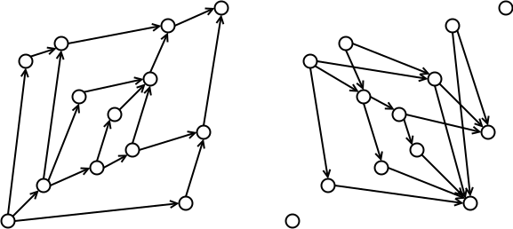
<figcaption aria-hidden="true">Example graph with dominance drawing
(left) and co-dominance drawing (right). In the subsequent drawings we
illustrate how these can be built..</figcaption>
</figure>

<figure>

<figcaption aria-hidden="true">Steps in building the two graphs
illustrated above. The top-left and top-right drawings show the oDFS
trees for the dominance and co-dominance graphs. The building algorithm
constructs both drawings, and does so by adding a new vertex to the
graph along with all edges to its parents. The dominance edges are found
by first finding the new vertex’s parent in the pDFS tree. The remining
parents are found by traversing children in the partially constructed
co-dominance graph. Likewise the first co-dominance parent is found from
the oDFS tree and remining parents are found by traversing its children
in the partial dominance graph..</figcaption>
</figure>

# Other ideas

## Relation to mergesort

The algorithm upon which we settle has hybrid complexity, with
$O(N\log(N))$ work in the general case and $O(N)$ when the DAG is a
tree. This is analogous to mergesort algorithms that make use of
presorting of the data. Our recommended algorithm takes data presorted
by principal coordinate and implicitly sorts by obverse coordinate. It
is like a merge sort that guarantees $O(N)$ under the following
condition. Suppose that we arrange the elements in presorted order and
examine the indices of the final sort. Consider each element and all
that came before. Of all elements with final sort indices less than this
element, the highest must come last.

Obviously much work has been done on efficient sorting. We have not had
the opportunity to relate the methods presented here to sorting methods.
It has been a considerable task to reach this point. We look forward to
contributions that consider this relationship in depth.
