---
author:
- J. Alex Stark
date: 2003–2022
title: Jaywalk Concepts and Ideas
---

- [1 Overview](#overview)
  - [1.1 Important
    notes](#important-notes)
  - [1.2
    Definition](#definition)
    - [1.2.1 Brief
      definition](#brief-definition)
    - [1.2.2 Technical
      summary](#technical-summary)
- [2 Foundation](#foundation)
  - [2.1 Simple planar
    graphs](#simple-planar-graphs)
    - [2.1.1 Starting
      points](#starting-points)
    - [2.1.2
      Inequality](#inequality)
    - [2.1.3
      Planarity](#planarity)
  - [2.2 Narrowing the
    scope](#narrowing-the-scope)
    - [2.2.1 Order
      dimension](#order-dimension)
    - [2.2.2
      Waypoints](#waypoints)
  - [2.3 Design
    choices](#design-choices)
    - [2.3.1 Sources and
      sinks](#sources-and-sinks)
    - [2.3.2 Planar
      arrangement](#planar-arrangement)
- [3 Mathematical
  perspective](#mathematical-perspective)
  - [3.1 Dominance drawing
    coordinates](#dominance-drawing-coordinates)
    - [3.1.1 Modified st-planar
      graphs and dominance
      drawings](#modified-st-planar-graphs-and-dominance-drawings)
    - [3.1.2
      Co-dominance](#co-dominance)
    - [3.1.3
      Crossings](#crossings)
  - [3.2 Loose
    ends](#loose-ends)
    - [3.2.1 Jaywalk core
      features](#jaywalk-core-features)
    - [3.2.2 Integer
      lexicography](#integer-lexicography)
- [4 Jaywalk compressed
  formats](#jaywalk-compressed-formats)
  - [4.1 Treenum
    format](#treenum-format)
    - [4.1.1 Basic idea of tree
      compression](#basic-idea-of-tree-compression)
    - [4.1.2 Reconstruction,
      overall](#reconstruction-overall)
    - [4.1.3 Reconstructing the
      oDFS tree, treenum
      case](#reconstructing-the-odfs-tree-treenum-case)
    - [4.1.4 Sequential (oDFS)
      ordering](#sequential-odfs-ordering)
  - [4.2 Family
    gathering](#family-gathering)
  - [4.3 Deep chain
    representation and
    reconstruction](#deep-chain-representation-and-reconstruction)
    - [4.3.1 General idea and
      example](#general-idea-and-example)
    - [4.3.2 Mutatis
      mutandis](#mutatis-mutandis)
  - [4.4 Non-tree DAG
    reconstruction and
    compression](#non-tree-dag-reconstruction-and-compression)
    - [4.4.1 Framing the
      task](#framing-the-task)
    - [4.4.2 Worked
      example](#worked-example)
  - [4.5 Compression and
    canonical compression](#compression-and-canonical-compression)
  - [4.6 Familial linkage and
    canonical forms](#familial-linkage-and-canonical-forms)
    - [4.6.1 Canonical
      compression](#canonical-compression)
    - [4.6.2 Preferred layout
      and ordering of children in
      chainums](#preferred-layout-and-ordering-of-children-in-chainums)
    - [4.6.3 Another
      note](#another-note)

------------------------------------------------------------------------

Heptodes documents and other content in `doc` directories are licensed
under the [Creative Commons Attribution 4.0
License](CC%20BY%204.0%20license).

Source code licensed and code samples are licensed under the [Apache 2.0
License](https://www.apache.org/licenses/LICENSE-2.0).

The CC BY 4.0 license requires attribution. When samples, examples,
figures, tables, or other excerpts, are used in a tutorial, or a
subdivision thereof, it is sufficient to provide the complete source and
license information once. This must be close to the beginning, such as
in an early acknowledgments slide. If this is done, only short notes are
required to be placed with each usage, such as in figure captions.

------------------------------------------------------------------------

<!-- mdformat off (Document metadata) -->
<!-- mdformat on -->

# Overview

## Important notes

- This is rough documentation, not a polished exposition. It is intended
  to help in the understanding of the code and tools.

- If anything herein is innovative or novel, that is by accident.
  Jaywalks were formed by putting existing ideas together, motivated by
  particular circumstances and needs.

## Definition

### Brief definition

Jaywalks are a special category of directed graphs (as in vertices
connected by edges) with associated schemes for their representation.
Jaywalks are not pure graphs, but also carry information about their
arrangement on the page (in a plane).

### Technical summary

A jaywalk combines a graph specification with layout information. The
vertices of the graph form a partially ordered set (poset) of
order-dimension 2. We refer to the two orderings as principal and
obverse indices. The graph is a transitively irreducible realization of
the poset vertex relationships. For a layout in the plane for rendering
as a drawing, the principal and obverse indices serve as coordinates for
a dominance drawing. In addition to a general form, jaywalks have a
specialized form for enumerations and other hierarchies and trees.

# Foundation

The order in which ideas unfold during a project is typically not the
best order of exposition. With the benefit of hindsight one can organize
the flow more logically. However, in this case we have found it useful
to keep roughly to the “original” order. Also it is helpful to give the
context in which the underlying ideas arose. This is not least because
the ideas are not on the whole in anyway novel. The rationale behind the
selection and combination of ideas is therefore more significant.

## Simple planar graphs

### Starting points

The starting point for jaywalks was the desire for simple representation
and handling of directed graphs, especially small trees. Small loops
would be normal enough to require efficient treatment.

<figure>
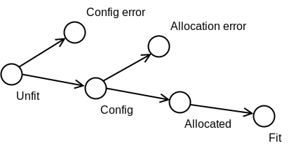
<figcaption aria-hidden="true">A simple tree.</figcaption>
</figure>

This was, so-to-speak, the beginning of time for jaywalks. There was, in
context, a before-time desire to handle shallower trees for things such
as hierarchical enumerations. Initially in the background, early on we
realized that a common framework would serve well, albeit with some
variations for convenience and brevity.

### Inequality

Thus jaywalks began as a way to represent simple DAGs, especially simple
shallow (enumeration-like) or simple deep trees. Often the vertices
would represent states. Edges would indicate permitted transitions, and
would ordinarily be bi-directional. The directedness of the graph would
reflect something else: increasing maturity, better fitness for use,
stronger permissions or guarantees. Consequently, in addition to
specifying a criterion such as “is this entity in such-and-such state?”,
we want to be able to specify a criterion such as “is this entity within
such-and-such subtree of the graph?”, or even “is this entity in
such-and-such region of the graph?”.

Thus a jaywalk might be used to define the states that a variable or
attribute might be “in”. A critically important task is the ability to
define a region (subgraph) through one or more constraints. How can this
be done such that the constraints can be tested very readily?

In order to specify a subtree of a tree one could number all the
vertices in a depth-first ordering. We use this such that deeper
vertices get higher numbers than their ancestors. This is a promising
scheme, since subtrees are contiguous ranges of indices.

<figure>
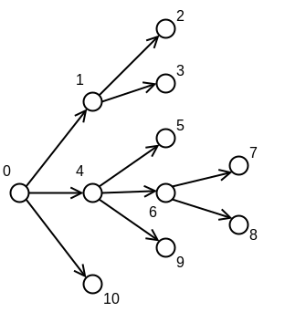
<figcaption aria-hidden="true">A tree with the order (reversed) in which
the vertices are visited in a depth-first search (DFS) visiting the
rightmost children first. We refer to this numbering as the
<em>principal ordering</em>, and the <em>principal
indices</em>.</figcaption>
</figure>

Here vertex 10 is the first vertex finished in the depth-first search
(DFS). An example is that the subtree rooted at vertex 4 has vertices
numbered between 4 and 9, 9 being the index of the next highest sibling.

### Planarity

This works for trees. It did not take much investigation to conclude
that meeting our needs for DAG regions more generally is more
challenging. Even in the tree case we might specify an inner region such
as “vertices 4 and 6 and the edge in between”. Note that for our
purposes the state of entities can be in transition, and so edges
represent potential temporary pseudo-states.

In the context that motivated jaywalks we decided that planar graphs
would be sufficient. These are graphs that can be drawn on a plane
without any edges crossing. While we needed much greater complexity, we
judged that this would be achieved with products of planar graphs, with
additional transition constraints as necessary.

DFS numbering can be applied in two easy ways, in one visiting child
vertices left-to-right and the other visiting right-to-left. Typically
when stored in data stuctures, there is a natural order of iteration
through a list-like structure of children. We refer to the natural
forward iteration as the *principal* order, and the backwards visitation
as the *obverse* order. In a pure sense, a graph does not have an
ordering of children. A planar graph is one that *can* be drawn in the
plane after necessary rearrangements. We decided early on that jaywalks
should incorporate their layout on that page (at least the basics
thereof), and so there was no burden introduced by including the order
in the jaywalk representation.

## Narrowing the scope

### Order dimension

<figure>
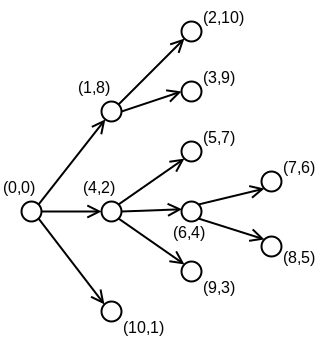
<figcaption aria-hidden="true">A tree with principal and obverse indices
(shown as pairs) that are found by depth-first search.</figcaption>
</figure>

The principal vs obverse DFS numbering means that we can delimit on
either side of a subtree. For instance $(p,q)$ is within the subtree
rooted at $(4,2)$ iff $4\leq p$ and $2\leq q$. Moreover, we can isolate
the two vertices $(4,2)$ and $(6,3)$, along with the edge connecting
them if we further constrain with $p\leq 6$ and $q\leq 4$.

The above inequalities work because the vertices of a DAG form a
partially ordered set (poset). That means that, for any two vertices, we
can ask if one is the ancestor of the other. This is the inequality
relation for the set. When, like this, the poset inequality can be
tested using two orderings, the poset is said to have *order dimension
2*. Let us put this formally. For any poset of order dimenension 2, one
can find 2 orderings, $p$ and $q$, of the set such that if we pick two
vertices $x$ and $y$, $x<y$ iff both $p_x<p_y$ and $q_x<q_y$.

For the needs of jaywalks, the ease of the order-dimension 2 tests are
ideal. A subgraph is a combination of ancestor and descendant
constraints.

<figure>
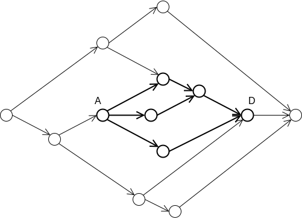
<figcaption aria-hidden="true">Within a graph, a subgraph can be defined
as all nodes that are descendents of an ancestor vertex and also
ancestors of a descendent vertex. Here the ancestor is A and the
descendent D.</figcaption>
</figure>

The vertices (and edges that connect them) are descendants of A and
ancestors of D.

### Waypoints

With posets and the dual orderings we can specify regions of a graph
using a small number of inequality constraints. There is still a
limitation with our ability to distinguish edges.

<figure>
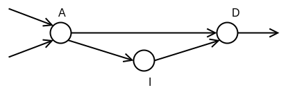
<figcaption aria-hidden="true">Part of a graph where D is reachable from
A both via I and directly. Transitive reduction will remove the direct
edge.</figcaption>
</figure>

In this subgraph we cannot simply specify the edge going directly from A
to D. If we constrain $(p,q)$ to $p_A<p<p_D$ and $q_A<q<q_D$, the region
will include the vertex I. In some cases we can exclude other paths, but
the method does not generalize and has pitfalls. If we wanted the path
including I we could specify as

$$(p_A<p\leq p_I \quad\text{AND}\quad q_A<q\leq q_I) \quad\text{OR}\quad
(p_I\leq p<p_D \quad\text{AND}\quad q_I\leq q<q_D)\text{.}$$

With this in mind, we chose for our purposes to require that the direct
edge be subdivided with the insertion of what we call a *waypoint*
vertex.

<figure>
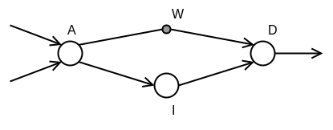
<figcaption aria-hidden="true">Part of a graph where a <em>waypoint</em>
has been added along the direct path between A and D so that the path is
not removed by transitive reduction. This has the important result that
we can distinguish which edges we “are on” when in a transitionary
pseudo-state between A and D.</figcaption>
</figure>

In graph theory this is a key concept. A graph undergoes transitive
reduction when all transitively unnecessary paths are removed. In the
example above we can reach I from A and can reach D from I, therefore we
can reach D from A without need for the direct path. In introducing
waypoints, we effectively required that jaywalks be transitively
irreducible.

## Design choices

### Sources and sinks

Jaywalks narrow the scope of supported graphs considerably. As we have
discussed above, most of the narrowing down actually comes from aspects
of the problems we are trying to tackle and the context in which they
are manifested. In contrast, one way in which we restrict supported
graphs flowed in the other direction. That is, the restriction arose
from mathematics and yet proves very compatible with the tasks at hand.

The restriction is that graphs should have a single source and a single
sink. (A source vertex has no inputs and a sink vertex has no outputs.)
Actually not quite. In jaywalks it must always be possible to
extrapolate such a source and sink. In practice this means that all
sources must be together on the outside and all sinks be together on the
outside. Then we can create an extrapolated global sink that connects to
all the real sinks. A tree is a straightforward example, with each leaf
being a sink.

<figure>
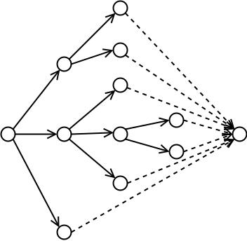
<figcaption aria-hidden="true">A the leaves of a tree can always be
connected to an extrapolated global sink.</figcaption>
</figure>

The root vertex is already a global source, and the graph can be
extended for processing by connecting all the leaves to a virtual global
sink.

<figure>
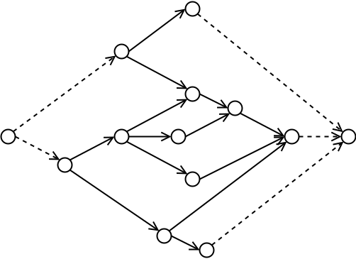
<figcaption aria-hidden="true">A graph with multiple sources or multiple
sinks is an acceptable jaywalk if all the sources and sinks are external
and could, in principle, be connected to a global source and global sink
without introducing crossings.</figcaption>
</figure>

A graph can have multiple sources and sinks but these cannot be
interleaved or the edges to the extrapolated source and sink would
cross.

### Planar arrangement

We chose to incorporate the planar arrangement into jaywalks for reasons
that contrast with those for sources and sinks. From the mathematical
point of view the arrangement of vertices is not necessarily as
important as the connections. A vertex has a set of children, but the
order does not affect, for example, whether the graph is classed as
planar. There are efficient methods for finding a valid arrangement for
a planar graph, a task which amounts to finding orderings of child
connections so that there are no edge crossings. We found that
incorporating the arrangement of vertices on the page brought a range of
benefits to jaywalks.

1.  A key purpose of jaywalks was, when used in code, for the coder to
    communicate intent via self-documentation. Thus the coder should be
    laying out the graph.

2.  While the tools that handle jaywalks could incorporate algorithms to
    manipulate the graph and layout on the page, we wanted the simplest
    and most efficient code. This does not, of course, rule out other
    utilities for automatic layout. Code gets compiled and rendered
    often, so the energy and speed of jaywalk processing is very
    important.

3.  Consistency of renderings is difficult if performed entirely
    automatically. Different tools may render differently. Small
    numerical differences lead to rendering variations.

4.  It turns out that the representation that includes layout (based on
    dominance drawings, discussed later) is actually more compact than
    most graph specifications.

5.  The jaywalk representation directly ensures that the graphs are
    order-dimension 2 and therefore can be used with constraints.

# Mathematical perspective

## Dominance drawing coordinates

### Modified st-planar graphs and dominance drawings

An *st-planar graph* is a DAG that can be drawn in the plane without
edge crossings and which has exactly one source and one sink, both of
which are on the outer face of the graph.

A *dominance drawing* is a drawing of a graph in a plane where one
vertex $v$ is reachable from another vertex $u$ if the Cartesian
coordinates of $v$ are greater than, or equal to, the coordinates of
$u$.

Jaywalks use the idea of dominance drawings for their representation,
through coordinates. Ordinary jaywalks use integer coordinates, with
floating-point considered an extension. A jaywalk graph can be
reconstructed from its coordinates of vertices by adding edges according
to reachability that will not be removed by transitive reduction.

<figure>
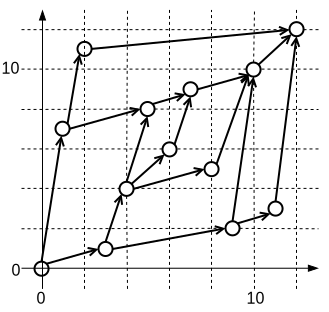
<figcaption aria-hidden="true">Example of a jaywalk graph with global
source and sink, which makes it an st-planar graph. Jaywalks are DAGs
that are transitively irreducible, and have external sources and sinks.
The graph is shown as a dominance drawing with coordinates that
correspond to principal and obverse orderings. All jaywalks are posets
of order-dimension 2, so the orderings are sufficient for a
jaywalk.</figcaption>
</figure>

### Co-dominance

If we flip the x-axis we get a different dominance drawing. If we flip
the constructed graph on the x-axis, putting the vertices back in the
same location we call it the *co-dominance* drawing (or co-dominance
graph). Note that the (global) source and sink are necessarily orphaned,
so-to-speak, in the co-dominance graph.

<figure>
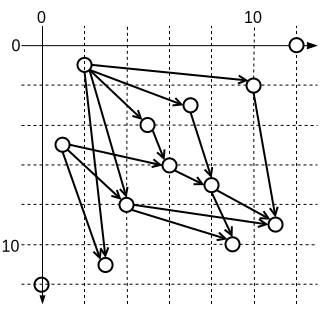
<figcaption aria-hidden="true">Co-dominance drawing, and hence graph,
corresponding to the jaywalk in the preceding figure. Notice that this
has non-global sources and sinks, two of which are both source and sink,
and so isolated..</figcaption>
</figure>

We depart from other practice with dominance and co-dominance graphs in
that we consider one vertex to be reachable from another in the
*dominance* graph if they share the same x or y coordinate (that is
greater than or equal). On the other hand, in the *co-dominance* graph
we require one coordinate of the reached vertex to be greater. Under
this scheme, if we take any two vertices, one will be reachable from the
other in either the dominance graph or the co-dominance graph and not
both.

<figure>
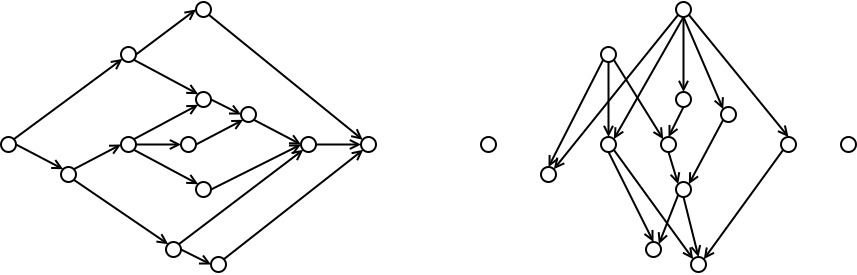
<figcaption aria-hidden="true">The graphs in the preceding figures,
presented in more natural horizontal and vertical arrangement. If we
choose any two vertices, one is reachable from the other in one graph
but not the other.</figcaption>
</figure>

### Crossings

Jaywalks are often st-planar graphs, albeit with either or both global
source and sink pruned. In most practical cases a planar arrangement
will be preferred over one with crossings. The principal and obverse DFS
orderings provide a suitable set of dominance coordinates: this is a
notable feature of st-planar graphs. Furthermore, in the dominance
drawing found in this fashion the edges may be drawn as straight lines
without crossings.

The converse is not the case. That is, a graph constructed from
dominance coordinates is not necessarily planar. Slightly ironically, a
simple dominance graph can have a co-dominance graph with many
crossings.

<figure>
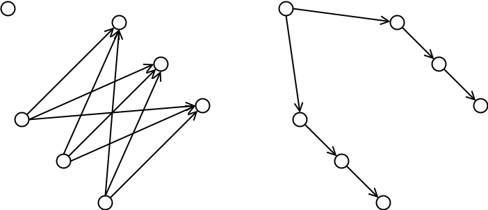
<figcaption aria-hidden="true">A complicated dominance graph can have a
simple corresponding co-dominance graph, and vice versa. The worst-case
complexity is a graph with the number of edges proportional to the
square of the number of vertices. This has implicates for some
construction algorithms (discussed elsewhere).</figcaption>
</figure>

This illustrates that dominance (likewise co-dominance) graphs can have
the worst-case complexity of edges: $\mathcal{O}(N^2)$.

## Loose ends

### Jaywalk core features

- The basic definition of a jaywalk is two sets of indices, the
  principal index and obverse index for each vertex. These indices serve
  as coordinates in the manner of a dominance drawing.

- Jaywalks are not necessarily planar. They are transitively
  irreducible.

- Jaywalks may have multiple sources and/or sinks. However, it must
  always be otherwise possible to add a global source and/or sink. For
  the sink this can be done by extrapolating the graph with an extra
  vertex with indices (dominance coordinates) that are higher than all
  the others in the specified jaywalk. A global source can be added in a
  similar manner.

- Jaywalks are considered *straightforward* if no edge is both a middle
  child of its parent and the middle parent of its child. In other
  words, if we find, for every vertex, the first and last child and the
  first and last parent, no edge will be missing. **Check if this is
  amenable to quick verification.**

### Integer lexicography

The criterion for reachability in the dominance graph is that one be
greater than the other in two lexicographic sorts, that is (primary,
obverse) and (obverse, primary). For the co-dominance graph one is
greater, the other less. However, note that we cannot reverse one of the
sets if indices if we permit equal indices. That is we cannot use, say
(reverse(primary), obverse) and (obverse, reverse(primary)).

It must be noted that the motivation behind equality of coordinates in
the dominance drawing arises secondarily from a desire to permit
compactness and primarily to support layouts that better align the
levels of tree-like structures.

# Jaywalk compressed formats

## Treenum format

### Basic idea of tree compression

We should be able to compress trees. This is to say, once we have listed
nodes in principal order, we have provided almost all information about
the tree, and should not need to provide the whole obverse order
explicitly. The scheme that follows compresses trees efficiently.
Moreover, the introduction of merges at vertices does not “break” the
compression. Not only can graphs with merges be represented, but also
the efficiency of compression is largely maintained on either side of
the merge.

In what follows we make use of what we call the principal and obverse
DFS trees. These are trees constructed from the graph by retaining only
those edges traversed in the corresponding search. If the graph has
merges, these trees are different. We will make only conceptual use of
the pDFS tree, and actual construction of the oDFS tree is generally
skipped, and the result we generate from reconstruction is to create a
chain of vertices arranged in oDFS order.

We first present what we call our *treenum* scheme. An efficient tree
compression scheme will require something like one edge annotation for
each parent node. The treenum scheme is designed for shallow trees where
the width is larger than the depth. Thus nodes with lots of children
should not need lots of annotation. Leaves should be essentially free.
An example is illustrated.

<figure>
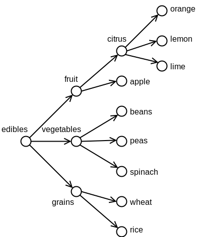
<figcaption aria-hidden="true">An example shallow tree.</figcaption>
</figure>

### Reconstruction, overall

The overall process for reconstructing a tree, and indeed for
reconstructing a DAG, is in three stages.

1.  Resolve given links into families of one or more children that link
    to a parent vertex. The method of resolution is explained in a later
    section.

2.  Reconstruct the oDFS tree.

3.  Chain the vertices in oDFS order. The method of chaining is
    explained in a later section.

It is generally straightforward to merge stage 3 into stage 2, thus
skipping actual tree construction and simplifying the intermediate data
structures.

### Reconstructing the oDFS tree, treenum case

<!-- mdformat off (Document metadata) -->

| Principal DFS | oDFS index | Parent    | Compressed parent | Child equivalent | Reconstruction stack |
|:--------------|-----------:|:----------|:------------------|:-----------------|:---------------------|
| edibles       |          0 | –         |                   | grain            | Z,                   |
| \+ fruit      |          8 | edibles   |                   | apple            | Z, edib,             |
| \+ + citrus   |         10 | fruit     |                   | lime             | Z, edib, frui,       |
| \+ + + orange |         13 | citrus    |                   |                  | Z, edib, frui, citr  |
| \+ + + lemon  |         12 | citrus    |                   |                  | Z, edib, frui, citr  |
| \+ + + lime   |         11 | citrus    | citrus            |                  | Z, edib, frui, citr  |
| \+ + apple    |          9 | fruit     | fruit             |                  | Z, edib, frui        |
| \+ vegetable  |          4 | edibles   |                   | spinach          | Z, edib,             |
| \+ + beans    |          7 | vegetable |                   |                  | Z, edib, vege        |
| \+ + peas     |          6 | vegetable |                   |                  | Z, edib, vege        |
| \+ + spinach  |          5 | vegetable | vegetable         |                  | Z, edib, vege        |
| \+ grain      |          1 | edibles   | edibles           | rice             | Z, edib              |
| \+ + wheat    |          3 | grain     |                   |                  | Z, grai              |
| \+ + rice     |          2 | grain     | grain             |                  | Z, grai              |

An example shallow tree where the width is larger than the depth. This
illustrates the treenum compression scheme for a fairly simple tree
(that shown in the above figure). The treenum reconstruction process is
applied in reverse principal DFS order. The parent link does not need to
be specified explicitly when (say for orange and lemon) the parent has
been given before (for lime). Eliding unneeded parent links compresses
the representation. We want code readers to be able to read in principal
order, and so it is preferable to specify links from parent to child. We
will address what we call *canonical* compression later. The last column
shows the evolving stack, from bottom to top, with labels truncated for
brevity.

<!-- mdformat on -->

The treenum oDFS tree reconstruction algorithm has the following general
features.

- The algorithm traverses the the vertices in reverse principal DFS
  order.

- A special link name, `unparented`, is used as a fake parent link for
  nodes that have no parents. These must be external vertices. The
  vertex with the lowest principal index is always unparented (and is
  the only such vertex in a true st-planar graph).

- In the treenum case the unparented vertex, which is always the global
  source if there is one, is used to seed the stack of parents. This is
  not just convenience, and rather ensures that the stack is never
  empty.

- Before reconstruction, an additional vertex is created to serve as a
  global source, the *unparented* link destination. This is deleted
  after reconstruction.

- Parentage stack with invariant: A stack of parents is maintained, with
  the invariant that the vertices on the stack have principal indices in
  order such that the top of the stack has the highest principal index.

- Invariant: All links are to parents, and therefore to vertices with
  lower principal index.

The treenum oDFS tree reconstruction algorithm processes each vertex in
the following steps.

1.  Look at the principal index of the current vertex. Pop all parents
    from the stack that have higher or equal principal indices. These
    are no longer valid parents for this vertex, nor for vertices we
    will process later.

2.  If there is a parent link for this vertex, pop all parents on the
    stack with higher or equal principal indices. Then push the new
    parent.

3.  Use the vertex on the top of the parent stack, without popping, as
    the parent for this node. If this is a leaf node, then it will be
    simply inserted. If it has children, then the subtree is spliced in.

### Sequential (oDFS) ordering

What we actually want, or at least how we have framed the task, is the
generation of a linkage (linked list or deque) of the vertices in oDFS
ordering. We so far have the oDFS tree. Algorithms that traverse the
oDFS tree in reverse order of principal indices must have processed all
children of the “current” vertex. Therefore the complete subtree is
available. Therefore the task is to insert the subtree into the correct
place in relation to the parent’s children.

We see from the above example we actually insert at the end. That is to
say we append the subtree / child after the last of the parent’s current
child subtrees. This is not quite trivial. However, we can note for the
current parent what is the last vertex among its descendants. When we
finish with a parent, by popping off the stack, we update the new parent
to ensure that we append appropriately.

## Family gathering

One of the principles of Jaywalk representation, including compressed
forms, is that all properly formed (syntax-wise) specifications should
be realizable as valid jaywalk graphs. Some forms may in fact be
nonsensical, but we leave user warnings about that to, say,
reformatters.

First of all, we treat the connections as non-directional. (Reformatters
that warn users may nonetheless base warnings on the directions.)
Basically families are some kind of clusters, but not islands. For
example, a simple chain of connections between parents and children
creates separate families, one for each parent. Conceptually we can
separate families between generations at a vertex if we can cut the set
of connected vertices into two, one with higher pDFS indices the other
with lower.

------------------------------------------------------------------------

This section is probably defunct.

In practical terms the rule that we use is that edges that bridge
combine. That is, we can add edges one at a time. An edge is one of:

1.  a new family link, when the higher pDFS index becomes the parent of
    the new family;

2.  simply adds to an existing family, adding a child to a parent where
    that child is not yet the child of another parent; and

3.  combining families by bridging.

There is a potential problem, because if we add an edge that bridges
existing families, edges within one family might bridge generation
(non-family) connections from the other. The trick is to be careful
about ordering how we add edges, creating an invariant.

------------------------------------------------------------------------

Any oDFS of the vertices can be used to create a valid DAG, and any
pattern of child-to-parents make a valid oDFS tree. The restrictions on
links is that

1.  each vertex only have one parent, that
2.  parents have higher pDFS indices than their children, and that
3.  children have contrary oDFS and pDFS orderings.

These rules actually arise from the rules of partially ordered sets. The
first rule is because the graph is a tree. The second arises because
(directed) edges must go from higher to lower indices in both orderings.
The third arises because of transitive reduction. A child must not be
reachable from other descendants of the parent, and therefore not from
the first descendant, which must be another child. For a set of siblings
to be all unreachable from each other they must have contrary orderings.

The first step in resolving the edges into family gatherings is to
traverse vertices in pDFS order, and convert edges so that they are
listed in the higher pDFS vertex. Then the second pass is to visit
vertices in reverse pDFS order. Those that have multiple connections
need to have them resolved to a single parent. Therefore the lowest, by
pDFS index, connected vertex becomes the parent and all other connected
vertices are converted to siblings by connecting them instead to that
parent. An example is illustrated.

<figure>
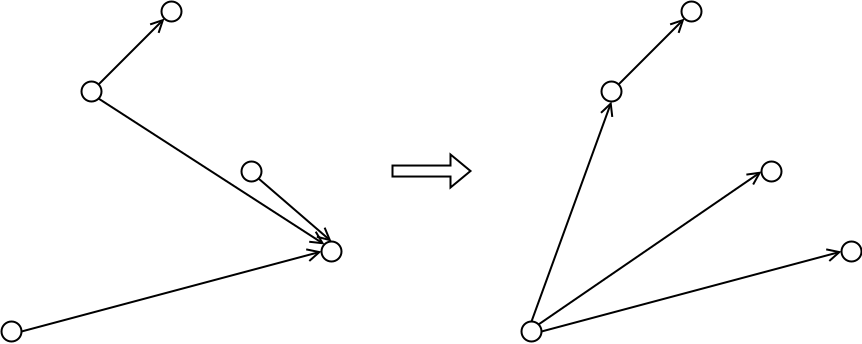
<figcaption aria-hidden="true">Graph rewrite rule for family
gathering.</figcaption>
</figure>

The result is an incomplete oDFS tree. The task of reconstruction is to
complete the tree, giving a parent to every vertex that lacks one.

<figure>
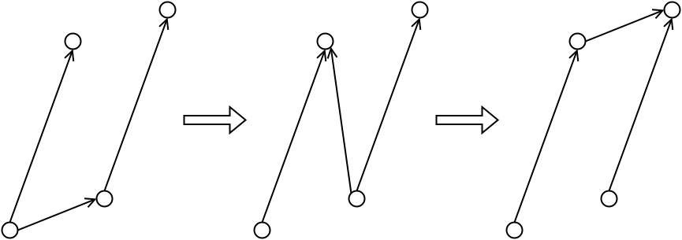
<figcaption aria-hidden="true">An example of an anomalous combination of
explicit edges. When the resolution rules are applied to the graph on
the left, in two applications, the result is arguably not what we would
expect.</figcaption>
</figure>

Potential complications arise when the first explicit edge does not span
the whole family. An example is illustrated. For now we just leave this
as an anomaly. The anomaly might be detected by noting which edges
result from reparenting, since it is further reparenting that can extend
the range in an inconsistent fashion.

One concern with this approach is that, while all inputs are handled,
bizarre input has a theoretically expensive gathering performance.

## Deep chain representation and reconstruction

### General idea and example

The objective in compressing DAGs is not achieving the most efficient
compression. Rather the primary criterion is efficiency of
communication, that is intelligibility.

The foregoing scheme, the *treenum* scheme, was designed specifically
for shallow trees. We now set out an alternative scheme for deeper and
narrower DAGs (still mostly tree-like) and we call these *chainums*
because they are especially well-suited to chains of enumerated states.

The key features of chainums are that they are

1.  primarily motivated by trees, that
2.  families are resolved into parent links, and that
3.  reconstruction defaults to making each vertex a child of the
    next-lowet pDFS index.

An example is illustrated.

<figure>
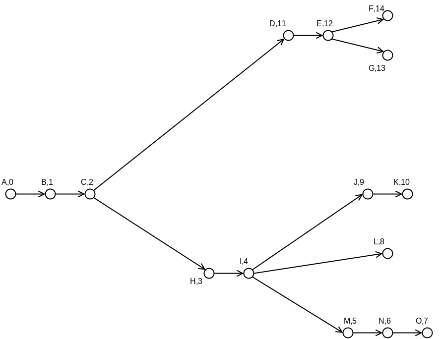
<figcaption aria-hidden="true">An example of a complicated tree that is
somewhat deep rather than shallow. This is better handled by chainum
than treenum compression.</figcaption>
</figure>

<!-- mdformat off (Document metadata) -->

| pDFS index | parent link | compressed parentage | Child & sibling | Reconstruction stack |
|:-----------|:------------|:---------------------|:----------------|:---------------------|
| A          |             |                      |                 |                      |
| B          | A           |                      |                 | Z, A                 |
| C          | B           |                      | H               | Z, B                 |
| D          | C           |                      |                 | Z, C                 |
| E          | D           |                      | G               | Z, C, D              |
| F          | E           |                      |                 | Z, C, E              |
| G          | E           | E                    |                 | Z, C, E              |
| H          | C           | C                    |                 | Z, C                 |
| I          | H           |                      | M               | Z, H                 |
| J          | I           |                      |                 | Z, I                 |
| K          | J           |                      |                 | Z, J                 |
| L          | I           | I                    |                 | Z, I                 |
| M          | I           | I                    | L               | Z, I                 |
| N          | M           |                      |                 | Z, M                 |
| O          | N           |                      |                 | Z, N                 |

Compression of the tree shown in the preceding figure). The full set of
parent links are shown with the compressed subselection in the next
column. These are converted into a suggested set of canonical familial
links that are well-suited to human readability. In many cases these
explicit edges will establish alternative paths in a graph of states.

<!-- mdformat on -->

Reconstruction of chainum oDFS trees is much like the process for
treenums. An example is shown in the table above. To reconstruct, we
traverse the vertices in reverse pDFS order. The main difference between
chainums and treenums is that we do not parent to the vertex previously
on the bottom of the stack. (a) If, after family gathering, the examined
vertex has an explicit parent, we parent to that. (b) Otherwise we
parent to the vertex with the next lowest pDFS index, which will be the
next vertex that we examine. Note that we still maintain a stack of
parents, but more to track the structure and in particular to insert
children in contrary order. It also enables us to create the oDFS chain
directly.

Briefly let us look at some steps in reconstruction of the example.
Applying the above rules, O parents to N and N to M by (b). The both M
and L parent to I by rule (a), with J also parenting to I but by rule
(b). In the meantime K parents to J by rule (b).

In some cases the chainum compression is arguably not ideal. However,
for most anticipated scenarios state chains will bifurcate. Often a
“normal” sequence of states will branch off with zero or one alternative
“anomalous” path from any given state. Therefore in most cases of
interest only the alternative child links need be specified in the
compressed representation.

### Mutatis mutandis

The overall strategy for constructing oDFS chains is very similar
between treenums and chainums. The main material difference is that

- In treenums implicit parents are found from the vertex at the top of
  the parentage stack, and

- In chainums implicit parents are found from the next vertex in the
  (reversed) pDFS sequence.

## Non-tree DAG reconstruction and compression

The preceding treenum and chainum schemes clearly work for true tree
DAGs. However, do they work, or can they be made to work, for non-tree
DAGs? And if so, are the edge merges handled gracefully? By that we
specifically mean that, during the course of oDFS tree reconstruction,
can the algorithm recover from a merge somewhere in the middle? Or put
another way, if there is a merge in the middle but the DAG is otherwise
tree-like either side, will both sides be efficiently compressed?

Consider the two drawings that follow. Vertices in the hashed area of
the first picture are, in the oDFS tree, reached from A. Vertices in the
region above the hatched region will be descendants of B in the oDFS
tree. If there is a merge there will be a slightly more complicated
scenario as shown in the second picture. Vertex C will have edges that,
directly or indirectly, merge with A. Put another way, both hatched
areas are, as in the first picture, descendants of A, but the right
hatched area contains vertices that are descendants of A in the pDFS
tree.

<figure>

<figcaption aria-hidden="true">Ranges of indices that are in pDFS and
oDFS subtrees. The top picture shows, in the hatched area, where
vertices are located if they are in the pDFS and oDFS subtrees of A but
not B. In the lower picture vertices in the right hashed area are
reachable both from A and C. Vertices here are in the pDFS subtree of C
but the oDFS subtree of A. They will, directly or indirectly, merge
descendants of A and C. The lower diagram also shows a vertex D that is
in the pDFS subtree for C but in the oDFS subtree for B rather than A.
Notice that the two hashed areas show where vertices in the oDFS subtree
of A lie, and that in this case the range of pDFS indices is not
continuous. That is, the pDFS indices of the oDFS descendants of A are
interrupted by D.</figcaption>
</figure>

The scenario is complicated further by vertices like D that are not
descendants of A in the oDFS tree and so further split the set of
vertices that are descendants of A. Overall this means that the
descendants of A are not a contiguous set when arranged by principal
index.

The approach that we used for treenums and chainums works well for
restarting the reconstruction when an interruption occurs. Specifically,
orienting the reconstruction around links to parents is simple to
implement and at least for a computer to reason about. That said, if
might be tricky to set out reults that the user can apply. Therefore we
recommend that a reformatter set the links according to a style
convention.

### Framing the task

### Worked example

Both treenum and chainum compression work well for non-tree DAGs, as
illustrated in the figure and table. The example DAG has two vertices
with merging edges. Reconstruction is applied in reverse pDFS order, and
we see that both schemes need explicit parents between S and L. The
compression proceeds smoothly thereafter.

<figure>
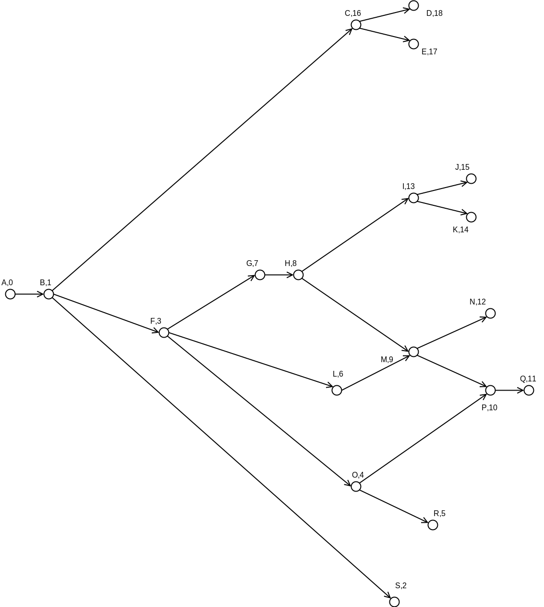
<figcaption aria-hidden="true">An example of a non-tree DAG with merging
edges at M and P. This results in discontinuous ranges of pDFS indices
in the oDFS subrees of 7 and 9. The descendants of 9 are (10, 11, 12)
which have pDFS indices (N, P, Q). Similarly the descendants of 7 do not
include L or O..</figcaption>
</figure>

<!-- mdformat off (Document metadata) -->

| pDFS index | oDFS index | pDFS parent | oDFS parent | treenum comp. | chainum comp. | Reconstruction stack |
|:-----------|:-----------|:------------|:------------|:--------------|:--------------|:---------------------|
| A          | 0          |             |             |               |               |                      |
| B          | 1          | A           | A,0         | A             |               | Z,A                  |
| C          | 16         | B           | B,1         |               |               | Z,B                  |
| D          | 18         | C           | C,16        |               |               | Z,B,C                |
| E          | 17         | C           | C,16        | C             | C             | Z,B,C                |
| F          | 3          | B           | B,1         |               | B             | Z,B                  |
| G          | 7          | F           | F,3         |               |               | Z,B,F                |
| H          | 8          | G           | G,7         | G             |               | Z,B,F,G              |
| I          | 13         | H           | H,8         | H             |               | Z,B,F,H              |
| J          | 15         | I           | I,13        |               |               | Z,B,F,I              |
| K          | 14         | I           | I,13        | I             | I             | Z,B,F,I              |
| L          | 6          | F           | F,3         | F             | F             | Z,B,F                |
| M          | 9          | L           | H,8         | H             | H             | Z,B,F,L              |
| N          | 12         | M           | M,9         | M             |               | Z,B,F,M              |
| O          | 4          | F           | F,3         | F             | F             | Z,B,F                |
| P          | 10         | O           | M,9         | M             | M             | Z,B,M                |
| Q          | 11         | P           | P,10        | P             |               | Z,B,O,P              |
| R          | 5          | O           | O,4         | O             | O             | Z,B,O                |
| S          | 2          | B           | B,1         | B             | B             | Z,B                  |

Familial lineages for the graph shown in the preceding figure). This
graph is better-suited to chainum compression. Nonetheless both schemes
recover after the merges at M and P. The reconstruction is applied in
reverse pDFS order, and we see both schemes working well from K down to
A.

<!-- mdformat on -->

## Compression and canonical compression

Compressing the DAG representation is essentially the same as performing
reconstruction. Assume that we start with links to parents for each
vertex. If we apply the reconstruction algorithm, we can see which links
can be inferred.

For an example, see table above. Consider the parent links from bottom
to top. There is no need to repeat *grain* for *rice*, because we push
this to the parentage stack when processing *wheat*. When we process
*spinach*, we push *vegetable* to the stack. When we reach *vegetable*
we pop it and the parent on the top of the stack is then *edibles*, so
that does not need to be given explicitly.

## Familial linkage and canonical forms

### Canonical compression

From the point of view of human readability, the representation with
links from children to their parents is not the most efficient. In the
case of very shallow trees, we would like to be able to read from top to
bottom. This amounts to traversing from root to leaves. Therefore, for
treenums, at least those that are true trees, simply reversing the links
works well.

For chainums we can also reverse the link from parent to first child,
and this suffices for what we might call simple cases. That is, we
define a *simple chainum* to be a tree that only bifurcates. There are
many scenarios in which this applies. A state DAG has this property if
the only transitions from each state (other than back up the tree) are
the normal path and one abnormal path.

The above rules work for simple trees. Our task, then is to design a
canonical family linkage that applies more broadly, maintaining
simplicity where possible. Realistically, our task is to represent DAGs
that are straightforward such that they are human readable. Once graphs
become much more complex, it is much easier to see the structure from a
diagram.

1)  Each vertex has zero of one explicit links.

2)  In any explicit family, that is between a vertex and all explicitly
    linked children, there must be a link between the parent and the
    furthest (highest pDFS index) child.

There are a few options for the other members of the family. We could
just leave those links as from sibling to parent. Or we could prefer to
link the siblings in a chain of increasing pDFS. Or decreasing pDFS.
Note that, while the above two rules are universal, anything else is a
preference, since flexibility of linkage is limited by rule 1. At the
time of writing, we prefer the following.

3)  For the link given in rule 2, prefer links from child to parent.

4)  For remaining familial links, prefer links between siblings in the
    direction of decreasing pDFS index.

The reason for the last rule is that it works with the decision below on
preferred ordering of children. The exact implementation of the link
redirection affects how exactly the preferences are followed. We suggest
the following approach.

- Traverse vertices in pDFS order.
- Process each family as a unit, considering the parent to last (highest
  pDFS) child link, and trying to reverse that as a link from parent to
  child. Proceed along siblings, trying to chain from one sibling to the
  sibling with next lowest pDFS index.
- Stop processing a family once first unable to redirect a link.

### Preferred layout and ordering of children in chainums

The above preference (4) embodies a preferred layout for chainums. That
is to say, it will work efficiently if a graph is laid out in a
particular way. First we assume that the graph is a tree and that it is
deep. Rule (2) has already implied a general preference for layout.

1)  Prefer to make the child with the most *normal* transition be the
    first (lowest pDFS) vertex. What we actually want is that the
    deepest chain be from low-pDFS vertex to another low-pDFS vertex.

For the more general situation we want to lay out the graph well when
there are three or more children. We decide that it is best to have
short chains on the outside rather than on the inside.

2)  A child with the highest pDFS index is less likely itself to have
    children. Therefore it is better to have the highest pDFS child have
    the explicit link to a sibling, freeing that one up to have an
    explicit link to its last child.

### Another note

This was an older comment. It should probably be folded into the rest of
the text.

The present consideration of representations and compression should not
presuppose a particular rendering into text. That said, we work on the
basis that the pDFS order will be known, likely by listing the vertices
in that order, and that each vertex will have zero or one links. In the
reconstruction algorithm we require that these have been resolved to be
the links to parents in the oDFS tree.

An important consideration is that all graph specifications should be
valid, even if the links would not make much sense from a human
standpoint. Below we will consider reformatting to a canonical
representation. For this reason we do not reject humanly irrational
input, and the reformatter should make the coder aware of any anomalies.
In short, we decide in this case that anomalous input should be handled
rather than triggering errors.

That said, all but the most complex graphs should have a straightforward
canonical form. This is especially true for pure-tree DAGs.
