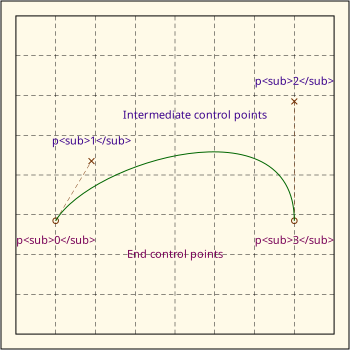
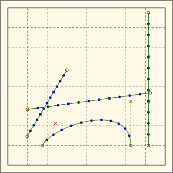

---
author:
- J. Alex Stark
date: 2025
title: An Introduction to Curves in Zebraix
---

- [1 Task](#task)
  - [1.1 General
    purpose](#general-purpose)

------------------------------------------------------------------------

Heptodes documents and other content in `doc` directories are licensed
under the [Creative Commons Attribution 4.0
License](CC%20BY%204.0%20license).

Source code licensed and code samples are licensed under the [Apache 2.0
License](https://www.apache.org/licenses/LICENSE-2.0).

The CC BY 4.0 license requires attribution. When samples, examples,
figures, tables, or other excerpts, are used in a tutorial, or a
subdivision thereof, it is sufficient to provide the complete source and
license information once. This must be close to the beginning, such as
in an early acknowledgments slide. If this is done, only short notes are
required to be placed with each usage, such as in figure captions.

------------------------------------------------------------------------

<!-- mdformat off (Document metadata) -->
<!-- mdformat on -->

# Task

<!-- 4.0 * 70pt =280pt for width 4.0. -->

<figure>

<figcaption aria-hidden="true"><a
href="figs-intro/intro_cubic_controlled.svg">Figure (SVG)</a> Caption: A
somewhat longer caption that spills into multiple lines to test this
behaviour, and to test insensitivity to line breaking in the source
file.</figcaption>
</figure>

In between text.

<!-- 3.5 * 70pt = 245pt for width 3.5. -->

<figure>

<figcaption aria-hidden="true"><a
href="figs-intro/intro_cubic_slider.svg">Figure (SVG)</a> A short
caption..</figcaption>
</figure>

In between text.

## General purpose

<!-- mdformat off (Document metadata) -->

| Arc type                    | Angle range                      | $\beta$      | $\rho$   | $\alpha$  |
|:----------------------------|:---------------------------------|:-------------|:---------|:----------|
| Parabola                    | $-\epsilon^\circ,\epsilon^\circ$ | $0$          | $1$      | $1$       |
| Arc less than semicircle    |                                  | $(0,2)$      | $(0,1)$  | $(1/2,1)$ |
| Semicircle                  | $-90^\circ,90^\circ$             | $2$          | $0$      | $1/2$     |
| Arc greater than semicircle |                                  | $(2,\infty)$ | $(-1,0)$ | $(0,1/2)$ |
| Full circle / indeterminate | $-180^\circ,180^\circ$           | $\infty$     | $-1$     | $0$       |

Caption.

<!-- mdformat on -->
