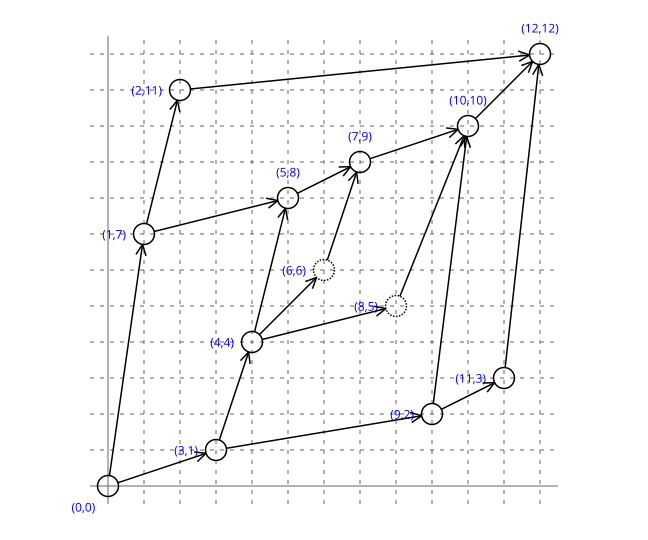
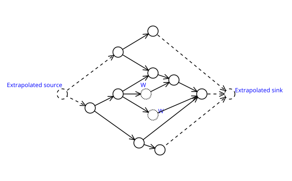

--------------------------------------------------------------------------------

Heptodes documents and other content in `doc` directories are licensed under the
[Creative Commons Attribution 4.0 License](CC BY 4.0 license).

Source code licensed and code samples are licensed under the
[Apache 2.0 License].

The CC BY 4.0 license requires attribution. When samples, examples, figures,
tables, or other excerpts, are used in a tutorial, or a subdivision thereof, it
is sufficient to provide the complete source and license information once. This
must be close to the beginning, such as in an early acknowledgments slide. If
this is done, only short notes are required to be placed with each usage, such
as in figure captions.

[Creative Commons Attribution 4.0 License]: https://creativecommons.org/licenses/by/4.0/legalcode
[Apache 2.0 License]: https://www.apache.org/licenses/LICENSE-2.0

--------------------------------------------------------------------------------

<!-- mdformat off (Document metadata) -->

---
title: Jaywalk Encoding for Text
author:
- J. Alex Stark
date: 2026
...

<!-- mdformat on -->

In between text.

 A moderately complicated tree (by expected standards.)\label{figB}](figs-encode/TreeEdiblesMerge.svg){width=300pt}

In between text.

<!-- mdformat off (Document metadata) -->

---------------------------------------------------------------------------------------
Label                  Ranks      RNA        FNA          RNB          FNB
----------             -----      ---------  -----------  ----------   ---------------
[source]               (-1, x)    edibles    --           --           --

edibles                ( 0,  0)   grain      ◊            ∙            ◊

⎬ fruit                ( 1,  8)   apple      ◊            beans        edibles

⎪ · ⎬ citrus           ( 2, 10)   lime       ◊            apple        fruit

⎪ · ⎪ · ⎪ orange       ( 3, 13)   ∙          ◊            lemon        citrus

⎪ · ⎪ · ⎪ lemon        ( 4, 12)   ∙          orange       lime         citrus

⎪ · ⎪ · ⎩ lime         ( 5, 11)   ∙          lemon        apple        citrus

⎪ · ⎩ apple            ( 6,  9)   ∙          citrus       beans        fruit

⎬ vegetable            ( 7,  4)   spinach    fruit        wheat        edibles

⎪ · ⎪ beans            ( 8,  7)   ∙          fruit        peas         vegetable

⎪ · ⎪ peas             ( 9,  6)   ∙          beans        spinach      vegetable

⎪ · ⎩ spinach          (10,  5)   ∙          peas         wheat        vegetable

⎩ grain                (11,  1)   rice       vegetable    ∙            edible

&nbsp;&nbsp; · ⎪ wheat (12,  3)   ∙          vegetable    rice         grain

&nbsp;&nbsp; · ⎩ rice  (13,  2)   ∙          wheat        ∙            grain

[sink]                 (14, y)    --         edibles                   orange
---------------------------------------------------------------------------------------

Table: For RNG and LNL source is at (-1,-1) and sink is at (14,14).
These are the locations shown in the corresponding drawing.  For RNL
and LNG source is at (-1,14) and sink is at (14,-1).\label{tabR}

<!-- mdformat on -->

In between text.

 A short caption.\label{figB}.](figs-encode/on_grid.svg){width=350pt}

In between text.

 A short caption.\label{figB}.](figs-encode/inference.svg){width=400pt}

In between text.

 A short caption.\label{figB}.](figs-encode/TreeNumMerge.svg){width=280pt}

In between text.

 A short caption.\label{figB}.](figs-encode/ComplexEdibles.svg){width=320pt}

In between text.

<!-- <\!-- mdformat off (Document metadata) -\-> -->

<!-- --------------------------------------------------------------------------------------- -->
<!-- Principal              oDFS   Parent       Compressed    Child         Reconstruction -->
<!-- DFS                   index                parent        equivalent    stack -->
<!-- ----------          -------   -----------  ------------  ------------  --------------------- -->
<!-- edibles                   0   --                         grain         Z, -->

<!-- ⎢ fruit                   8   edibles                    apple         Z, edib, -->

<!-- ⎢ ⎢ citrus               10   fruit                      lime          Z, edib, frui, -->

<!-- ⎢ ⎢ ⎢ orange             13   citrus                                   Z, edib, frui, citr -->

<!-- ⎢ ⎢ ⎢ lemon              12   citrus                                   Z, edib, frui, citr -->

<!-- ⎢ ⎢ ⎣ lime               11   citrus       citrus                      Z, edib, frui, citr -->

<!-- ⎢ ⎣ apple                 9   fruit        fruit                       Z, edib, frui -->

<!-- ⎢ vegetable               4   edibles                    spinach       Z, edib, -->

<!-- ⎢ ⎢ beans                 7   vegetable                                Z, edib, vege -->

<!-- ⎢ ⎢ peas                  6   vegetable                                Z, edib, vege -->

<!-- ⎢ ⎣ spinach               5   vegetable    vegetable                   Z, edib, vege -->

<!-- ⎣ grain                   1   edibles      edibles       rice          Z, edib -->

<!-- · ⎢ wheat                 3   grain                                    Z, grai -->

<!-- · ⎣ rice                  2   grain        grain                       Z, grai -->
<!-- --------------------------------------------------------------------------------------- -->

<!-- Table: An example shallow tree where the width is larger than the depth.  This -->
<!-- illustrates the treenum compression scheme for a fairly simple tree (that shown -->
<!-- in the above figure\text{, figure \ref{figR}}).  The treenum reconstruction -->
<!-- process is applied in reverse principal DFS order.  The parent link does not -->
<!-- need to be specified explicitly when (say for orange and lemon) the parent has -->
<!-- been given before (for lime).  Eliding unneeded parent links compresses the -->
<!-- representation.  We want code readers to be able to read in principal order, and -->
<!-- so it is preferable to specify links from parent to child.  We will address what -->
<!-- we call *canonical* compression later.  The last column shows the evolving -->
<!-- stack, from bottom to top, with labels truncated for brevity.\label{tabR} -->

<!-- <\!-- mdformat on -\-> -->

In between text.

<!-- mdformat off (Document metadata) -->

---------------------------------------------------------------------------------------
Principal              oDFS   Parent       Compressed    Child         Reconstruction
DFS                   index                parent        equivalent    stack
----------            -----   -----------  ------------  ------------  ---------------------
edibles                   0   --                         grain         Z,

⎬ fruit                   8   edibles                    apple         Z, edib,

⎪ · ⎬ citrus             10   fruit                      lime          Z, edib, frui,

⎪ · ⎪ · ⎪ orange         13   citrus                                   Z, edib, frui, citr

⎪ · ⎪ · ⎪ lemon          12   citrus                                   Z, edib, frui, citr

⎪ · ⎪ · ⎩ lime           11   citrus       citrus                      Z, edib, frui, citr

⎪ · ⎩ apple               9   fruit        fruit                       Z, edib, frui

⎬ vegetable               4   edibles                    spinach       Z, edib,

⎪ · ⎪ beans               7   vegetable                                Z, edib, vege

⎪ · ⎪ peas                6   vegetable                                Z, edib, vege

⎪ · ⎩ spinach             5   vegetable    vegetable                   Z, edib, vege

⎩ grain                   1   edibles      edibles       rice          Z, edib

&nbsp;&nbsp; · ⎪ wheat    3   grain                                    Z, grai

&nbsp;&nbsp; · ⎩ rice     2   grain        grain                       Z, grai
---------------------------------------------------------------------------------------

Table: An example shallow tree where the width is larger than the depth.  This
illustrates the treenum compression scheme for a fairly simple tree (that shown
in the above figure\text{, figure \ref{figR}}).  The treenum reconstruction
process is applied in reverse principal DFS order.  The parent link does not
need to be specified explicitly when (say for orange and lemon) the parent has
been given before (for lime).  Eliding unneeded parent links compresses the
representation.  We want code readers to be able to read in principal order, and
so it is preferable to specify links from parent to child.  We will address what
we call *canonical* compression later.  The last column shows the evolving
stack, from bottom to top, with labels truncated for brevity.\label{tabR}

<!-- mdformat on -->
