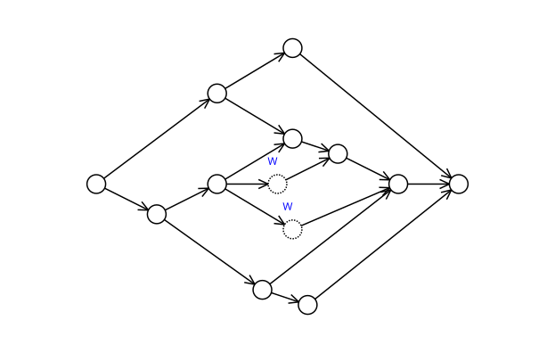
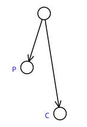

% Pre-Jaywalk Graph Exploration
% J. Alex Stark
% 2003--2022


----------------------------------------

Heptodes documents and other content in `doc` directories are licensed under the
[Creative Commons Attribution 4.0 License] (CC BY 4.0 license).

Source code licensed and code samples are licensed under the [Apache
2.0 License].

The CC BY 4.0 license requires attribution.  When samples, examples, figures,
tables, or other excerpts, are used in a tutorial, or a subdivision thereof, it
is sufficient to provide the complete source and license information once.  This
must be close to the beginning, such as in an early acknowledgments slide.  If
this is done, only short notes are required to be placed with each usage, such
as in figure captions.

[Creative Commons Attribution 4.0 License]: https://creativecommons.org/licenses/by/4.0/legalcode
[Apache 2.0 License]: https://www.apache.org/licenses/LICENSE-2.0

----------------------------------------


# Ti-da-st(e)-planar graphs: Building blocks for enumerations and state graphs

## Please read

The fact that documents are, or appear to be, carefully and formally written
does not indicate that a project is formal. Rather, even a fun side project
would be pointless if it were not clearly described. It would be aimless to
pursue a side project without any goals and purpose in mind.

## Scope

This document describes the basic mechanisms in Patinon for specifying
enumerations, FSMs, typestate graphs and so on. It covers the building blocks
and not the final assembly of these entities. For example, the following are not
covered.

*   Typestate graphs make use of graph products.
*   FSMs can specify permitted transitions in detail.
*   Hierarchical enumerations can use packed data ranges with offsets.
*   Details of syntax in any final sense.

Patinon provides various methods for combining and refining graphs and sets, but
these are discussed elsewhere.

### Nomenclature

Partially-ordered sets (posets)
:   We assume that the reader is familiar with the basics of these. To avoid
    confusion, in Patinon we avoid use of the greater-than signs when dealing
    with posets.

Graphs and DAGs
:   We assume that the reader is familiar with the basics of graphs. Herein we
    will discuss planar graphs.

## Enumerations

### Traditional enums

Enumerations are richer in Patinon than in most languages. A straightforward
enum is a set of identifiers and associated integer values that are
automatically assigned. They are used to enumerate and identify possbilities.

```
enum Citrus {
   orange,
   lemon,
   grapefruit,
   lime,
}
{
   check_eq(Citrus.size, 3)
   tree_type :Citrus
   // ...

   if (tree_type == Citrus.lemon) {
      // ...
   }
}
```

The underlying representation can be specified, gaps of unused values are
allowed, and values can be specified.

```
enum Apple :unit8 {
   granny_smith = 8,
   bramley = 2,
   fuji = 5,
}
{
   check_eq(Apple.size, 9)
   check_eq(Apple.min, 2)
   // ...
}
```

Notice that Patinon treats the size as being the maximum value plus 1. One can
already see that Patinon handles enums with a bit more formality and provides
some introspection.

### Simple hierarchies

Enumerations can be extended by embedding and by combination into tree
hierarchies. First, here is a tree.

```
enum Fruit {
   apple :Apple,
   grape,
   citrus :Citrus,
   peach,
}
{
   harvest :Fruit
   // ...

   if (harvest == Fruit.citrus.lemon) {
      // ...
   }
}
```

Second, here is a an embedding. *Remember that all syntax is rough and ad-hoc.*

```
enum FruitEmbedded {
   apple :Apple,
   grape,
   embed citrus :Citrus,
   peach,
}
{
   harvest :Fruit
   // ...

   if (harvest == Fruit.lemon) {
      // ...
   }
}
```

Value assignment is not supported when there are hierarchies or embeddings.

### Introspection

Patinon will support some amount of introspection, using names and short
documentation. It will have rules for conversion of snake case and camel case,
in the spirit of making code lightweight. The rules will perhaps be to separate
into words, capitalizing the first and lower-casing the remainder.

```
enum Transform {
   hadamard,
   fft % "FFT: Fast Fourier Transform",
   i_dct % "iDCT: Inverse discrete-cosine transform",
   affine_transformation,
}
// Transform.hadamard.name is "Hadamard", others are "FFT", "iDCT" and "Affine
// transformation".
```

## Planar graphs

### tidastep graphs

The building blocks for Patinon's graphs are *transitively irreducible st-planar
graphs and the source and sink nodes can be extrapolated*. Let us unpack that,
initially just briefly.

*   Planar graphs (assumed to be DAGs) are graphs that can be drawing without
    edge crossings.
*   Every st-planar graph has one source node and one sink node. All nodes can
    be reached from the source and are able to reach the sink. In other words,
    there is only one graph and the source node is the only one without parents
    and the sink node is the only one without children.
*   Often either a source or sink node is not needed. This is the case for
    trees, which have a root (the source) but no sink. Patinon can extrapolate a
    source and/or sink node. The graph must be laid out so that all nodes that
    are without a parent can be connected to the source, and all nodes without a
    child can be connected to the sink.
*   The graph must be *transitively irreducible*, which means that there are no
    transitive reduction simplifications. Suppose that we build up a graph. If
    we already have `A->B->C` we cannot bridge states A and C by adding an edge
    `A->C`.
*   If a graph is needed with bridging edges these are converted by inserting
    what we call a *waystate* (a waypoint state). So, in this example, we add
    state W and add two edges `A->W` and `W->C`. Waystates are useful in that
    they can be used to specify restrictions on paths.

### Planarity, source and sink

Here is a rather elaborate st-planar graph. Real code is not going to want a
graph like this, but it is a fun illustration.



We can remove the source and the sink from the graph and let Patinon extrapolate
them. The requirement is that the edges connecting to either an extrapolated
source or sink do not cross any other edges.


## Main ideas

### Key graph types

A simple graph can be linear.


Typestates will often be very simple. Quite a lot of extra management detail can
be achieved with just a few branches.


Enumerations can be represented in graphs.


A classic FSM is the traffic light sequence, that is used in Europe.


### Graph types as DAGs

Enumerations are represented well as tidastep graphs because of their
hierarchical potentials.


Also, Patinon always works with DAGs, so the traffic light example's underlying
graph has simple forward arrows. If transitions are restricted in particular
directions, those would be imposed in a "layer above" the graph.


## Some more detail

### Transitive reduction and waypoints

We consider the issue of transitive irreducibility at this early stage with some
misgivings. Really it is a minor point, but it is part of the definition of the
class of graph, so we cannot really avoid addressing it. The idea of transitive
reduction of a graph is that one removes edges that directly join edges that
otherwise have an indirect connection. The idea is that the direct route is "not
necessary", because it does not add to the reachability of any one node from any
other.

In Patinon we want our graphs not to be reducible. This is why we use the term
*transitively irreducible*. It means that, if one node can be indirectly reached
from another there is not a direct connection. The following violates this.


The solution is to add what we call a *waypoint*, because in Patinon we are
concerned with state transitions and paths and these are added states on the
way.


### Aside

**Please** ignore the following aside unless you are curious. In Patinon one
does not normally specify graphs by adding edges, so it is not necessary to
check for invalid edges that bridge nodes. In addition to simply duplicating an
existing edge, the following three patterns create violations of irreducibility.





What we *would* needed to check *(if we regularly did this)* would be to see if
any of the parents of C are either P or its ancestors, or if any of the (direct)
children of P are decendants of C.

The properties of tidastep graphs mean that we do not need to make these checks.

## Orderings and dominance

### Dominance drawings

A wonderful property of tidastep graphs is that specifying them is simple. We
associate two numbers with each node.


This is the graph that we showed earlier. Before we rotated by 45 degrees. This
new layout is the raw *dominance drawing*. The source is in the SW corner, the
sink in the NE corner.

*   Most of the time we rotate the drawing through an odd number of octants so
    that, instead of up and to the right, the overall direction aligns with a
    compass direction.
*   There are some conventions and cosmetic defaults that we choose for Patinon.
    These are often made so that the specification and rendering of enumeration
    hierarchies and of typestate graphs are largely the same. For example, we
    often rotate the graph so that the general direction is to the East.

The orderings are straightforward.

*   The *dominance* rule is that you can reach an arrival node A with orderings
    $$x_A$$ and $$y_A$$ from destination node D with orderings $$x_D$$ and
    $$y_D$$ *if and only if* both $$x_D < x_A$$ and $$y_D < y_A$$.
*   This rule determines the reachability. One can reach A from D directly or
    indirectly through intermediate nodes. Because of transitive irreducibility,
    we do not add direct edges if indirect edges provide a path.

### Orderings examples

Let us look at a few of the preceding graphs with their two orderings. First,
the linear graph.


Next, the branching graph. (Aside: we adjusted the edges for the earlier plot,
whereas here we show the raw form.) The sink (not shown) has ranks (5,5) in the
orderings.


Enumerations are simple if there is no hierarchy. One later. Here is the
hierarchical example. This is representative of any kind of tree. The sink (not
shown) has ranks (12,12) in the orderings.


The dominance scheme works for any tidastep graph, even if complicated.


### Orderings definition

Tidastep graphs have a relatively straightforward method for finding suitable
orderings. (Relative in that graphs concepts can get pretty complicated.) That
is what is so neat about them. Restrictions that are fairly natural to the kinds
of graphs that Patinon needs enable us to leverage theory that has been
thought-through deeply. The orderings in question are found by left and right
depth-first search. Because there is no obvious left versus right in our graphs,
and because the practical meaning of the orderings are different we refer to one
as *prime* and the other as the *obverse*. The prime ordering is imbued with
more meaning.

The prime ordering is a graph topological ordering found by depthwise search.
For trees the algorithm is simple. Label the nodes from the source (tree root),
descending the more anti-clockwise children first, and labelling nodes before
their children. For obverse ordering, descend the most clockwise first.

For graphs with merges, the prime ordering is found by descending down the more
*clockwise* children first, numbering from $$n-1$$ down to $$0$$, and numbering
all children before the parent. The obverse ordering is the same but descending
more *anti-clockwise* children first. These methods push merging nodes, that is
those with more than one parent, to higher numbers than all of the parents.

The reason for this is twofold, but let us look at a couple of example first. In
Patinon the preferred way to specify tidastep graphs is to list nodes in prime
order and specify the obverse order. First, the linear graph.

```
tidastep Riddle {
   four_legs  % 0,
   two_legs   % 1,
   three_legs % 2,
}
```

Second, consider the citrus enumeration. The obverse ordering is reversed
between sibling leaf nodes.

```
tidastep CitrusGraph {
   orange     % 3,
   lemon      % 2,
   grapefruit % 1,
   lime       % 0,
}
```

This form of specification is concise and has a few notable benefits.

*   Enums are listed in the expected ordering. The clockwise / anti-clockwise
    convention leads to enumerations drawn in the arrangement that we would
    expect.
*   The most fit-for-use state in a graph is listed at the end and therefore
    easy to find. This is Patinon's convention: put the most "typical" (most
    "capable") path of states along the most clockwise chain of edges.

This is illustrated in the specification for the branched example.

```
tidastep ConfigError {
   unfit        % 0,
   config_error % 4,
   config       % 1,
   error        % 3,
   fit          % 2,
}
```

### Longer examples

Declaring hierarchies and trees is quite straighforward. More complicated graphs
are inevitably harder, but visualization is quite easy. (The drawings shown here
are automatic with relatively little tweaking.)

```
tidastep FruitGraph {
   Fruit              % 0,
   apple              % 8,
   apple.granny_smith % 11,
   apple.bramley      % 10,
   apple.fuji         % 9,
   grape              % 7,
   citrus             % 2,
   citrus.orange      % 6,
   citrus.lemon       % 5,
   citrus.grapefruit  % 4,
   citrus.lime        % 3,
   peach              % 1,
}
```

The complicated example graph can be specified using this scheme.

```
tidastep ComplicatedGraph {
   S  % 0,
   A  % 7,
   B  % 11,
   C  % 1,
   D  % 4,
   E  % 8,
   FW % 6,
   G  % 9,
   HW % 5,
   I  % 2,
   J  % 10,
   K  % 3,
   T  % 12,
}
```

## Posets

### Purpose

One does not need any of this graph specification for enumerations without
hierarchies or for simple linear state graphs. However, as soon as graphs get
more interesting, Patinon needs to be able to do one task very well indeed. This
is to be able to specify and check if one state (or other node interpretation)
is a reachable from another. This is because the directedness of the edges
represents an increase in capability or change in permissions. Therefore, for
example, the set of all nodes X that are reachable from A is the set of states
at least as capable as A.

This reachability also can be described as *being a descendant of*. The relation
$$A \leq X$$ (along with $$A < X$$) is a classic *partial ordering*. So the
established principles of posets (partially ordered sets) bring pre-packaged
properties.

As mentioned elsewhere, Patinon prefers only to use $$A < B$$ and avoids use of
$$B > A$$. The rejection of use of greater-than helps remind us that the
entities are not ordered, but only partially so.

While merges of branches (nodes with indegrees greater than 1) need to be
handled, they are no expected to be common in base graphs. They do arise in
products of graphs.

In the early explorations behind Patinon, the possibility of dropping the
directedness was considered. This was because some of the articles surrounding
typestate provided more automatic lowering (or other transitions) than was
envisaged for Patinon. However, fairly quickly it became clear that there were
critical benefits of edge directions, not least in the ability to constrain
capabilities.

### Five cases

It is a property of st-planar graphs that the reachability of node B relative to
node A can be established from the prime and obverse orderings.

|                 | prime(B) < | prime(A) == prime(B) | prime(A) < prime(B) |
:                 : prime(A)   :                      :                     :
| :-------------: | :--------: | :------------------: | :-----------------: |
| **obverse(B) <  | B < A      |                      | cousins             |
: obverse(A**)    :            :                      :                     :
| **obverse(A) == |            | A == B               |                     |
: obverse(B)**    :            :                      :                     :
| **obverse(A) <  | cousins    |                      | A < B               |
: obverse(B)**    :            :                      :                     :

Notice that two nodes are cousins (on separate internal branches, not reachable
from each other in either direction) of the prime and obverse orderings are,
so-to-speak, in disagreement.

Aside: The ability to check the relative orderings of two nodes applies to
transitively reducible graphs. For example, $$A < B$$ says that B can be reached
from A. This is true if the graph has reductions. The benefit of irreducibility
is that it says which potential means of reaching one node from another are
necessary, and therefore included.

## Rationale

One might think from all the discussion in this document that Patinon adopted
tidastep graphs early on, or at least st-planar graphs. However, this was not
the case. All the critical decisions towards the adoption of this restricted
category of graph were made with specific design intent.

*   The directedness of edges, that is the use of DAGs over unidirected graphs,
    was chosen because it supports simple notions of capability and permission.
*   The ability to determine partial ordering from two orderings was realized
    before the connection with st-planar graphs was made. It was already
    realized that planar graphs would have this property, and the st-planar
    refinement brought with it a body of knowledge about these graphs.
*   We understood that trees would require two orderings to establish partial
    ordering. The ability to extend this to a fairly flexible set of graphs was
    considered a significant benefit. The mindset was already that complex state
    graphs would be composed from products, potentially restricted, of simpler
    base graphs.
*   We wanted the requirement for waypoints quite early on, since we understood
    that users would want this. Imposing it as a requirement does not seem to
    onerous, not least since we can effectively elide the waypoints. Then we
    realized that this made the graphs irreducible, which bought with it the
    huge benefit of dominance drawings.
*   We thought about "left" versus "right" depth-first searches, and decided on
    a scheme in which one is considered superior to the other, namely the prime
    ordering and obverse ordering. To reiterate points made earlier, the
    movivation behind prime's primacy over obverse is that (a) enumerations and
    trees are specified and drawn in a consistent fashion, and (b) we judged
    that it is easiest if the "most mature / active" state is the one at the
    bottom, not hidden in the middle.
