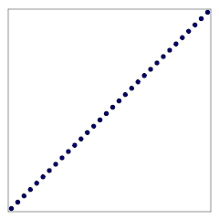
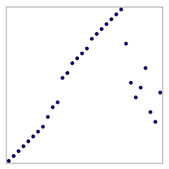

--------------------------------------------------------------------------------

Heptodes documents and other content in `doc` directories are licensed under the
[Creative Commons Attribution 4.0 License](CC BY 4.0 license).

Source code licensed and code samples are licensed under the
[Apache 2.0 License].

The CC BY 4.0 license requires attribution. When samples, examples, figures,
tables, or other excerpts, are used in a tutorial, or a subdivision thereof, it
is sufficient to provide the complete source and license information once. This
must be close to the beginning, such as in an early acknowledgments slide. If
this is done, only short notes are required to be placed with each usage, such
as in figure captions.

[Creative Commons Attribution 4.0 License]: https://creativecommons.org/licenses/by/4.0/legalcode
[Apache 2.0 License]: https://www.apache.org/licenses/LICENSE-2.0

--------------------------------------------------------------------------------

<!-- md-formatter off (Document metadata) -->

---
title: WSC Information-Transfer Mergesort
author:
- J. Alex Stark
date: 2023
...

<!-- md-formatter on -->

# Preliminary remarks

This document describes the main ideas, implementation and design of an
investigation into some variations on mergesort. Summary results are presented.
This project is a side project to a side project, and so time for exploration
and presentation of results was severely constrained. There are various
consequences of this.

*   This documentation is very rough. With more time the presentation could be
    made more concise and clear.

*   Performance evaluation is almost solely a strict count of comparisons.

*   Little consideration is given to locality of reference, or to any practical
    sorting considerations.

*   No 'field study' was conducted into what sort patterns arise in practical
    situations.

*   Code developed for the project is very unpolished, with little optimization.

*   Little consideration was given to storage.

*   Code was developed in Rust. This choice was made in the project out of which
    this (sub-)project arose, and not because it was thought best for this
    project.

*   We only compare performance against standard mergesort, and do not survey
    enhancements to mergesort.

# Comparison sorting

## Mergesort

The project was framed as an exploration into comparison sorting where the count
of the number of comparisons is the overriding efficiency criterion.

Comparison sorting is sorting in which the only question we can, so-to-speak, as
of the data is which of two elements (members) comes before the other. The
classic complexity bound is that, if all input arrangements are equally likely,
then the average number of comparison requests must be at least $\log_2(N!)$.

Mergesort is the standard against which we compare our results. Some reasons for
this follow.

1.  The average number pf comparisons, for equally likely input arrangements, is
    quite close to the bound.
2.  The worst case (worst across input arrangements) is very good.
3.  The algorithm is quite simple, without complex conditions. (That is,
    branches and so on.)

We did not have the resources to compare with enhancements to mergesort and in
particular those known as adaptive mergesorts.

## Transfer of information

The methods that we explored we call information transfer mergesorts. There is a
significant distinction between these and many adaptive mergesorts. An adaptive
mergesort seeks to adapt the mergesorts to detectable patterns. Doing so enables
them to be much more efficient for special cases, while incurring what might be
called a detection cost. In contrast, the methods herein discussed fit within
the mergesort. The idea is to convery information from one stage of the
mergesort to the next. Each stage is modified so that it can process the two
subsorts more efficiently for some patterns of input arrangements. One way of
drawing the contrast is that adaptive methods seek to adapt to patterns, while
information transfer conveys smaller-scale information outwards. The merge
stages do not 'know' anything about patterns, and faster processing for certain
large-scale patterns happens almost 'accidentally' from the perspective of the
mechanistic merging. One task of information transfer is to take the summarized
information transferred from the two inbound subsorts and condense it into a new
summary for a subsequent sort.

## Beating the bound

The bound on performance of comparison sorting cannot be broken. However, it
does not have quite the universal meaning one might take. Let us put this
succinctly.

> A change in algorithm performance that affects a vast set of cases may have
> little impact on the average performance over a vastly vast set of
> possibilities.

The point is that improving the performance over a large set of special-case
patterns does not necessarily, from the perpective of bounds, mean that the
average performance be substantially degraded. This is because $N!$ possible
arrangements is utterly vast. (We are assuming non-small sort problems, such as
when $N>1000$.)

That said, mergesort is very efficient, and so incorporating logic to handle,
even in an implicit manner, a set of patterns more speedily, will almost
inevitably degrade average performance, especially at early small subsort
stages.

# Patterns of interest

At this point we outline the patterns that we will first discuss, and later
analyse. Some of this might seem ponderous, with excessive detail for an early
stage in the discussion. The rationale is that we do not wish to duplicate part
of the presentation later.

## Main patterns

<!-- md-formatter off (Table misunderstood) -->

: Two sorting task examples drawn as a sets of points.  The x-coordinates are
  the input indices, and the y-coordinates are the output indices.  The
  performance of comparison sorting algorithms do not depend on the exact
  values, and only on relative values. Drawing (a) illustrates the singular case
  where the data is presorted.  Drawing (b) is like this, but a small proportion
  of the members have been displaced.  This illustrates the scenario where the
  values of some members of a previously-sorted dataset are updated, and the
  data is to be sorted again.\label{figA}

| |       |
|:---------------:|:---------------:|
|  |  |
|       (a)      |       (b)      |
|               |               |

<!-- md-formatter on -->

We will represent sort tasks graphically as shown\text{ in figures \ref{figA}
through \ref{figD}}. We are not concerned about the actual member values.
Rather, we focus on the input and output orderings. In these drawings the
elements of the sort set are shown as dots whose x-coordinate is given by the
input-order index and the y-coordinate is given by the output-order index. The
figure\text{ (figure \ref{figA})} shows two such drawings. Plot (a) shows a task
in which the entire set is presorted: the input and output indices are the same.
Plot (b) shows a set of data that is mostly presorted but for which some members
have been displaced. This represents the scenario where a dataset has been
sorted but a proportion of members have been updated with new values. We will in
later analysis consider sorting performance as the proportion of displacement is
increased. Of particular importance is that performancy does not degrade rapidly
with small proportion of updates to member values.

<!-- md-formatter off (Table misunderstood) -->

:   Two sorting patterns. Plot (a) illustrates the task of merging 4 smaller
    presorted data sets that have been concatenated.  Plot (b) illustrates the
    task of sorting a presorted dataset after futher data has been
    appended.\label{figB}

| |     |
|:---------------:|:---------------:|
|  |  |
|       (a)      |       (b)      |
| | |

<!-- md-formatter on -->

The next figure\text{ (figure \ref{figB})} shows two common scenarios. Plot (a)
illustrates the task of merging separately-sorted datasets. A mergesort methods
that handles presorted data should perform well if, for example, the task is to
merge 4 presorted sets of equal size. Our analysis should consider not only this
but also scenarios where the number of sets to be merged is not a power of 2,
and where the sizes are not uniform. Plot (b) illustrates the scenario where a
previously sorted set is augmented with new data. The new data is simply
appended. If the number of new members is proportionately small, the sort
performance should be high.

We use the word *arrangement* to refer to a unique set of input-output indices.
It is analogous, if not synonymous, with *permutation*. The plots are like
permutation matrices with a dot everywhere such a matrix contains a 1. We use
*pattern* to refer to a set of arrangements with a common structure. We can
think of patterns as general, parameterized by proportions and counts of
sub-patterns.

<!-- md-formatter off (Table misunderstood) -->

: Two sorting patterns.  Plot (a) illustrates the case where data has been
  coarsely sorted into groups and the task is to finish the sort.  Pattern (b)
  is similar, but the values of some members are displaced in an attempt to
  approximate an imperfect presort, or another imprecise grouping.\label{figC}

| |    |
|:---------------:|:---------------:|
|  |  |
|       (a)      |       (b)      |
| | |

<!-- md-formatter on -->

The next figure\text{ (figure \ref{figC})}, plot (a), shows another key pattern.
This is one with grouped members. For example, the data may have been
preprocessed with a bucket sort. Scenarios that may present this kind of pattern
are less likely to have uniform sizes of sub-grouping, and so sort performance
should be evaluated more on uneven or otherwise non-advantageous
parameterizations.

## Further patterns

<!-- md-formatter off (Table misunderstood) -->

: Two sorting patterns in which the data arrives in groups but without ordering
  between the groups.  In (a) the groups are themselves presorted, whereas in
  (b) they are not.  Thus (b) illustrates a sort task where data is strongly
  grouped.\label{figD}

| |    |
|:---------------:|:---------------:|
|  |  |
|       (a)      |       (b)      |
| | |

<!-- md-formatter on -->

Later we will extend our analysis to a few other patterns that stretch the
capabilities of sorting algorithms while arguably having less application to
common real-world scenarios. In the preceding figure\text{ (figure \ref{figC})},
plot (b), we apply the displacement process described earlier to plot (a). This
approximately simulates an imperfect grouped presort. The illustrations of the
next figure\text{ (figure \ref{figD})}, plots (a) and (b), show random blockwise
patterns that mimick roughly grouped data.

# Drawing up anchors

## Anchors and lozenges

As discussed earlier, the general approach to mergesort under consideration
involves the transfer of information from one stage to another. We are combining
this with ideas from DAGs of order-dimension 2. These ideas suggest what
information might be profitably maintained as the algorithm goes up the
divide-and-conquer hierarchy. The ideas also provide methods for updates with
bounded performance guarantees.

![Specific dataset members, and chains of members, that we use to carry
information from one mergesort stage to the next. The members are considered to
be points with input and output indices as the x and y coordinatess. The head of
the sort (the first member) is the "southernmost" member and the tail is the
"northernmost". We call the elements that are first and last in the unsorted
data *anchors*. During our algorithms we often maintain chains of members as
shown. One is the SW chain from W anchor to S head, selecting the most southerly
member as the chain proceeds eastwards.\label{figJ}](figs/standard_lozenge.svg)

The full information is illustrated in the figure\text{ (figure \ref{figJ})}.
Elements that have so far been sorted in one of the subsorts can be considered
to be vertices in a graph, each with a unique index and a value. The
illustration shows the process for a stable sort, thought for simplicity one can
think of unique values. The approach suggested by graphs of order-dimension 2 is
to record shrink-wrapped chains of vertices. We can find these either working
left and right across indices, or up and down across values. We call the element
with the lowest index the "west anchor", We scan through elements, forming two
chains of elements with the lowest and highest values encountered so far. Then
we do the same from the element with the highest index, that is the east anchor,
scanning down indices, forming two more chains. These chains form a kind of
lozenge shape.

<!-- 1288 wide -->

![Combining the chains from two subsorts. This illustration has left and right
size-8 sorts. Since the left head precedes the right head, the combined SW chain
is simply the left SW chain. Likewise the NE chain from the right becomes the
combined chain because the right tail comes after the left tail The other two
chains necessarily require splicing. The SE combined chain begins with the whole
of the right SE chain. The part of the left SE chain after the right head is
discarded and the remainder is appended to the end of the right SE chain. The
ideas of posets of order-dimension 2 lead to the realization that the
comparisons required are $O(N)$. This is because we only test members in the
left once in the whole sort for each discard, and once per chain join for
retention.\label{figK}](figs/TwoLozenge.jpg){ width=2.862222222in }

We learn from examination of DAGs of order-dimension 2 that we can merge
lozenges as mergesort unfolds. When we merge two subsorts we only need traverse
elements in the chains when they are removed. Consider the SW chains of two
subsorts, that is those that begin at their east anchors and end at their south
heads. The chain in the right subsort remains unchanged, except that we need
only append those elements in the left subsort's chain that come before the
right south head in the sort. The work we need to do is to find the cut, being
potentially some part beginning with the anchor being discarded and potentially
some part (any remaining) being appended. If we begin at the anchor and search
for the cut point from there, the overall number of comparisons is $O(N)$.

A key question, that is asnwered implicitly or explicitly, is where the anchors
lie relative to the ranges of the other subsort. That is, to ask whether the
left east anchor lies between the right head and tail, or if it comes before or
after. Likewise, we find the relative location of the right west anchor relative
to the left head, right head range.

## Anchor comparisons

Let us consider, in isolation, the task of comparing the anchor of one subsort
with the value range of another subsort, and performing the same comparison with
the subsort exchanged.

<!-- 860px wide -->

![Ranges of members in subsorts relative to key members. The process of
combining the chains of two subsorts involves comparisons between the head and
tail members of both sides. See the earlier figure\text{ (figure \ref{figK})}.
It involves comparisons between these and the left E anchor and right W anchor.
Overall we make use of two ranges. On the left, the extent is that of all the
data from head to tail, and dividing the range is the E anchor. We label values
outside of this range as either before (B) or after (A), and we subdivide the
range into upper (U) and lower (L) by the E anchor. A similar division of ranges
of values on the right uses right subsort W
anchor.\label{figN}](figs/AnchorRanges.jpg){ width=1.911111111in }

<!-- md-formatter off (Table misunderstood) -->

: Where anchors can lie relative to ranges.  The rows are for locations of the
left E anchor relative to the right ranges as illustrated in the preceding
figure\text{ (\ref{figN})}.  The row labelled *A* is for cases in which the left
anchor is sorted after the right tail.  The columns are for locations of the
right W anchor relative to the left subsort ranges.  The table notes that it is
not possible for the left anchor to be after the right tail when the right
anchor is after the left tail.  There are 8 possibilities.  *(Formatting of this
table is limited by current versions of tooling.)*\label{tabO}

| Left anchor, right interval | Right an- // A | chor, lef- // U+L | t interval // B |
|------:|:-----:|:---------:|:------:|
|   A   |  $\times$     |   $\checkmark$ | $\checkmark$ |
|  U+L  |  $\checkmark$ |   $\checkmark$ | $\checkmark$ |
|   B   |  $\checkmark$ |   $\checkmark$ |  $\times$    |

<!-- md-formatter on -->

<!-- md-formatter off (Table misunderstood) -->

: An expanded version of the preceding table\text{ (table \ref{tabO})}, with the
ranges split by anchor.  Algorithmically this addresses the question as to what
"happens" if we first compare the subsort anchors.  If the left anchor precedes
the right anchor we narrow down to the 4 possibilities in the intersection of
rows L and B, and columns A and U. *(Formatting of this table is limited by
current versions of tooling.)*\label{tabP}

| Left anchor, right interval | Right a- // A | nchor, l- // U | eft int- // L | erval // B |
|------:|:-----:|:-------:|:------:|:------:|
|   A   |  $\times$    |   $\times$     | $\checkmark$ | $\checkmark$  |
|   U   |  $\times$    |   $\times$     | $\checkmark$ | $\checkmark$  |
|   L   | $\checkmark$ |   $\checkmark$ |  $\times$    | $\times$      |
|   B   | $\checkmark$ |   $\checkmark$ |  $\times$    | $\times$      |

<!-- md-formatter on -->

This is illustrated\text{ (figure \ref{figN})}. The left anchor (circle) may be
above (A), within (U+L) or below (B) the range of values in the right subsort.
There are three possibilities for the two cases, giving nine in total, but two
are immediately impossible. The tricky aspect of approaching this as a sequence
of comparisons, which is what our overall problem statement constrains us to do,
is that there is no real symmetry. The 7 valid possibilities are shown in the
first table\text{ (table \ref{tabO})}. At least 3 comparisons will be required.
We can introduce symmetry by first comparing anchors. Then each anchor is placed
in one of four ranges, splitting the within-range into upper (U) and lower (L)
relative to the other anchor. This expands the combinations to 16. However, as
shown in the second table\text{ (table \ref{tabP})}, only 8 are possible.
Comparing anchor values first distinguishes between the top-left and
bottom-right 4, and exactly 3 comparisons are required overall. Actually not
quite: if either anchor is at its subsort's head or tail, either the second or
third can be elided.

## 4-way sort

<!-- 2876px wide -->

![Half of the arrangements for size-4 merge for left anchor > right anchor. The
first number shows, for each case, the number of comparisons required in the
classic sort. The total is $4\times 4 + 8\times 5 = 56 = 24+32$. The sort using
anchor predicates has total comparisons $58$, since one case is reduced to 3 and
one increased to 6, and one increased from 5 to 6. The expensive case (4 to 6)
is really, after the 2 subsort comparisons, $n/2=2$ for the classic sort, and
$3+n/4$ using anchor comparisons, both on average for random
arrangements.\label{figM}](figs/TwentyFour.jpg){ width=4.793333333in }

The first two stages in the hierarchy of a mergesort deserve special attention.
Specifically let us consider the merging of two sorted pairs that complete a
4-way sort. First let us assume that we begin the second stage by comparing the
anchors from the pair subsorts. We can divide the arrangements into sets
according to the results, and only consider one. The 12 arrangements arising
when the right west anchor sorts ahead of the left east anchor are shown in the
figure\text{ (figure \ref{figM})}. If the data is uniformly scrambled, the
optimal total count of comparisons is $$ \lceil 12 \log_2(24)\rceil = 56 . $$
Perhaps surprisingly, mergesort in classic form achieves this, requiring 4
comparisons for 4 arrangements and 5 comparisons for 8 arrangements.

The comparisons required if we find and use anchor comparisons is more complex.
Consider the arrangements laid out in the figure\text{ (figure \ref{figM})}.
Arrangement A only requires 3 comparisons, one for each of the pair subsorts,
and the comparison between the 2 anchors. In cases B, C and D we do not need
separate comparisons for the left anchor against the right head and tail, but we
need 1 between the left head and right anchor. So that is 4 comparisons before
actually merging. Then, during merge, arrangements C and D require the initial
comparison between left and right heads, totalling 5 comparisons. The
arrangements E, F and G are analogous, and are $180^\circ$ rotations of B, C and
D.

The remaining arrangements are more elaborate, and involve more comparisons than
the classic sort. Arrangement I involves a comparison between the left head and
right tail, and does not use the comparison between the anchor values.
Arrangement H also does not use left anchor and right tail. More than that, K is
strictly inefficient in that we compare the left head and right tail, but we
*should* know that given that we have to compare the two tails.

In summary, this approach requires 59 comparisons to sort 4 values. Some of the
increase is inefficiency. However some, in the manner of Huffman (or other
variable-length) codes, arises as we increase the efficiency with presorted
data, and similar patterns for larger sorts.

# Vector divide-and-conquer

<!-- 1588px wide -->

{ width=2.528888889in }

Since mergesorting is performed in stages, and since we implemented experiments
on vector data, we wrote a non-recursive iterator. This provides a convenient
means to organize work. The figure\text{ (figure \ref{figX})} show the steps
involved in sorting a vector of 16 elements. The ranges for the merges in each
step are shown in the table below\text{ (table \ref{tabY})}. In each step a full
range results from merging two subsorts, one with range $[\text{midpoint} -
\text{extent}, \text{midpoint})$, and the other with range $[\text{midpoint} ,
\text{midpoint} + \text{extent})$. The table shows manipulation for u8 data
type. Typically a larger datatype would be used. We found it simplest to
implement the maximum size sort and use a subset. For u8 that means (a) a
size-256 sort (255 steps), (b) seeding with the final step of a size-256 sort,
shown as step -1 in the table, and (c) just using the first 15 steps for, say, a
size-16 sort. (Note, on a point of fine detail, that there is a slight
difference between the step -1 and step 254 in the negation pattern.)

<!-- md-formatter off (Table misunderstood) -->

\blandscape
: The calculated information required for the 15 steps of a size-16 mergesort.
For each step, numbered in the first column, the half-open range for the sort is
shown in the second column.  The remaining columns show how we implemented the
calculation of these ranges, and are described in the main text.  *(Typesetting
limitations, note for future: Prefer line between -1 and 0 and 14 and
15.)*\label{tabY}

|   Ste  | Range                | mid$\pm$extent       | mid              |       extent | return  |     negation |         mask |          xor |
|-------:|:-------------------|:-------------------|:-----------------|-------------:|:-------:|-------------:|-------------:|-------------:|
|   -1   |                      |                      |                  | $1000\,0000$ |         | $1000\,0000$ | $1000\,0000$ |          --- |
|    0   | $[0,2)$              | $1\pm 1$             | $\{8\}-4-2-1$    | $0000\,0001$ | $\circ$ | $0111\,1111$ | $1111\,1111$ | $1111\,1111$ |
|    1   | $[2,4)$              | $3\pm 1$             | $\{8\}-4-2+1$    | $0000\,0001$ | $\circ$ | $0111\,1110$ | $1111\,1111$ |          $1$ |
|    2   | $\;\;[0,4)$          | $\;\;2\pm 2$         | $\{8\}-4-2$      | $0000\,0010$ |         | $0111\,1110$ | $1111\,1110$ |          --- |
|    3   | $[4,6)$              | $5\pm 1$             | $\{8\}-4+2-1$    | $0000\,0001$ | $\circ$ | $0111\,1101$ | $1111\,1111$ |         $11$ |
|    4   | $[6,8)$              | $7\pm 1$             | $\{8\}-4+2+1$    | $0000\,0001$ | $\circ$ | $0111\,1100$ | $1111\,1111$ |          $1$ |
|    5   | $\;\;[4,8)$          | $\;\;6\pm 2$         | $\{8\}-4+2$      | $0000\,0010$ |         | $0111\,1100$ | $1111\,1110$ |          --- |
|    6   | $\;\;\;\;[0,8)$      | $\;\;\;\;4\pm 4$     | $\{8\}-4$        | $0000\,0100$ |         | $0111\,1100$ | $1111\,1100$ |          --- |
|    7   | $[8,10)$             | $9\pm 1$             | $\{8\}+4-2-1$    | $0000\,0001$ | $\circ$ | $0111\,1011$ | $1111\,1111$ |        $111$ |
|    8   | $[10,12)$            | $11\pm 1$            | $\{8\}+4-2+1$    | $0000\,0001$ | $\circ$ | $0111\,1010$ | $1111\,1111$ |          $1$ |
|    9   | $\;\;[8,12)$         | $\;\;10\pm 2$        | $\{8\}+4-2$      | $0000\,0010$ |         | $0111\,1010$ | $1111\,1110$ |          --- |
|   10   | $[12,14)$            | $13\pm 1$            | $\{8\}+4+2-1$    | $0000\,0001$ | $\circ$ | $0111\,1001$ | $1111\,1111$ |         $11$ |
|   11   | $[14,16)$            | $15\pm 1$            | $\{8\}+4+2+1$    | $0000\,0001$ | $\circ$ | $0111\,1000$ | $1111\,1111$ |          $1$ |
|   12   | $\;\;[12,16)$        | $\;\;14\pm 2$        | $\{8\}+4+2$      | $0000\,0010$ |         | $0111\,1000$ | $1111\,1110$ |          --- |
|   13   | $\;\;\;\;[8,16)$     | $\;\;\;\;12\pm 4$    | $\{8\}+4$        | $0000\,0100$ |         | $0111\,1000$ | $1111\,1100$ |          --- |
|   14   | $\;\;\;\;\;\;[0,16)$ | $\;\;\;\;\;\;8\pm 8$ | $\{8\}$          | $0000\,1000$ |         | $0111\,1000$ | $1111\,1000$ |          --- |
|   15   |                      |                      |                  | $0000\,0001$ | $\circ$ | $0111\,0111$ | $1111\,1111$ |       $1111$ |
|$\vdots$|                      |                      |                  |              |         |              |              |              |
|  253   |                      |                      |                  | $0100\,0000$ |         | $0100\,0000$ | $1100\,0000$ |          --- |
|  254   |                      |                      |                  | $1000\,0000$ |         | $0000\,0000$ | $1000\,0000$ |          --- |

\elandscape

<!-- md-formatter on -->

The key concept employed in our chosen algorithm is that the mid-points for
ranges are expressed consistently as $\pm$ switches. For example, the first step
has mid-point = 1, but we express this as $$1 = 8-4-2-1.$$ We go further when
embedding in a size-256 sort. That is, using notation in common with the
table\text{ (table \ref{tabY})}, $$1=128-64-32-16-8-4-2-1 = \{8\}-4-2-1.$$

The algorithm is then designed in logical steps.

*   The side extents are powers of two. At each step we either shift the
    previous extent one bit higher or return to an extent of 1.
*   The mid-point is calculated by adding or subtracting powers of 2 down to the
    new extent. A negation pattern specifies which bit positions are negated,
    and a mask eliminates the lowest bits.
*   We can determine when we need to return the extent to 1 by checking to see
    if the bitwise AND of the previous extent and negation pattern is non-zero.
*   The negation pattern is only changed when the extent is returned to 1. The
    necessary change is a bitwise XOR with a pattern, shown in the last column
    in the table. This pattern is iteself a bitwise XOR of the previous extent,
    with $(\text{extent}-1)$.
*   The mask is the two's complement negation of the extent. We chose to use
    unsigned arithmetic, so we find the mask by adding 1 to the bitwise NOT of
    the extent.

For sort sizes that are not powers of 2, the sequence must be appropriately
truncated. We have not examined this thoroughly. It is actually only necessary
to look at the mid-oint, and otherwise we can just truncate the upper range to
the size. Our current method is to check to see if the mid-point is within range
(leaves any range above it) and if not, shift the extent up to the next power of
two and recalculate the mid-point. Since we then proceed to the next step, that
step can return the extent to 1. Crudely this might mean $O(\log(N^2))$ maximum
work. However, it may be provable that for each time a bit shift happens more
than once at a lower shirt position, one at a higher level is necessarily not
skipped. This might mean that the work is maximally proportional to
$\lceil\log_2(N)\rceil$.

# DAGs of order-dimension 2

## Concepts

The project discussed here originated as a side project of a side project. The
thread connecting these is partially ordered sets of order-dimension 2, along
with dominance drawings. Let us review these.

A good starting point is st-planar graphs that are transitively irreducible. An
st-planar graph is a DAG with one external source and one external sink, and
without crossings. Transitive reduction is the removal of edges that are not
needed for reachability. That is to say, if vertex B can be reached from A and C
from B, then we remove any edges from A to C, since C is transitively reachable
from A. We say that a DAG is transitively irreducible if no edges can be removed
by transitive reduction.

The vertices of st-planar graphs form a partially ordered set. If we number the
edges by depth-first search (DFS) in two ways, we can use the numerings as
coordinates in a plane such that one vertex is reachable from another if and
only if it is placed above and to the right. The two DFSs are executed by either
visiting the leftmost of rightmost children first. Conversely, we can begin with
the coordinates from the two DFSs and place them in a drawing, called a
*dominance* drawing. We can recover the edges by adding edges between vertices
that are reachable by the rule of above and to the right, and not add edges that
would be removed by transitive reduction. The graph will be correctly recovered
by this procedure if and only iff the vertices form a poset of order-dimension
2.

## Sorting as a task in dominance drawing

The task of comparison sorting is much like the task of placing vertices in a
dominance drawing. It is as if we have been given the x-coordinates as a
contiguous set of integers, and we can compare the relative y-coordinate
location of any two vertices.

One interesting perspective on comparison sorting is that it is an implied task
within dominance drawing construction. In other words, any algorithm that
constructs the dominance drawing of a set of values necessarily sorts those
values. Equally, every sort task can be represented by a DAG of order-dimension
2. Now, the two coordinates for the vertices are obtained as the
children-after-parents sequence of vertex visitations ina DFS. Therefore we may
try to find algorithms that exploit properties of the graph. We might, for
example, expect that we can construct dominance drawings more efficiently when
the graph is planar or a tree.

## Tree-edge construction

Using knowledge of one coordinate, and the ability to do pairwise comparisons of
the other coordinates (via values, which have the ordering), it is possible to
construct one of the DFS trees. More generally, it is possible to identify all
the leftmost (or all the rightmost) parents of every vertex. Equally one can
identify all the rightmost (or all the leftmost) children. The simplest version
of this process is a sequential sweep. However, since we are interested in
mergesorts with their divide-and-conquer approach, we describe a block-merge
step.

Consider a completed block, that is a set of vertices, contiguous in the
x-coordinates. By *complete* we mean that all vertices with parent internally in
the block are connected to it, and that the leftmost parent is connected.
Suppose that we wish to merge the block with a similar one to the left. The only
vertices in the right block that connect with those in the left are the
unparented ones. So we need to maintain a chain of these. This chain is the SW
chain in the lozenge.

Scan through the vertices in the left block, from right to left. Mainly those in
the SE chain in the lozenge will be leftmost parents. This is because transitive
reduction means that mostly those in the NE and SE chain will be parents.
Further, the rightmost vertex in the left block will be a parent more to the
left of any in the others in the NE chain. Thus basic st-planar graphs can be
constructed mostly traversal of the left block's SE chain and the right block's
SW chain.

<!-- 2520px wide -->

![An illustration of how transitive reduction simplifies, fairly generally,
maintenance of a front, that is a set of leaf or root vertices. The task
illustrated is for merging of two sets of vertices and maintaining the set of
most-SE vertices, which are, incidentally, leaves in a co-dominance graph. The
left drawing has populated regions U, V and W where U+V is the set of vertices
for which there are no vertices to the S and E. When we combine with a block of
vertices on the right, the vertices in the front T are to the S and E of those
in U. Therefore the combined front is
T+V.\label{figE}](figs/FrontMerge.jpg){ width=4.2in }

This algorithm enables us to construct one DFS tree. If the DAG is a tree, then
one DFS tree can be found from the other by reordering children. Maintaining the
SE and SW chains is relatively straightforward task. The aforementioned
traversal is like a mergesort of the two chains beginning at the anchor points,
and this ends when one of the chains is exhausted. Without loss of generality
assume that the SW chain of the right block is exhausted. In this case the
following apply.

*   The bottom of the right block is higher than that of the left block.
    Equivalently, the beginning of the left-sorted data comes before the
    beginning of the right.
*   The SW chain of the connected (merged) blocks is simply the SW chain of the
    left block.
*   The trailing part of the SE chain of the right block, as illustrated in the
    figure\text{ (figure \ref{figE})}. The lengthened chain is the combined
    block's SE chain.
*   During traversal of the left SE and right SW chains, there is 1 comparison
    for each removed vertex, resulting in $N$ comparisons in total over a full
    sort.

# Analysis

## Implementation

For this project we implemented three versions of mergesort. The approach in all
cases was to minimize comparisons. Other matters of efficiency were largely
disregarded. Furthermore, the modified mergesorts made much use of auxiliary
data structures. The three versions were as follows.

1.  Classic mergesort.

2.  "Skipless" mergesort. This is much like mergesort, but one that uses anchor
    points and the comparison strategies set out in the 4-way sort section
    above. This accelerates for simple sequential patterns, specifically when an
    anchor equals a head or tail. This also creates and maintains the chains.
    What it does not do is the use the chains to skip work.

3.  "Pure" (elaborated) mergesort. This is like the *skipless* mergesort, but
    uses the chains to skip work. We did not explore the best strategies for
    skipping. Maintenance of chains is rather more complicated and expensive
    when skipping. We used the methods outlined earlier that are $O(N)$-bounded.

    Perhaps not surprisingly, the skipless method is generally more efficient
    than the pure method for small sort stages. The more expensive bookkeeping
    of the pure method is not offset by benefits of skipping work. Even in later
    stages the pure method introduces costs such that it is a bit more expensive
    over uniformly random input arrangements.

We present results below for the three methods, along with a blend that uses the
skipless method for the smaller subsorts and switches to the pure methods for
subsequent larger sorts. Since the skipless method maintains the chains, this
switch is seamless.

## Results

### Uniformly random arrangements

\blandscape
:   Counts, averaged over uniformly random arrangements, of comparisons made in
    size-4096 sorts. Results are shown for classic mergesort, for the skipless
    experimental method, and the pure experimental method. For the pure method
    we show the raw average counts, totalled across all subsorts, in each stage
    (subsort size). All other results are shown normalized by the sort size. The
    columns in format "$a+b$" show an attempt to split the counts into
    comparisons required for bookkeeping ($a$), and other counts required for
    merging subsorts ($b$). For the most part the reader is likely to disregard
    these. The final column shows the blended sort that uses the skipless method
    for the first 4 stages and the pure method for higher stages.\text{\label
    {tabRA}}

INCLUDE-FILE: tables/TableRandComp.md

\elandscape

The performance averaged over uniformly random arrangements are shown in the
first results table\text{ (table \ref{tabRA})}. The sort size for the majority
of the experiments is 4096, and the results are averaged over at least 100 runs.
In this table only we show in the first results column the average counts of
comparisons. Thereafter we normalize by 4096, so a final tally of $12.0$ would
correspond to exactly $N\log_2(N)$ comparisons for this sort size. Mainly for
reasons of diagnostics and experimental exploration, results are shown as the
sum of two components. This is to say we categorized each comparison as either
(a) being required for maintenance of chains or anchor information, or (b) being
otherwise part of the subsort merge process.

### Main patterns

\blandscape
:   Counts of comparisons for input arrangements that are presorted, or nearly
    so. Experiments were much like those in the preceding results table\text{
    (table \ref{tabRA})}. The results for classic, skipless and pure methods are
    here presented in groups rows with classic method at the top. Total counts
    are shown at the bottom. The first column is for presorted data, with a
    single arrangement for the pattern. For subsequent experiments the values of
    a percentage of members, randomly selected are updated
    (displaced).\text{\label {tabRB}}

INCLUDE-FILE: tables/TablePresort.md

\elandscape

We chose, as described earlier, to analyse some patterns that we conjectured
might appear in real use cases. Results for the pattern that amounts to sorting
presorted data\text{ (figure "table" \ref{figA})} are shown in the second
results table\text{ (table \ref{tabRB})}. In this and subsequent tables the
results are shown with results for classic mergesort in the first rows, the
skipless method in the second set of rows, the full pure results in the third
set of rows, with summary totals at the bottom. The first columns show the
results for exactly presorted input data. Remaining columns are for the case,
with increasing proportion, were the values of a small number of presorted
members are replaced by new values. Thus we assess the performance on the task
of updating an existing sort. All algorithms should behave well, which means
that their performance remains good for a very small proportion of updates.
Inevitably, as the percentage increases, the performance should tend towards the
uniformly random task. We show $10\%$ to test this trend, but that would be a
large update for a large dataset in real scenarios.

\blandscape
:   Counts for experiments, and with presentation, much like those for the
    preceding table \text{ (table \ref{tabRB})}. In these experiments the
    patterns correspond to merging of 2 or more presorted subsorts of subsets of
    data.\text{ (See figure \ref{figB}(a).)} For the first four presented
    experiments the subsorts were of equal size. For the last experiment there
    were 4 subsorts with sizes in the ratios $3:5:4:5$.\text{\label {tabRC}}

INCLUDE-FILE: tables/TableMergeSub.md

\elandscape

The pattern for our next set of experiments is that of merging sets of presorted
data. The next table\text{ (table \ref{tabRC})} shows counts of comparisons for
a sampling of tasks. The results for merging exactly 2, 4 or 16 presorts should
be good for any method, insofar as they can operate as sorting presorted data in
the first subsort stages and then transition to final stages more like those for
sorting uniformly random arrangements. When the subsort sizes are not a
power-of-two division, or the block distribution is uneven, we expect
performance to degrade more. Nonetheless it is important that the degradation is
not precipitous.

\blandscape
:   Results for experiments that simulate appending new data to an existing
    (pre-) sorted set of data such that the size of the combined dataset is
    4096.\text{ (See figure \ref{figB}(b).)} Proportionately small size
    increases are shown. In 2 of the cases the boundary between the end of the
    presorted set and the uniformly randomly valued new data is at a
    power-of-two boundary. That is to say that the appended data set falls
    exactly into a subsort.\text{\label {tabRD}}

INCLUDE-FILE: tables/TableAppend.md

\elandscape

Our next set of results are for the task of appending data to a presorted
dataset, and re-sorting. These are set out in the next table\text{ (table
\ref{tabRD})}. The final sort size is 4096 in experiments reported herein. We
see that, for enhanced sorts, there is a noticeable but not dramatic benefit
from alignment with a power-of-two boundary.

### Additional patterns and tests

\blandscape
:   Results where the pattern is a sequence of ascending blocks, each internally
    unsorted\text{ (see figure \ref{figC}(a))}. The performance of all methods
    varies substantially with the number and size of sub-blocks. As expected,
    the performance when bucketing is imperfect\text{ (see figure
    \ref{figC}(b))} is lower\text{\label {tabRE}}

INCLUDE-FILE: tables/TableBlockDiag.md

\elandscape

One can imagine scenarios in which the incoming data is partially sorted. The
next table\text{ (table \ref{tabRE})} shows the counts for some patterns that
aim, imperfectly, to capture such tasks. For this we would expect at least
reasonable performance. By that we mean that an enhanced sort should be able to
improve on mergesort when there are, say, more than 8 sub-blocks to the pattern
or where the sub-block sizes are favourable. We find that uneven block sizes are
indeed challenging

\blandscape
:   Results for random clusters where the clustered data is presorted\text{ (see
    figure \ref{figD}(a))}. The results are listed by numbers of clusters, four
    with even split and one with uneven split ($3:5:4:5$).\text{\label {tabRF}}

INCLUDE-FILE: tables/TableRandBlockPresort.md

\elandscape

\blandscape
:   Results for random clusters where the clustered data is unsorted\text{ (see
    figure \ref{figD}(b))}. The results are laid out in the same way as the
    previous table\text{ (table \ref{tabRF})}.\text{\label {tabRG}}

INCLUDE-FILE: tables/TableRandBlockRand.md

\elandscape

The next two tables show results for random but distinct clusters. In the first
of the two\text{ (table \ref{tabRF})} the clusters are presorted, whereas in the
second\text{ (table \ref{tabRG})} they are not. Various sizings were tested.

\blandscape
:   Counts of comparisons for patterns of increasing size with $0.1\%$ of
    members having displaced values. The results for 4096 supplements earlier
    results\text{ (table \ref{tabRB})}.\text{\label {tabRH}}

INCLUDE-FILE: tables/TableSizedPresort.md

\elandscape

\blandscape
:   Results for the basic size-4096 presort pattern followed by the comparison
    counts for slightly smaller (4095) and larger (4097) presort patterns. These
    are followed by counts for input datasets size 4095 and 4097 where the
    presorted data was reversed. While it might be argued that such variations
    do not map to exact read-life scenarios, they can help us in investigating
    robustness.\text{\label {tabRI}}

INCLUDE-FILE: tables/TableBidirection.md

\elandscape

Finally we conducted experiments across sort sizes. The next table\text{ (table
\ref{tabRH})} show comparison counts across increasing sizes with the same
proportion ($0.1\%$) of displaced member values. Thus the column for 4096
supplements earlier results\text{ (table \ref{tabRB})}. The absolute number of
displaced members of course increases with sort size, arguably making the
patterns more challenging. We also conducted tests when the sort size is not an
exact power of two, and on reverse-presorted data. Results are shown in the last
table\text{ (table \ref{tabRI})}. The 4096 presort is compared with 4095 and
4097, followed by reversed 4095 and 4097. The most notable result is that, for
our version of the classic mergesort, there is a significant difference between
forward and reverse of size 4097.
