--------------------------------------------------------------------------------

When open-sourcing, place licence here.

--------------------------------------------------------------------------------

<!-- md-formatter off (Document metadata) -->

---
title: Concatenation 01
author:
- J. Alex Stark
date: 2022
...

<!-- md-formatter on -->

# Task

# Concatenation \#01

Concatenation of test samples, set 0.

## Misc

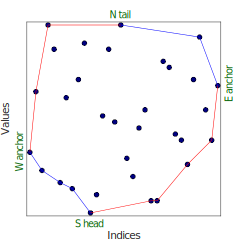

## Intro

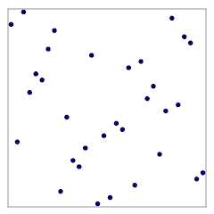

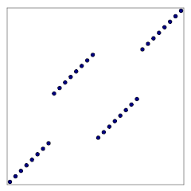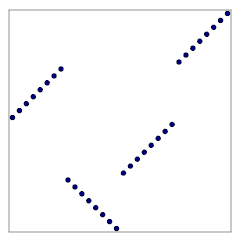

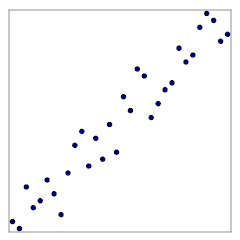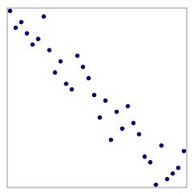

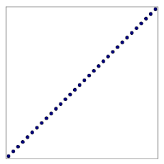

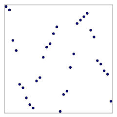

### With shuffle

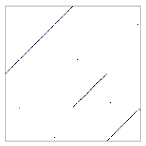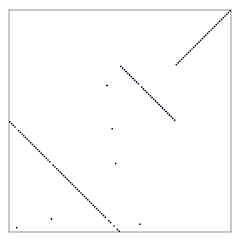

### With random displacement

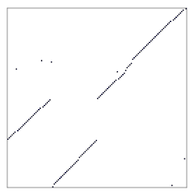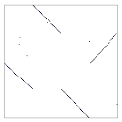

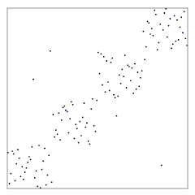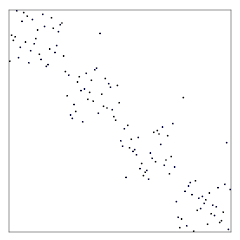

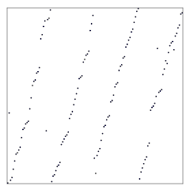

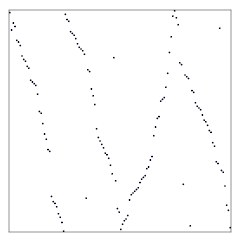

# Tables

<!-- md-formatter off (Document metadata) -->

\blandscape

: Sample pipe table.

| Fruit         | Price         | Price         | Price         | Price         | Price         | Price         | Price         | Price         | Advantages         |
|---------------|---------------|---------|-----------------------------------------|--------|---------------|--------|---------------|---------|--------------------|
| Bananas       | $1.34         | $1.34         | Very long line of text to check for unevenness | $1.34         | $1.34         | $1.34         | $1.34         | $1.34         | - built-in wrapper |
|               |               |               |               |               |               |               |               |               | - bright color     |
| Oranges       | $2.10         | $2.10         | $2.10         | $2.10         | $2.10         | $2.10         | $2.10         | $2.10         | - cures scurvy     |
|               |               |               |               |               |               |               |               |               | - tasty            |

\elandscape

<!-- md-formatter on -->

\blandscape
:   TableRandComp.

INCLUDE-FILE: TableRandComp.md

\elandscape

\blandscape
:   TablePresort.

INCLUDE-FILE: TablePresort.md

\elandscape

\blandscape
:   TableSizedPresort.

INCLUDE-FILE: TableSizedPresort.md

\elandscape

\blandscape
:   TableMergeSub.

INCLUDE-FILE: TableMergeSub.md

\elandscape

\blandscape
:   TableAppend.

INCLUDE-FILE: TableAppend.md

\elandscape

\blandscape
:   TableBlockDiag.

INCLUDE-FILE: TableBlockDiag.md

\elandscape

\blandscape
:   TableRandBlockPresort.

INCLUDE-FILE: TableRandBlockPresort.md

\elandscape

\blandscape
:   TableRandBlockRand.

INCLUDE-FILE: TableRandBlockRand.md

\elandscape

\blandscape
:   TableBidirection.

INCLUDE-FILE: TableBidirection.md

\elandscape
